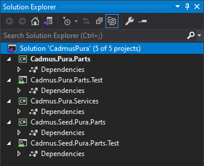

- [Creating Backend Core](#creating-backend-core)
  - [1. Create Solution](#1-create-solution)
  - [2. Add Parts/Fragments](#2-add-partsfragments)
    - [2.1. Add Models Projects](#21-add-models-projects)
    - [2.2. Adding Parts or Fragments](#22-adding-parts-or-fragments)
    - [2.3. Adding Part or Fragment Seeders](#23-adding-part-or-fragment-seeders)
  - [3. Add Services](#3-add-services)
  - [4. Publish NuGet Packages](#4-publish-nuget-packages)

# Creating Backend Core

The backend is a set of C# libraries, built with VS.

The following procedure will:

- create a new Visual Studio solution for the backend components (business layer).
- add to it these libraries:
  - library for [parts](parts)/[fragments](fragments) (if required), plus a test library.
  - library for [parts](part-seeders)/[fragments](fragment-seeders) mock data seeders, plus a test library.
  - library for [API](api) services.

In what follows, `__PRJ__` represents the short name you chose for your project.

## 1. Create Solution

▶️ (1) launch VS and create a new _blank solution_ named `Cadmus__PRJ__`. Alternatively, use this command:

```bash
dotnet new sln -n Cadmus__PRJ__
```

## 2. Add Parts/Fragments

💡 If you have project-specific parts or fragments, follow the steps in this section.

### 2.1. Add Models Projects

▶️ (1) add to this solution a _C# .NET class library_, named `Cadmus.__PRJ__.Parts`:

```bash
dotnet new classlib -n Cadmus.__PRJ__.Parts
dotnet sln Cadmus__PRJ__.sln add Cadmus.__PRJ__.Parts/Cadmus.__PRJ__.Parts.csproj
```

This will hold parts and fragments specific to your projects. Usually a single library is enough, but you are free to distribute components across several libraries should you need more granularity for their reuse.

▶️ (2) delete the empty `Class1.cs` file from the newly created project and (as for any library which is meant to be published into a NuGet package) add metadata for it, e.g.:

```xml
<!-- inside the "main" PropertyGroup: -->
<IncludeSymbols>true</IncludeSymbols>
<SymbolPackageFormat>snupkg</SymbolPackageFormat>
<Authors>Daniele Fusi</Authors>
<Company>Fusi</Company>
<Product>Cadmus</Product>
<Description>Parts for Cadmus __PRJ__.</Description>
<Copyright>by Daniele Fusi 2025</Copyright>
<NeutralLanguage>en-US</NeutralLanguage>
<PackageLicenseExpression>GPL-3.0-or-later</PackageLicenseExpression>
<PackageTags>Cadmus;parts</PackageTags>
<Version>0.0.1</Version>
<FileVersion>0.0.1</FileVersion>
<AssemblyVersion>0.0.1</AssemblyVersion>
```

▶️ (3) add another _C# .NET 9 class library_ named `Cadmus.Seed.__PRJ__.Parts` to provide the mock data seeders for your components. This is not strictly a requirement, but it's suggested to let you play with the editor while building it. Once created, delete the empty `Class1.cs` file from it and add metadata as above.

```bash
dotnet new classlib -n Cadmus.Seed.__PRJ__.Parts
dotnet sln Cadmus__PRJ__.sln add Cadmus.Seed.__PRJ__.Parts/Cadmus.Seed.__PRJ__.Parts.csproj
```

▶️ (4) add another _C# .NET 9 class library_ named `Cadmus.__PRJ__.Services` to provide some API services to plug into your API. Once created, delete the empty `Class1.cs` file from it, and add metadata as above.

```bash
dotnet new classlib -n Cadmus.__PRJ__.Services
dotnet sln Cadmus__PRJ__.sln add Cadmus.__PRJ__.Services/Cadmus.__PRJ__.Services.csproj
```

▶️ (5) add a _XUnit Test Project_ named `Cadmus.__PRJ__.Parts.Test` to contain the tests for the `Cadmus.__PRJ__.Parts` library. Alternatively, any other unit test framework can be used; this just reflects my preferences, and is suggested as the test templates I provide use XUnit. Once created, delete the empty `UnitTest1.cs` class.

```bash
dotnet new xunit -n Cadmus.__PRJ__.Parts.Test
dotnet sln Cadmus__PRJ__.sln add Cadmus.__PRJ__.Parts.Test/Cadmus.__PRJ__.Parts.Test.csproj
```

▶️ (6) add a _XUnit Test Project_ named `Cadmus.Seed.__PRJ__.Parts.Test` to contain the tests for the `Cadmus.Seed.__PRJ__.Parts` library. Alternatively, any other unit test framework can be used; this just reflects my preferences, and is suggested as the test templates I provide use XUnit. Once created, delete the empty `UnitTest1.cs` class.

```bash
dotnet new xunit -n Cadmus.Seed.__PRJ__.Parts.Test
dotnet sln Cadmus__PRJ__.sln add Cadmus.Seed.__PRJ__.Parts.Test/Cadmus.Seed.__PRJ__.Parts.Test.csproj
```

Your solution should now look like this (here `PRJ` is `Pura`):



▶️ (7) add references across projects in the solution, according to this schema:

- `Cadmus.__PRJ__.Parts.Test` depends on:
  - `Cadmus.__PRJ__.Parts`
  - `Cadmus.Seed.__PRJ__.Parts`
- `Cadmus.__PRJ__.Services` depends on:
  - `Cadmus.__PRJ__.Parts`
  - `Cadmus.Seed.__PRJ__.Parts`
- `Cadmus.Seed.__PRJ__.Parts` depends on:
  - `Cadmus.__PRJ__.Parts`
- `Cadmus.Seed.__PRJ__.Parts.Test` depends on:
  - `Cadmus.Seed.__PRJ__.Parts`

Adding a project reference can be done by right clicking the `Dependencies` node under the test project, selecting `Add Project Reference` from the popup menu, and checking the target project in the list which appears. Finally close the dialog with `OK`.

Alternatively, just edit the `csproj` XML file and add a line in an `ItemGroup` element like in this sample (replace the path with the correct one):

```xml
<ItemGroup>
  <ProjectReference Include="..\Cadmus.Pura.Parts\Cadmus.Pura.Parts.csproj" />
</ItemGroup>
```

### 2.2. Adding Parts or Fragments

You can now add as many parts and fragments as required to the `Cadmus.__PRJ__.Parts` project.

▶️ (1) add a reference to the Cadmus core components to this project. This can be done in the VS UI, by adding a new NuGet package named `Cadmus.Core`; from the command line, as shown below; or by editing the `csproj` project XML file, and adding this line under an `<ItemGroup>` element (replace the version number with the latest available version):

- command line:

```bash
cd Cadmus.PRJ.Parts
dotnet add package Cadmus.Core
```

- CS project file:

```xml
<ItemGroup>
  <PackageReference Include="Cadmus.Core" Version="7.0.3" />
</ItemGroup>
```

>Should you need existing components to build your own (e.g. to extend or integrate them), add their packages in the imports too.

▶️ (2) add a plain C# class for each part or fragment, representing its data model. Please refer to these pages for details:

- ⚙️ [adding parts](./parts)
- ⚙️ [adding fragments](./fragments)

💡 If you have several parts/fragments using the `StandardDataPinTextFilter` to filter pin string values, you have better use a helper class providing a singleton for it, like in the following code:

```cs
static internal class DataPinHelper
{
    private static StandardDataPinTextFilter? _filter;

    /// <summary>
    /// Gets the default filter used for pins.
    /// This improves performance, as we can share this filter
    /// among several parts.
    /// </summary>
    static public IDataPinTextFilter DefaultFilter
    {
        get { return _filter ??= new StandardDataPinTextFilter(); }
    }
}
```

### 2.3. Adding Part or Fragment Seeders

For each part or fragment you should provide a corresponding mock data seeder to the `Cadmus.Seed.__PRJ__.Parts` project. This is extremely useful to let developers and users play with the editor.

▶️ (1) add a reference to the Cadmus core seed components to this project, as explained above. Also, a reference to the `Bogus` package is useful to leverage the power of this library rather than creating mock data from scratch. The package references are listed below (replace the version number with the latest available version):

- command line:

```bash
cd Cadmus.Seed.PRJ.Parts
dotnet add package Bogus
dotnet add package Cadmus.Core
dotnet add package Cadmus.Seed
```

- CS project file:

```xml
<ItemGroup>
  <PackageReference Include="Bogus" Version="35.5.1" />
  <PackageReference Include="Cadmus.Core" Version="7.0.3" />
  <PackageReference Include="Cadmus.Seed" Version="7.0.2" />
</ItemGroup>
```

▶️ (2) add a plain C# class for each part or fragment seeder. Please refer to these pages for details:

- ⚙️ [adding part seeders](./part-seeders)
- ⚙️ [adding fragment seeders](./fragment-seeders)

## 3. Add Services

Every Cadmus backend project using its own data models requires a couple of services:

- **repository provider**: this provides a Cadmus repository, used to edit the database, including all the models required for your project.
- **part seeder factory provider**: this provides a parts seeder factory, which provides the factory for generating part seeders. A part seeder is used to generate mock data to play with when developing the UI.

- ⚙️ [adding services](services).

## 4. Publish NuGet Packages

Once your parts, seeders, and services are ready, typically you should package them and publish the package so that it is available to yourself and to the community. Alternatively, you will just add a reference to the compiled library in your consumer projects.

To package the libraries for NuGet (you must have a free account for it), you should do this just once:

▶️ (1) not required, but suggested: ensure that you have added these to the `PropertyGroup` of each csproj to be packaged:

```xml
<IncludeSymbols>true</IncludeSymbols>
<SymbolPackageFormat>snupkg</SymbolPackageFormat>
```

This ensures that symbols are included when building the package.

▶️ (2) insert the package metadata by right clicking the project and picking `Properties`: author, license, version, etc.

Once you have setup your projects in this way, just publish them like in this batch:

```bat
@echo off
echo BUILD Cadmus PRJ Packages
del .\Cadmus.PRJ.Parts\bin\Debug\*.nupkg

cd .\Cadmus.PRJ.Parts
dotnet pack -c Debug -p:IncludeSymbols=true -p:SymbolPackageFormat=snupkg
cd..

cd .\Cadmus.PRJ.Services
dotnet pack -c Debug -p:IncludeSymbols=true -p:SymbolPackageFormat=snupkg
cd..

cd .\Cadmus.Seed.PRJ.Parts
dotnet pack -c Debug -p:IncludeSymbols=true -p:SymbolPackageFormat=snupkg
cd..

pause
```

(in this sample I'm publishing the `Debug` versions for diagnostic purposes, but you should pick the `Release` version once you are comfortable with it).
