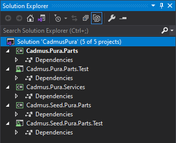

- [Creating Backend Core](#creating-backend-core)
  - [1. Create Solution](#1-create-solution)
  - [2. Add Parts/Fragments](#2-add-partsfragments)
  - [3. Add Services](#3-add-services)
  - [4. Publish NuGet Packages](#4-publish-nuget-packages)
  - [5. Add API Project](#5-add-api-project)

# Creating Backend Core

The **backend solution** consists of:

- an optional set of C# libraries projects with their test projects.
- an [API project](api.md).
- an optional tool project typically used to handle project-specific tasks, e.g. importing data from some source.

Additionally, you might want to create an independent repository to host the online [help](help.md) of your project, with instructions about using the editor and your project-specific conventions.

This section shows how to create the core backend solution.

> In the following code templates, `__PRJ__` represents the short name you chose for your project.

## 1. Create Solution

▶️ (1) create a new _blank solution_ named `Cadmus__PRJ__`. Alternatively, use this command:

```bash
dotnet new sln -n Cadmus__PRJ__
```

## 2. Add Parts/Fragments

💡 If you have project-specific parts or fragments, follow the steps in this section.

▶️ (1) add to this solution a _C# .NET class library_, named `Cadmus.__PRJ__.Parts`:

```bash
dotnet new classlib -n Cadmus.__PRJ__.Parts
dotnet sln Cadmus__PRJ__.slnx add Cadmus.__PRJ__.Parts/Cadmus.__PRJ__.Parts.csproj
```

This library will contain parts and fragments specific to your projects. Usually a single library is enough; but you are free to distribute components across several libraries, should you need more granularity for their reuse.

▶️ (2) delete the empty `Class1.cs` file from the newly created project and set metadata for it, e.g.:

```xml
<PropertyGroup>
  <TargetFramework>net10.0</TargetFramework>
  <ImplicitUsings>disable</ImplicitUsings>
  <Nullable>enable</Nullable>
  <IncludeSymbols>true</IncludeSymbols>
  <SymbolPackageFormat>snupkg</SymbolPackageFormat>
  <Authors>Daniele Fusi</Authors>
  <Company>Fusi</Company>
  <Product>Cadmus</Product>
  <Description>Parts for Cadmus __PRJ__.</Description>
  <Copyright>by Daniele Fusi 2026</Copyright>
  <NeutralLanguage>en-US</NeutralLanguage>
  <PackageLicenseExpression>GPL-3.0-or-later</PackageLicenseExpression>
  <PackageTags>Cadmus;parts</PackageTags>
  <DebugType>portable</DebugType>
  <DebugSymbols>true</DebugSymbols>
  <PublishRepositoryUrl>true</PublishRepositoryUrl>
  <EmbedUntrackedSources>true</EmbedUntrackedSources>
  <ContinuousIntegrationBuild>true</ContinuousIntegrationBuild>
  <Deterministic>true</Deterministic>
  <Version>0.0.1</Version>
  <FileVersion>0.0.1</FileVersion>
  <AssemblyVersion>0.0.1</AssemblyVersion>
</PropertyGroup>

<PropertyGroup>
  <GenerateDocumentationFile>true</GenerateDocumentationFile>
</PropertyGroup>

<ItemGroup>
  <PackageReference Include="Microsoft.SourceLink.GitHub" PrivateAssets="All" Version="10.0.400" />
</ItemGroup>
```

▶️ (3) add another _C# class library_ named `Cadmus.Seed.__PRJ__.Parts` to provide the mock data seeders for your components. This is not strictly a requirement, but it's suggested to let you play with the editor while building it. Once created, delete the empty `Class1.cs` file from it and set metadata as above:

```bash
dotnet new classlib -n Cadmus.Seed.__PRJ__.Parts
dotnet sln Cadmus__PRJ__.slnx add Cadmus.Seed.__PRJ__.Parts/Cadmus.Seed.__PRJ__.Parts.csproj
```

▶️ (4) add another _C# class library_ named `Cadmus.__PRJ__.Services` to provide some API services to plug into your API. Once created, delete the empty `Class1.cs` file from it, and add metadata as for the parts project.

```bash
dotnet new classlib -n Cadmus.__PRJ__.Services
dotnet sln Cadmus__PRJ__.slnx add Cadmus.__PRJ__.Services/Cadmus.__PRJ__.Services.csproj
```

▶️ (5) add a _XUnit Test Project_ named `Cadmus.__PRJ__.Parts.Test` to contain the tests for the `Cadmus.__PRJ__.Parts` library. Alternatively, any other unit test framework can be used; this just reflects my preferences, and is suggested as the test templates I provide use XUnit. Once created, delete the empty `UnitTest1.cs` class and set metadata like shown below:

```bash
dotnet new xunit -n Cadmus.__PRJ__.Parts.Test
dotnet sln Cadmus__PRJ__.slnx add Cadmus.__PRJ__.Parts.Test/Cadmus.__PRJ__.Parts.Test.csproj
```

```xml
<Project Sdk="Microsoft.NET.Sdk">

 <PropertyGroup>
  <TargetFramework>net10.0</TargetFramework>
  <ImplicitUsings>disable</ImplicitUsings>
  <Nullable>enable</Nullable>
  <IsPackable>false</IsPackable>
  <UseMicrosoftTestingPlatformRunner>true</UseMicrosoftTestingPlatformRunner>
  <OutputType>Exe</OutputType>
 </PropertyGroup>

 <ItemGroup>
  <PackageReference Include="coverlet.collector">
   <PrivateAssets>all</PrivateAssets>
   <IncludeAssets>runtime; build; native; contentfiles; analyzers; buildtransitive</IncludeAssets>
  </PackageReference>
  <PackageReference Include="xunit.v3" />
 </ItemGroup>

 <ItemGroup>
  <ProjectReference Include="..\Cadmus.__PRJ__.Parts\Cadmus.__PRJ__.Parts.csproj" />
 </ItemGroup>

 <ItemGroup>
  <Using Include="Xunit" />
 </ItemGroup>

</Project>
```

▶️ (6) add a _XUnit Test Project_ named `Cadmus.Seed.__PRJ__.Parts.Test` to contain the tests for the `Cadmus.Seed.__PRJ__.Parts` library. Alternatively, any other unit test framework can be used; this just reflects my preferences, and is suggested as the test templates I provide use XUnit. Once created, delete the empty `UnitTest1.cs` class.

```bash
dotnet new xunit -n Cadmus.Seed.__PRJ__.Parts.Test
dotnet sln Cadmus__PRJ__.slnx add Cadmus.Seed.__PRJ__.Parts.Test/Cadmus.Seed.__PRJ__.Parts.Test.csproj
```

Your solution should now look like this (here `PRJ` is `Pura`):



▶️ (7) add references across projects in the solution, according to this schema:

- `Cadmus.__PRJ__.Parts.Test` depends on:
  - `Cadmus.__PRJ__.Parts`
  - `Cadmus.Seed.__PRJ__.Parts`
- `Cadmus.__PRJ__.Services` depends on:
  - `Cadmus.__PRJ__.Parts`
  - `Cadmus.Seed.__PRJ__.Parts`
- `Cadmus.Seed.__PRJ__.Parts` depends on:
  - `Cadmus.__PRJ__.Parts`
- `Cadmus.Seed.__PRJ__.Parts.Test` depends on:
  - `Cadmus.Seed.__PRJ__.Parts`

Adding a project reference can be done by right clicking the `Dependencies` node under the test project, selecting `Add Project Reference` from the popup menu, and checking the target project in the list which appears. Finally close the dialog with `OK`.

Alternatively, just edit the `csproj` XML file and add a line in an `ItemGroup` element like in this sample (replace the path with the correct one):

```xml
<ItemGroup>
  <ProjectReference Include="..\Cadmus.Pura.Parts\Cadmus.Pura.Parts.csproj" />
</ItemGroup>
```

▶️ (2) add a plain C# class for each part or fragment seeder. Please refer to these pages for details:

- ⚙️ [adding part seeders](./part-seeders)
- ⚙️ [adding fragment seeders](./fragment-seeders)

## 3. Add Services

Every Cadmus backend project using its own data models requires a couple of services:

- **repository provider**: this provides a Cadmus repository, used to edit the database, including all the models required for your project.
- **part seeder factory provider**: this provides a parts seeder factory, which provides the factory for generating part seeders. A part seeder is used to generate mock data to play with when developing the UI.

- ⚙️ [adding services](services).

## 4. Publish NuGet Packages

Once your parts, seeders, and services are ready, typically you should package them and publish the package so that it is available to yourself and to the community. Alternatively, you will just add a reference to the compiled library in your consumer projects.

Use a script to automate publishing. This is a raw example:

```bat
@echo off
echo BUILD Cadmus PRJ Packages
del .\Cadmus.PRJ.Parts\bin\Release\*.nupkg

cd .\Cadmus.PRJ.Parts
dotnet pack -c Release -p:IncludeSymbols=true -p:SymbolPackageFormat=snupkg
cd..

cd .\Cadmus.PRJ.Services
dotnet pack -c Release -p:IncludeSymbols=true -p:SymbolPackageFormat=snupkg
cd..

cd .\Cadmus.Seed.PRJ.Parts
dotnet pack -c Release -p:IncludeSymbols=true -p:SymbolPackageFormat=snupkg
cd..

pause
```

## 5. Add API Project

Finally, add an [API project](api.md) to the same solution. This will just be a thin layer with configuration specific to your project.
