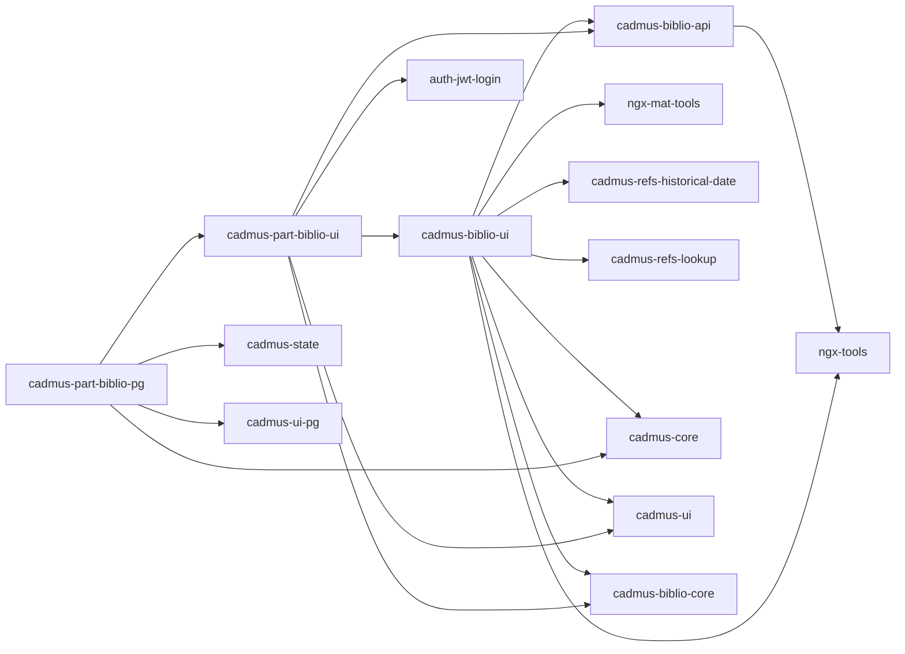

# Bibliography Shell

- 🌐 <https://github.com/vedph/cadmus_biblio_shell>

This shell provides components for editing an independent bibliography stored in a separate database (currently PostgreSQL). This is the approach used for top-down strategies, where Cadmus items just link to bibliographic records which are edited in their own integrated UI. Alternatively, when your bibliography has few or none repetitions from item to item, you can adopt the bottom-up strategy, where each item contains a local bibliography which can then be indexed and consolidated into a separate resource.

In top-down, users link to existing bibliographic records and/or create new ones directly when they are required the first time. So, the database, which might pre-exist, is updated in real time and all the users share it. In bottom-up, users just write specific bibliography for each item, and later we can have a program collect and consolidate it into a single resource if required.

