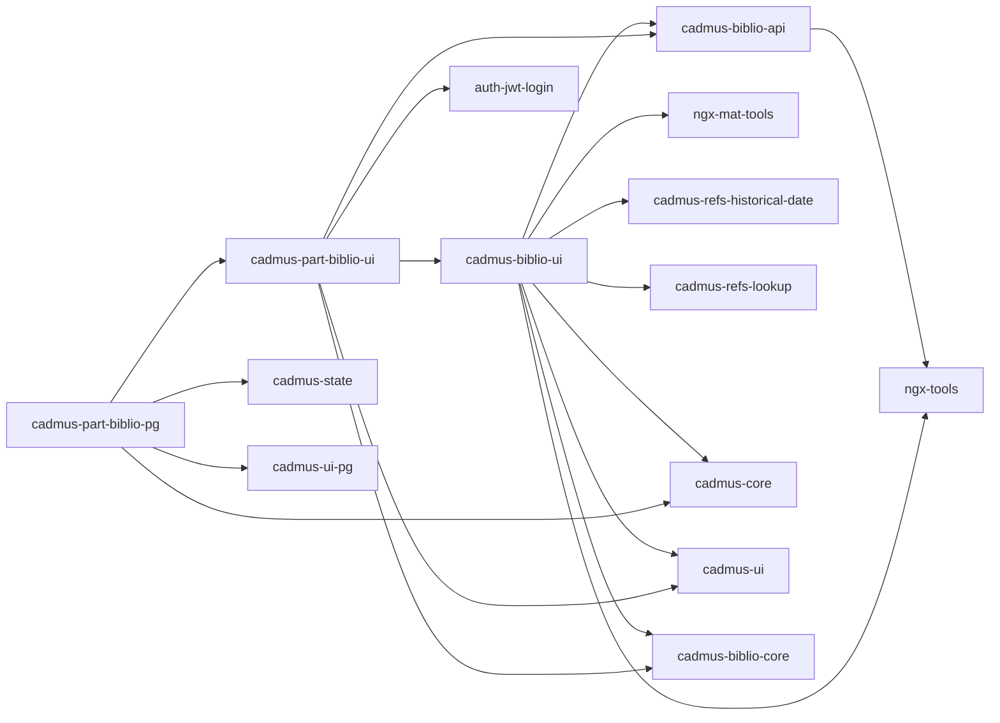

# Bibliography Shell

- 🌐 <https://github.com/vedph/cadmus_biblio_shell>

```mermaid
graph LR;
  cadmus-biblio-api --> ngx-tools
  cadmus-biblio-ui --> ngx-tools
  cadmus-biblio-ui --> ngx-mat-tools
  cadmus-biblio-ui --> cadmus-refs-historical-date
  cadmus-biblio-ui --> cadmus-refs-lookup
  cadmus-biblio-ui --> cadmus-core
  cadmus-biblio-ui --> cadmus-ui
  cadmus-biblio-ui --> cadmus-biblio-api
  cadmus-biblio-ui --> cadmus-biblio-core
  cadmus-part-biblio-ui --> auth-jwt-login
  cadmus-part-biblio-ui --> cadmus-ui
  cadmus-part-biblio-ui --> cadmus-biblio-ui
  cadmus-part-biblio-ui --> cadmus-biblio-api
  cadmus-part-biblio-ui --> cadmus-biblio-core
  cadmus-part-biblio-pg --> cadmus-core
  cadmus-part-biblio-pg --> cadmus-state
  cadmus-part-biblio-pg --> cadmus-ui-pg
  cadmus-part-biblio-pg --> cadmus-part-biblio-ui
```
