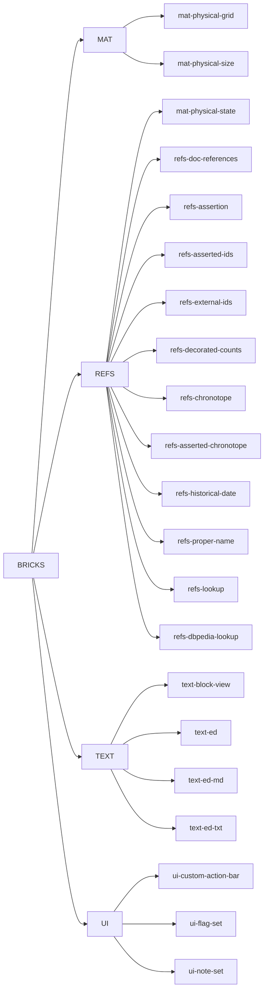

# Bricks

- 🌐 <https://github.com/vedph/cadmus-bricks-shell-v3>

```mermaid
graph LR;
  BRICKS --> MAT
  BRICKS --> REFS
  BRICKS --> TEXT
  BRICKS --> UI
  MAT --> mat-physical-grid
  MAT --> mat-physical-size
  REFS --> mat-physical-state
  REFS --> refs-doc-references
  REFS --> refs-assertion
  REFS --> refs-asserted-ids
  REFS --> refs-external-ids
  REFS --> refs-decorated-counts
  REFS --> refs-chronotope
  REFS --> refs-asserted-chronotope
  REFS --> refs-historical-date
  REFS --> refs-proper-name
  REFS --> refs-lookup
  REFS --> refs-dbpedia-lookup
  TEXT --> text-block-view
  TEXT --> text-ed
  TEXT --> text-ed-md
  TEXT --> text-ed-txt
  UI --> ui-custom-action-bar
  UI --> ui-flag-set
  UI --> ui-note-set
```
