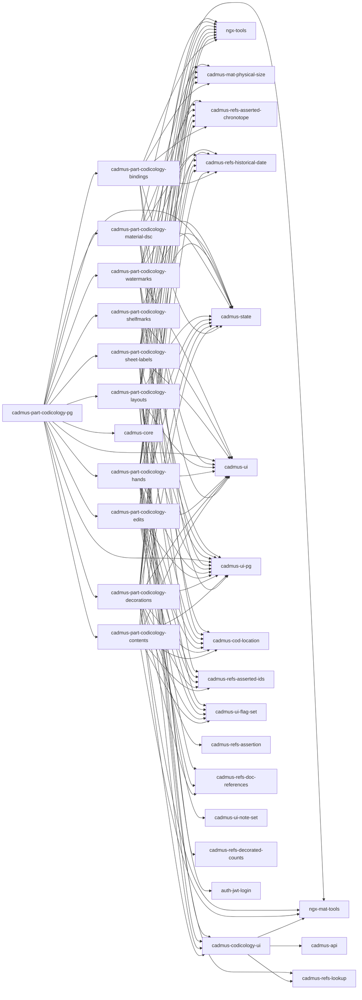

# Codicology Shell

- 🌐 <https://github.com/vedph/cadmus-codicology-shell>

```mermaid
graph LR;
  cadmus-codicology-ui --> ngx-mat-tools
  cadmus-codicology-ui --> cadmus-refs-lookup
  cadmus-codicology-ui --> cadmus-api
  cadmus-part-codicology-bindings --> ngx-tools
  cadmus-part-codicology-bindings --> cadmus-mat-physical-size
  cadmus-part-codicology-bindings --> cadmus-refs-asserted-chronotope
  cadmus-part-codicology-bindings --> cadmus-refs-historical-date
  cadmus-part-codicology-bindings --> cadmus-state
  cadmus-part-codicology-bindings --> cadmus-ui
  cadmus-part-codicology-bindings --> cadmus-ui-pg
  cadmus-part-codicology-contents --> ngx-tools
  cadmus-part-codicology-contents --> ngx-mat-tools
  cadmus-part-codicology-contents --> cadmus-cod-location
  cadmus-part-codicology-contents --> cadmus-refs-asserted-ids
  cadmus-part-codicology-contents --> cadmus-ui-flag-set
  cadmus-part-codicology-contents --> cadmus-state
  cadmus-part-codicology-contents --> cadmus-ui
  cadmus-part-codicology-contents --> cadmus-ui-pg
  cadmus-part-codicology-decorations --> ngx-tools
  cadmus-part-codicology-decorations --> ngx-mat-tools
  cadmus-part-codicology-decorations --> cadmus-refs-assertion
  cadmus-part-codicology-decorations --> cadmus-mat-physical-size
  cadmus-part-codicology-decorations --> cadmus-refs-asserted-chronotope
  cadmus-part-codicology-decorations --> cadmus-refs-asserted-ids
  cadmus-part-codicology-decorations --> cadmus-refs-doc-references
  cadmus-part-codicology-decorations --> cadmus-refs-historical-date
  cadmus-part-codicology-decorations --> cadmus-cod-location
  cadmus-part-codicology-decorations --> cadmus-ui-flag-set
  cadmus-part-codicology-decorations --> cadmus-state
  cadmus-part-codicology-decorations --> cadmus-ui
  cadmus-part-codicology-decorations --> cadmus-ui-pg
  cadmus-part-codicology-decorations --> cadmus-codicology-ui
  cadmus-part-codicology-edits --> ngx-tools
  cadmus-part-codicology-edits --> cadmus-cod-location
  cadmus-part-codicology-edits --> cadmus-refs-asserted-ids
  cadmus-part-codicology-edits --> cadmus-refs-doc-references
  cadmus-part-codicology-edits --> cadmus-refs-historical-date
  cadmus-part-codicology-edits --> cadmus-ui-flag-set
  cadmus-part-codicology-edits --> cadmus-state
  cadmus-part-codicology-edits --> cadmus-ui
  cadmus-part-codicology-edits --> cadmus-ui-pg
  cadmus-part-codicology-hands --> ngx-tools
  cadmus-part-codicology-hands --> cadmus-cod-location
  cadmus-part-codicology-hands --> cadmus-mat-physical-size
  cadmus-part-codicology-hands --> cadmus-refs-asserted-chronotope
  cadmus-part-codicology-hands --> cadmus-refs-asserted-ids
  cadmus-part-codicology-hands --> cadmus-refs-doc-references
  cadmus-part-codicology-hands --> cadmus-refs-historical-date
  cadmus-part-codicology-hands --> cadmus-ui-flag-set
  cadmus-part-codicology-hands --> cadmus-ui-note-set
  cadmus-part-codicology-hands --> cadmus-state
  cadmus-part-codicology-hands --> cadmus-ui
  cadmus-part-codicology-hands --> cadmus-ui-pg
  cadmus-part-codicology-hands --> cadmus-codicology-ui
  cadmus-part-codicology-layouts --> ngx-tools
  cadmus-part-codicology-layouts --> cadmus-cod-location
  cadmus-part-codicology-layouts --> cadmus-mat-physical-size
  cadmus-part-codicology-layouts --> cadmus-refs-asserted-chronotope
  cadmus-part-codicology-layouts --> cadmus-refs-decorated-counts
  cadmus-part-codicology-layouts --> cadmus-refs-historical-date
  cadmus-part-codicology-layouts --> cadmus-state
  cadmus-part-codicology-layouts --> cadmus-ui
  cadmus-part-codicology-layouts --> cadmus-ui-pg
  cadmus-part-codicology-layouts --> cadmus-codicology-ui
  cadmus-part-codicology-material-dsc --> ngx-tools
  cadmus-part-codicology-material-dsc --> cadmus-cod-location
  cadmus-part-codicology-material-dsc --> cadmus-refs-asserted-chronotope
  cadmus-part-codicology-material-dsc --> cadmus-refs-historical-date
  cadmus-part-codicology-material-dsc --> cadmus-state
  cadmus-part-codicology-material-dsc --> cadmus-ui
  cadmus-part-codicology-material-dsc --> cadmus-ui-pg
  cadmus-part-codicology-pg --> cadmus-core
  cadmus-part-codicology-pg --> cadmus-state
  cadmus-part-codicology-pg --> cadmus-ui
  cadmus-part-codicology-pg --> cadmus-ui-pg
  cadmus-part-codicology-pg --> cadmus-part-codicology-bindings
  cadmus-part-codicology-pg --> cadmus-part-codicology-contents
  cadmus-part-codicology-pg --> cadmus-part-codicology-decorations
  cadmus-part-codicology-pg --> cadmus-part-codicology-edits
  cadmus-part-codicology-pg --> cadmus-part-codicology-hands
  cadmus-part-codicology-pg --> cadmus-part-codicology-layouts
  cadmus-part-codicology-pg --> cadmus-part-codicology-material-dsc
  cadmus-part-codicology-pg --> cadmus-part-codicology-sheet-labels
  cadmus-part-codicology-pg --> cadmus-part-codicology-shelfmarks
  cadmus-part-codicology-pg --> cadmus-part-codicology-watermarks
  cadmus-part-codicology-sheet-labels --> ngx-tools
  cadmus-part-codicology-sheet-labels --> ngx-mat-tools
  cadmus-part-codicology-sheet-labels --> auth-jwt-login
  cadmus-part-codicology-sheet-labels --> cadmus-mat-physical-size
  cadmus-part-codicology-sheet-labels --> cadmus-refs-asserted-chronotope
  cadmus-part-codicology-sheet-labels --> cadmus-refs-historical-date
  cadmus-part-codicology-sheet-labels --> cadmus-ui-flag-set
  cadmus-part-codicology-sheet-labels --> cadmus-refs-lookup
  cadmus-part-codicology-sheet-labels --> cadmus-state
  cadmus-part-codicology-sheet-labels --> cadmus-ui
  cadmus-part-codicology-sheet-labels --> cadmus-ui-pg
  cadmus-part-codicology-sheet-labels --> cadmus-codicology-ui
  cadmus-part-codicology-shelfmarks --> cadmus-state
  cadmus-part-codicology-shelfmarks --> cadmus-ui
  cadmus-part-codicology-shelfmarks --> cadmus-ui-pg
  cadmus-part-codicology-watermarks --> cadmus-cod-location
  cadmus-part-codicology-watermarks --> cadmus-mat-physical-size
  cadmus-part-codicology-watermarks --> cadmus-refs-asserted-chronotope
  cadmus-part-codicology-watermarks --> cadmus-refs-asserted-ids
  cadmus-part-codicology-watermarks --> cadmus-refs-historical-date
  cadmus-part-codicology-watermarks --> cadmus-state
  cadmus-part-codicology-watermarks --> cadmus-ui
  cadmus-part-codicology-watermarks --> cadmus-ui-pg
```
