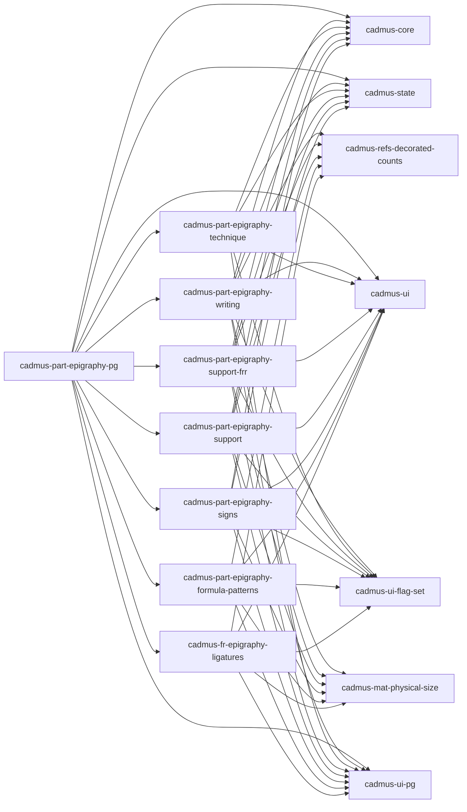

# Epigraphy Shell

- 🌐 <https://github.com/vedph/cadmus-epigraphy-shell>

```mermaid
graph LR;
  cadmus-fr-epigraphy-ligatures --> cadmus-mat-physical-size
  cadmus-fr-epigraphy-ligatures --> cadmus-refs-decorated-counts
  cadmus-fr-epigraphy-ligatures --> cadmus-ui-flag-set
  cadmus-fr-epigraphy-ligatures --> cadmus-ui
  cadmus-fr-epigraphy-ligatures --> cadmus-ui-pg
  cadmus-part-epigraphy-formula-patterns --> cadmus-mat-physical-size
  cadmus-part-epigraphy-formula-patterns --> cadmus-refs-decorated-counts
  cadmus-part-epigraphy-formula-patterns --> cadmus-ui-flag-set
  cadmus-part-epigraphy-formula-patterns --> cadmus-ui
  cadmus-part-epigraphy-formula-patterns --> cadmus-ui-pg
  cadmus-part-epigraphy-signs --> cadmus-mat-physical-size
  cadmus-part-epigraphy-signs --> cadmus-ui-flag-set
  cadmus-part-epigraphy-signs --> cadmus-core
  cadmus-part-epigraphy-signs --> cadmus-state
  cadmus-part-epigraphy-signs --> cadmus-ui
  cadmus-part-epigraphy-signs --> cadmus-ui-pg
  cadmus-part-epigraphy-support --> cadmus-refs-decorated-counts
  cadmus-part-epigraphy-support --> cadmus-ui-flag-set
  cadmus-part-epigraphy-support --> cadmus-mat-physical-size
  cadmus-part-epigraphy-support --> cadmus-core
  cadmus-part-epigraphy-support --> cadmus-state
  cadmus-part-epigraphy-support --> cadmus-ui
  cadmus-part-epigraphy-support --> cadmus-ui-pg
  cadmus-part-epigraphy-support-frr --> cadmus-refs-decorated-counts
  cadmus-part-epigraphy-support-frr --> cadmus-ui-flag-set
  cadmus-part-epigraphy-support-frr --> cadmus-mat-physical-size
  cadmus-part-epigraphy-support-frr --> cadmus-core
  cadmus-part-epigraphy-support-frr --> cadmus-state
  cadmus-part-epigraphy-support-frr --> cadmus-ui
  cadmus-part-epigraphy-support-frr --> cadmus-ui-pg
  cadmus-part-epigraphy-technique --> cadmus-ui-flag-set
  cadmus-part-epigraphy-technique --> cadmus-core
  cadmus-part-epigraphy-technique --> cadmus-state
  cadmus-part-epigraphy-technique --> cadmus-ui
  cadmus-part-epigraphy-technique --> cadmus-ui-pg
  cadmus-part-epigraphy-writing --> cadmus-mat-physical-size
  cadmus-part-epigraphy-writing --> cadmus-refs-decorated-counts
  cadmus-part-epigraphy-writing --> cadmus-ui-flag-set
  cadmus-part-epigraphy-writing --> cadmus-core
  cadmus-part-epigraphy-writing --> cadmus-state
  cadmus-part-epigraphy-writing --> cadmus-ui
  cadmus-part-epigraphy-writing --> cadmus-ui-pg
  cadmus-part-epigraphy-pg --> cadmus-core
  cadmus-part-epigraphy-pg --> cadmus-state
  cadmus-part-epigraphy-pg --> cadmus-ui
  cadmus-part-epigraphy-pg --> cadmus-ui-pg
  cadmus-part-epigraphy-pg --> cadmus-part-epigraphy-support
  cadmus-part-epigraphy-pg --> cadmus-part-epigraphy-support-frr
  cadmus-part-epigraphy-pg --> cadmus-part-epigraphy-technique
  cadmus-part-epigraphy-pg --> cadmus-part-epigraphy-writing
  cadmus-part-epigraphy-pg --> cadmus-part-epigraphy-signs
  cadmus-part-epigraphy-pg --> cadmus-fr-epigraphy-ligatures
  cadmus-part-epigraphy-pg --> cadmus-part-epigraphy-formula-patterns
```
