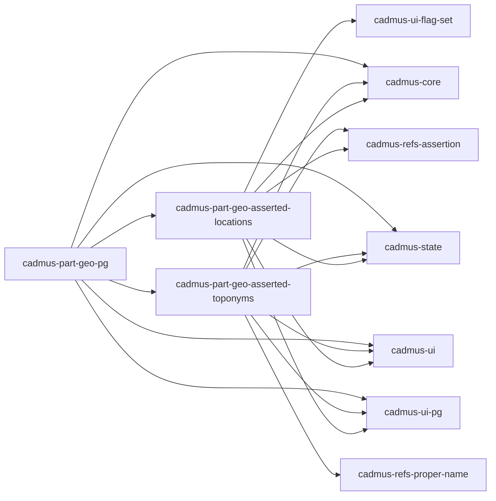

# Geography Shell

- 🌐 <https://github.com/vedph/cadmus-geo-shell>

```mermaid
graph LR;
  cadmus-part-geo-asserted-locations --> cadmus-refs-assertion
  cadmus-part-geo-asserted-locations --> cadmus-ui-flag-set
  cadmus-part-geo-asserted-locations --> cadmus-core
  cadmus-part-geo-asserted-locations --> cadmus-state
  cadmus-part-geo-asserted-locations --> cadmus-ui
  cadmus-part-geo-asserted-locations --> cadmus-ui-pg

  cadmus-part-geo-asserted-toponyms --> cadmus-refs-assertion
  cadmus-part-geo-asserted-toponyms --> cadmus-refs-proper-name
  cadmus-part-geo-asserted-toponyms --> cadmus-core
  cadmus-part-geo-asserted-toponyms --> cadmus-state
  cadmus-part-geo-asserted-toponyms --> cadmus-ui
  cadmus-part-geo-asserted-toponyms --> cadmus-ui-pg

  cadmus-part-geo-pg --> cadmus-core
  cadmus-part-geo-pg --> cadmus-state
  cadmus-part-geo-pg --> cadmus-ui
  cadmus-part-geo-pg --> cadmus-ui-pg
  cadmus-part-geo-pg --> cadmus-part-geo-asserted-locations
  cadmus-part-geo-pg --> cadmus-part-geo-asserted-toponyms
```
