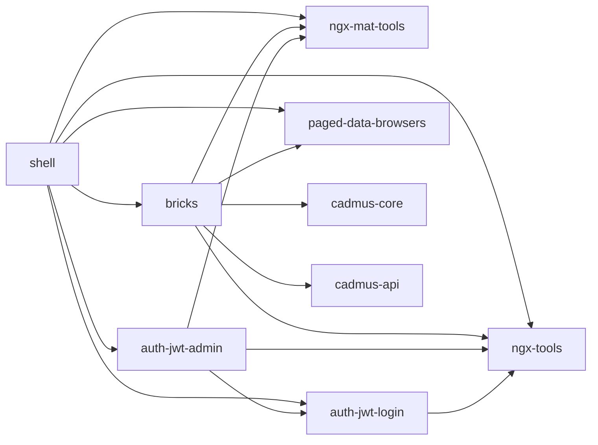

# Cadmus Frontend

- [bricks](bricks)
- [Cadmus shell](shell)
- [geography shell](geography-shell)
- [epigraphy shell](epigraphy-shell)
- [codicology shell](codicology-shell)

## Overview

This diagram shows the dependencies among the main `@myrmidon` frontend repositories used for Cadmus:

- 🌐 repositories:
  - [@myrmidon/ngx-tools repository](https://github.com/vedph/ngx-tools): both `ngx-tools` and `ngx-mat-tools`. Basic extensions for Angular.
  - [@myrmidon/auth-jwt repository](https://github.com/Myrmex/auth-jwt): both `auth-jwt-login` and `auth-jwt-admin`.
  - [bricks repository](https://github.com/vedph/cadmus-bricks-shell-v3): the [bricks](bricks) libraries repository. These are small, general-purpose UI widgets used to build Cadmus part and fragment editors.
  - [@myrmidon/ngx-annotorious repository](https://github.com/vedph/ngx-annotorious): Annotorious V3-based image annotation components. Before bricks V3, these were part of the same bricks repository.

## Shells

Some models families are designed and developed as a set in a corresponding UI shell.
