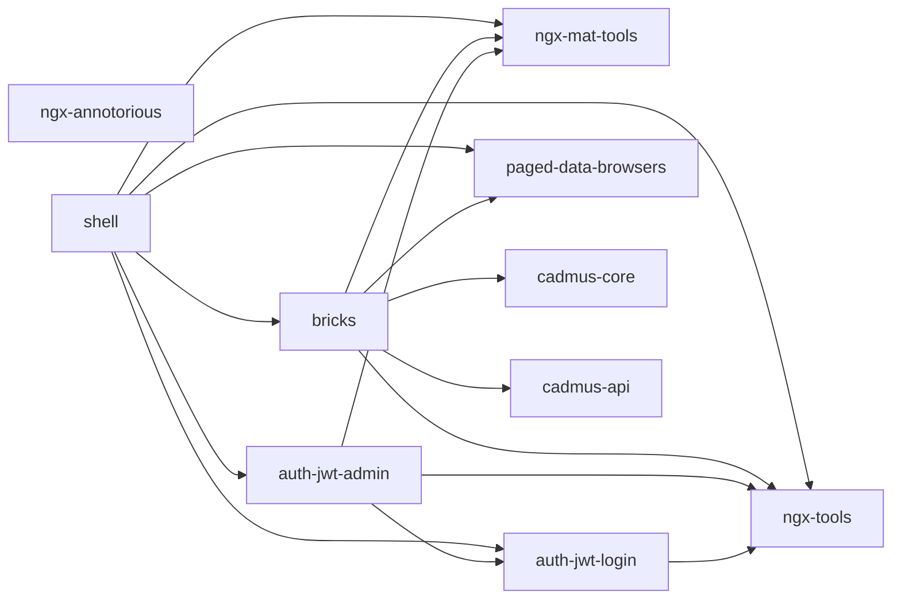

# Cadmus Frontend

The Cadmus frontend is an Angular editor built by composition. You create an Angular application, add Cadmus packages to it, and optionally add new packages for your own models. The frontend layer of a Cadmus editor has these main components:

- _core packages_: these provide most of the editor's business logic and related UI components. These packages are developed in their own workspace, providing a shell application for their testing.
- _part and fragment editors packages_: these provide data models and their editors for the UI, and are assembled together to build your own data architecture.
- _app pages_: a few pages are added to the app for wrapping logic related to user account handling (homepage, login, registration, password reset, user management). Apart from the homepage, which is of course freely designed, usually you just copy-paste the other pages, unless you want to customize them.
- _app configuration_: files used to define which data models and editors are used at which routes in the web app.
- _app assets_: custom resources like images, icons, and optionally local data.

Most of the packages make use of a set of UI widgets named _bricks_, as they represent the building blocks for many model editors. Also, many data packages are shared among several projects, and are grouped under distinct knowledge domains, each in its own development shell.

- [bricks](bricks)
- [Cadmus shell](shell)
- [bibliography shell](biblio-shell)
- [geography shell](geography-shell)
- [epigraphy shell](epigraphy-shell)
- [codicology shell](codicology-shell)

>All the packages are distributed via NPM under the base namespace `@myrmidon`.

## Overview

This diagram shows the dependencies among some core `@myrmidon` frontend repositories used for Cadmus. Some of them are more general-purpose, and thus do not include `cadmus` in their name.

>Throughout all this documentation, the diagrams showing packages omit the `@myrmidon/` prefix for short.

The NGX tools and Material tools are generic extensions used for Angular-based apps. They mostly include generic services and pipes. NGX Annotorious can be used to provide visual annotations via an Angular wrapper for [Annotorious V3](https://annotorious.dev/).

The `auth-` packages are used to provide JWT-based authentication and account management, including both business logic and ready to use UI components. This provides a shared foundation for handling user accounts in every Cadmus app.

Finally, two core Cadmus packages include the basic data models (`cadmus-core`) and the services which connect to the backend API (`cadmus-api`).

The corresponding code repositories are:

- [@myrmidon/ngx-tools repository](https://github.com/vedph/ngx-tools): both `ngx-tools` and `ngx-mat-tools`. Basic extensions for Angular.
- [@myrmidon/auth-jwt repository](https://github.com/Myrmex/auth-jwt): both `auth-jwt-login` and `auth-jwt-admin`.
- [bricks repository](https://github.com/vedph/cadmus-bricks-shell-v3): the [bricks](bricks) libraries repository. These are small, general-purpose UI widgets used to build Cadmus part and fragment editors.
- [@myrmidon/ngx-annotorious repository](https://github.com/vedph/ngx-annotorious): Annotorious V3-based image annotation components. Before bricks V3, these were part of the same bricks repository.

