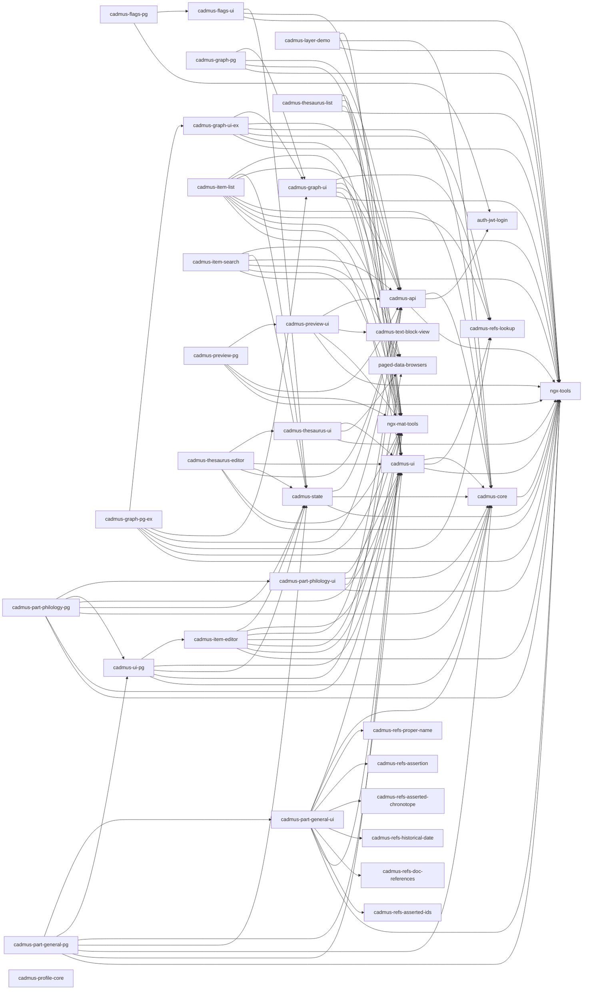

# Shell

Cadmus shell is the main repository for Cadmus frontend. It contains the editor's core components, and the most used part libraries (general and philology). Other shells exist for more specific knowledge domains.

- 🌐 <https://github.com/vedph/cadmus-shell-v3>

