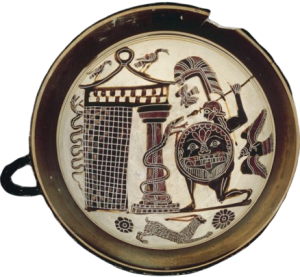
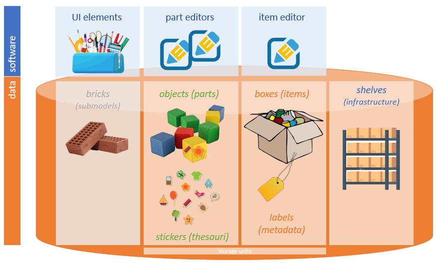

# Cadmus Documentation

Welcome to the Cadmus documentation. This is work in progress, and currently includes only a small subset of pages, progressively consolidating more sparse documentation provided at the level of each project. In the end, this will become a single documentation source for the Cadmus infrastructure.

>🌐 Cadmus code can be found in repositories at the [VeDPH GitHub](https://github.com/vedph/). You can find more information about these repositories in the Backend and Frontend section of this documentation.

## Overview

Cadmus is an open-ended, modular, and full-stack creation system for highly structured content, including text with any number of specialized annotation layers, and capable of multiple types of data export (including TEI) and import (mostly via the Proteus system).

The first public presentation of Cadmus is this recorded speech at [VeDPH](https://www.unive.it/pag/39287) seminars. Since then, its architecture and implementation have constantly evolved, but still retain the basic approach outlined there.

<iframe width="560" height="315" src="https://www.youtube.com/embed/lYykjz26TCg" title="Daniele Fusi, Presenting Cadmus: a general-purpose and modular content editing alternative" frameborder="0" allow="accelerometer; autoplay; clipboard-write; encrypted-media; gyroscope; picture-in-picture" allowfullscreen></iframe>

One of the key concepts in Cadmus is **reuse**, which is obtained via modularity, both in _data_ and in their _editor_ UI.

Using a metaphor, imagine a set of 📦 _boxes_ (named _items_), each representing a data record, whatever its type. Every box has a small 🏷️ _label_ (=an essential set of metadata), and may contain any number of 🚗 _objects_ (named _parts_; the name comes from the fact that they are the parts of a macro-model, built by aggregation). The boxes with these objects are stored on shelves, i.e. the database infrastructure.

>In turn, the objects contained in boxes are often built by assembling smaller pieces, known as _bricks_. For instance, the same wheels used in many different types of toy cars could be bricks. Bricks are small, frequently-reused sub-models, with their corresponding UI. For instance, a datation model can be reused in any object model including a datation; so we have a reusable brick model for it, and a corresponding brick UI component, which can be integrated in the object's editor UI. You can play with some stock bricks [here](https://cadmus-bricks.fusi-soft.com).

Optionally, you also have a set of 🖼️ _stickers_ you can attach to any of these objects; these are the [thesauri](models/thesauri), i.e. predefined (yet editable) taxonomies used in your data. For instance, think of an object representing a set of keywords to attach to your item; for each of these keywords, you might want to use a language identifier; and in its UI, the language might be selected from a dropdown list. This list of languages would thus be a thesaurus, having an entry for each language, with an ID (maybe an [ISO639](https://www.iso.org/iso-639-language-codes.html) language code) and a human-friendly label.

Every 🚗 object has its own data model, designed to be independent and reusable. So, the model of each 📦 box is _dynamic_, as it depends on the objects we put in it. This allows for a _modular_ and _open_ architecture, where models are built by progressive composition, and are [shared](models/shared) across several projects, thus fostering collaboration and reuse.

As for data, also their _editors_ are modular: for each object model there is a corresponding editing UI, so the full editor is just built by aggregation, too. UI modularity goes even beyond the object level, so that a lot of shared UI widgets ("bricks") are reused across many object editors and projects.

In addition, also _texts_ and all their _annotations_, whatever their complexity and overlap, are included in the same architecture. A text is just an object, put in a box like any other; and each type of annotation is another object too, put in the same box. So you have an object for each "layer" of annotations on top of the same base text, e.g. for critical apparatus, comments, orthographic deviations, ligatures, etc.

With such a layered text, users must no longer take care of manually marking up a text, which requires specific IT skills; nor they have to force its model in the cage of the constraints imposed by a specific serialization technology. Models are free to be designed in a more abstract way, taking care only of the knowledge domain they refer to. All what users must do is selecting the text they want to annotate, and clicking a button to get into the editor for the chosen annotation type. This will provide the full UI to cope with its specific model, just like for any other object: the composable editors can be as simple as a web form, or full-fledged web apps, or anything in between.

This way, new annotations can be added to the same text without affecting the existing ones, nor being affected by them. Adding a new layer is just tossing a new object in the same box; and everyone is free to design new layers with their models, as for any other object.

In the end, this brings together non textual data, textual data, and meta textual data, in an open-ended, modular architecture; and optionally allows you to define complex relationships across objects by projecting any subset of their data into a RDF-like graph, ready to be exported into a LOD cloud.

Finally, as a content editor Cadmus is located at the center of a potentially wider data flow, which may include data import (even when requiring complex remodeling) and data export. For instance, a number of [export modules](migration/index.md) allows you generating standard formats automatically: e.g. a full TEI XML document with standoff annotation, or a set of RDF entities, or whatever other format or technology. As the content created by the editor is just a standard NoSql database, all what you have to do is querying it for whatever purpose.

## Software Layers

Technically, the system is a _full-stack framework_ using a number of layers: from bottom to top, they are:

1. database layer ([MongoDB](https://www.mongodb.com), and [PostgreSQL](https://www.postgresql.org) for indexes and graph).
2. data layer ([C#](https://dotnet.microsoft.com/en-us/languages/csharp)).
3. business layer ([C#](https://dotnet.microsoft.com/en-us/languages/csharp)).
4. web API layer ([ASP.NET 9](https://www.asp.net)).
5. web frontend layer ([Angular 19](https://angular.io)).

A Cadmus editor, composed by aggregating existing parts or adding new ones, is _distributed_ via 🐋 [Docker](https://www.docker.com/) images, so that all what you need to run it, either locally or on a server, is a machine with Docker installed. Of course, given the layered architecture, you are free to replace the layers you want, e.g. to use a different frontend, or a different storage technology. Yet, in most cases you can just put together object models created for several projects, and have your own up and running in a few hours.

In the end, this tool will allow you to build your own data with your own models, getting a full, standard database for them (or any other resource derived from it, like a TEI document). Once you have the database, you can also grab it and do whatever you want with it, forgetting Cadmus altogether.

## Contents

### Data Models

- [models](models/index)
  - [shared models](models/shared)
  - [taxonomies: thesauri](models/thesauri)

### Data Migration

- [data migration](migration/index)
  - [graphs](migration/graph/index)
    - [adapters](migration/graph/adapters)
    - [mappings](migration/graph/mappings)
      - [JMES path](migration/graph/jmes-path)
    - [updating](migration/graph/updating)
    - [database](migration/graph/database)
    - [walking](migration/graph/walking)
      - [walking filters](migration/graph/walking-filters)
      - [walking API](migration/graph/walking-api)
      - [walking sample](migration/graph/walking-sample)
    - [graph studio](migration/graph/graph-studio)
      - [graph studio sample](migration/graph/graph-studio-samples)

### Backend

### Frontend

- [frontend](frontend/index)
  - [bricks](bricks)
  - [Cadmus shell](shell)
  - [bibliography shell](biblio-shell)
  - [geography shell](geography-shell)
  - [epigraphy shell](epigraphy-shell)
  - [codicology shell](codicology-shell)

### Deployment

- [deployment](deploy/index)
  - [setup](deploy/setup)
