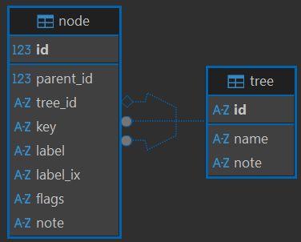

# Taxonomy Trees

- 🌐 [taxonomies store](https://github.com/vedph/taxo-store)
- ⚙️ [development](../develop/taxostore.md)

- [Taxonomy Trees](#taxonomy-trees)
  - [Store](#store)
  - [Data Source](#data-source)

Thesauri provide relatively short and stable taxonomies; they can be changed, either by editing or by importing them, but this usually does not happen often, and editing a thesaurus requires more access privileges.

So, thesauri are typically defined at project start in its seed profile (a JSON document) and possibly refined while using the editor.

Taxonomy trees are used for the same purpose of thesauri, but they are designed for a different scenario:

- **independent storage**: taxonomies are maintained in an independent store, completely self-contained and independent from the Cadmus database. This allows designing and implementing them as authority lists targeted to any consumer.
- **large data**: taxonomies are usually much larger than thesauri.
- **high granularity editing**: whatever the update strategy, thesauri are changed as a set. You edit or import a thesaurus as a whole set, even when you change a single entry in it. Taxonomy trees instead are edited at the maximum level of granularity, that of the single entry. For instance, it might happen that while describing an iconography with a set of descriptors from a closed vocabulary implemented as a taxonomy tree, users do not find a proper term, and want to add a new one: so, without leaving the part editor they are working in, they just add the new term and use it. This requires per-entry editing, as the taxonomy is large and shared, so that it might even be edited concurrently.

## Store

The [taxonomies store](https://github.com/vedph/taxo-store) is a totally independent system, which can be used even outside Cadmus, backed by a PostgreSQL database including trees and nodes.

In this store, each taxonomy is a **tree** with 1 or more root nodes; so it could be a flat list as well as a hierarchical list (which happens in most cases).

Users can browse and find nodes in a tree, and edit it. To provide an easy **editing** experience:

- each _tree_ (=taxonomy) has a string identifier and a human-friendly name.
- each _node_ has a string key and a human-friendly label. Internally, nodes use numeric IDs for performance reasons; but the software layer interacting with the database provides access to nodes via keys, which are designed to be unique within a single tree

Thus, to provide a global node identifier, the convention is using the tree ID (a string) + `/` + the node's key (a string). Of course, while working in the scope of a single tree the node key is enough.

Figure 1 shows the schema of the store:

- _Figure 1 - The taxonomy store database schema_

The taxonomies subsystem provides:

- full backend logic to manage taxonomies.
- API endpoints ready to be integrated in your API.
- [frontend components](https://github.com/vedph/taxo-store-shell) to integrate in your frontend. Cadmus provides a part editor based on these components.
- TODO UPDATE a Cadmus part, [taxonomies store tree nodes part](https://github.com/vedph/taxo-store/blob/master/docs/taxo-store-nodes.md), provides a ready to use part which allows user to pick nodes from any specific tree, while also editing it. This part lets you pick any number of node IDs from a single tree. The tree is specified as the part's role ID, and lookup and editing parameters can be customized via backend settings for each combination of part type ID and part role ID.

## Data Source

Taxonomies can have any data source. A CSV-based importer is provided, so that you can fully instantiate a taxonomies store by just providing a set of CSV files in your Cadmus API: the API will take care of creating the database if not found, and populating it from the CSV files.
