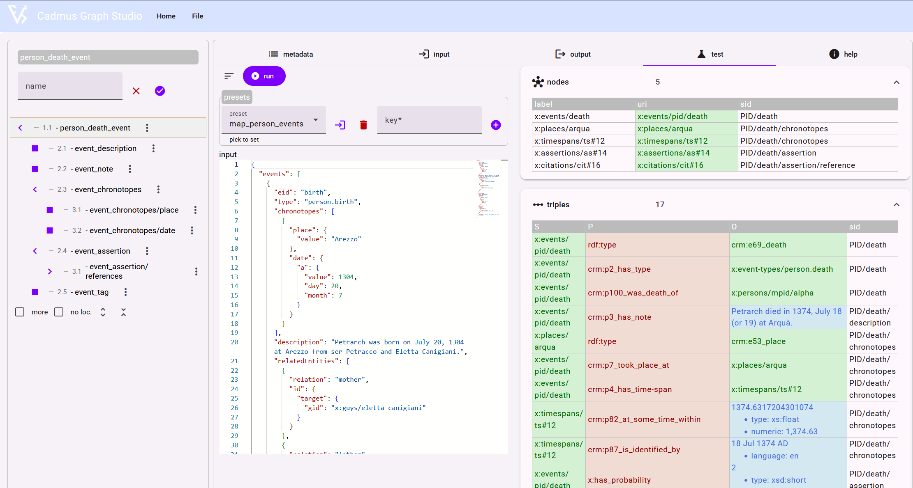

# Graph Studio Examples

- [Graph Studio Examples](#graph-studio-examples)
  - [Work](#work)
    - [Work Example](#work-example)
  - [Events](#events)
    - [Named Mappings](#named-mappings)
      - [Note](#note)
      - [Chronotope](#chronotope)
    - [Document Mappings](#document-mappings)
      - [Text Sent Event](#text-sent-event)
    - [Event Example](#event-example)

Let us consider a couple of example mappings for [Graph Studio](graph-studio.md). Say we have a Cadmus item representing a literary work, including:

- a metadata part which among others includes an `eid` metadatum, providing the user-friendly EID for the work.
- a historical events part, listing some events related to that work.

In mapping these data to the graph, for each work we want:

- a node representing the _work_.
- a number of nodes and triples representing _events_ involving that work.

Let us now consider the mappings for this output.

## Work

For each work, we want a node representing it, whose identifier must be both unique and human-readable. In Cadmus, the human readable identifier for an item (`EID`) can be provided inside a metadata part in that item, having a metadatum named `eid` whose value is equal to the human-readable ID.

So, in this example we assume that every work item has a `MetadataPart` with an entry named `eid` and a value equal to the human-friendly ID for that work. Thus, when mapping a work item we don't start from the item itself, but rather from its `MetadataPart`.

So, our mapping for the work will have a number of features we can group in the following sections:

- **metadata**: the mapping filters its input source data as it refers to a _part_ source, whose type is a _metadata_ part; also, such parts must belong to items with a `work` _facet_. This means that only items representing works (and not persons, manuscripts, etc.) will be considered.
- **input**: inside each matched metadata part, we must pick the metadatum entry with name=`eid`, and extract its value. This is the item's EID (the item's human-readable ID).
- **output**: we must create an entity (=a graph node) representing the work, assigning a globally unique identifier to it; and say that this entity is a CIDOC-CRM `E90_symbolic_object`.

We can build a globally unique identifier for the work by concatenating:

1. a conventional prefix we want to use for all our works, here `itn:works/`;
2. the item's globally unique ID (GUID), which is the internal ID of the item in Cadmus, but is not human-readable;
3. the item's human-readable ID (EID), as read from the metadata part.

The formal representation of this mapping in JSON is:

```json
{
  "name": "work",
  "sourceType": 2,
  "facetFilter": "work",
  "partTypeFilter": "it.vedph.metadata",
  "description": "Map a work item to a node via the item's EID extracted from its MetadataPart.",
  "source": "metadata[?name='eid']",
  "sid": "{$part-id}/{@[0].value}",
  "output": {
    "nodes": {
        "work": "itn:works/{$item-id}/{@value}"
    },
    "triples": ["{?work} a E90_symbolic_object"]
  }
}
```

As you can see, here `name`, `sourceType` (`2`=part, i.e. the source is a part rather than an item), `facetFilter`, `partTypeFilter`, and `description` refer to the mapping's metadata; these provide filtering for input data, an arbitrary name for the mapping, and its description.

Then, the `source` property determines the input data we select from our source object, here the metadata part. This JMES expression, `metadata[?name='eid']`, means:

- from our data object, select the property named `metadata`. This happens to be an array, i.e. a list of objects, each representing a metadatum with two properties: `name` and `value`.
- among the entries of this metadata list, select the one whose name is `eid`.

>The [SID](mappings.md#source-id-sid) (source ID) is an ID used by the mapper to identify the source data connected to this mapping. Whenever these data change (because a user saves a part matching this SID), Cadmus will be able to find which mappings should be run again to update the graph. The SID here is equal to the part's GUID suffixed with the EID.

Finally, the output is:

- a node representing the work. This has an UID built of a fixed prefix (`itn:works/`) for works; the item GUID; and the item EID.
- a triple saying that the work node is an `E90_symbolic_object`.

👉 Note that the same value of metadatum `eid` is recalled in two different templates in a different way. In the mapping properties, the SID refers to the JSON code returned by matching the source JMES expression, which is an array like:

```json
[
  { "name": "eid", "value": "alpha"}
]
```

So, in this case the `sid` property draws the value from the first item in the array: `[0].value`. When evaluating `output` instead, each matched item becomes the source; thus, we just include `value` in `output.nodes.work`, because now the context is just the object:

```json
{ "name": "eid", "value": "alpha"}
```

### Work Example

Let us see a concrete example, starting from this JSON input data which corresponds to the serialized data of a Cadmus metadata part, here having two entries, `eid` and `copyright`:

```json
{
  "metadata": [
    {
      "name": "eid",
      "value": "alpha"
    },
    {
      "name": "copyright",
      "value": "(C) some guy 2023"
    }
  ]
}
```

The above mapping produces 1 node and 1 triple:

- node:
  - URI: `itn:works/a3fee4e4-34e5-442c-978b-20e9fcd6af21/alpha`.
  - label: `itn:works/alpha`.
  - SID: `b43ac02a-728f-466b-8e69-df810871ab3d/alpha`.
- triple:
  - s: `itn:works/a3fee4e4-34e5-442c-978b-20e9fcd6af21/alpha` (the above node's URI).
  - p: `rdf:type`.
  - o: `E90_symbolic_object`.

>Note that, as per mapping, the GUID used in the SID refers to the `MetadataPart`, which effectively contains the work's EID; while the GUID used in the node representing the work is that of the work's item.

## Events

Events are complex entities, which produce several nodes and triples. Each event type has its mapping. The historical events part model in Cadmus is an array of objects of type `HistoricalEvent`:

- `events` (`HistoricalEvent[]`):
  - `eid` (`string`)
  - `type` (`string`)
  - `chronotope` (`AssertedChronotope`):
    - `place` (`AssertedPlace`):
      - `tag` (`string`)
      - `value` (`string`)
      - `assertion` (`Assertion`)
        - `tag` (`string`)
        - `rank` (`short`)
        - `references` (`DocReference[]`):
          - `type` (`string`)
          - `tag` (`string`)
          - `citation` (`string`)
          - `note` (`string`)
    - `date` (`AssertedDate`):
      - `a` (`Datation`):
        - `value` (`float`)
        - `isCentury` (`boolean`)
        - `isSpan` (`boolean`)
        - `month` (`short`)
        - `day` (`short`)
        - `isApproximate` (`boolean`)
        - `isDubious` (`boolean`)
        - `hint` (`string`)
      - `b` (`Datation`)
      - `tag` (`string`)
      - `assertion` (`Assertion`)
  - `assertion` (`Assertion`)
  - `relatedEntities` (`RelatedEntity[]`):
    - `relation` (`string`)
    - `id` (`string`)
  - `note` (`string`)

Some of the output data for such events, like those coming from an event's note or chronotope, always require the same mappings. Thus, rather than repeating all these mappings for each event in its descendants, we use a more compact notation, where shared mappings are under section `namedMappings`. Here, each of these mapping is under an arbitrary key. Later, in the `documentMappings` section, these mappings will be referenced by their key only. Once the software reads this JSON document, it will dereference mappings and supply other required values, like identifiers.

### Named Mappings

#### Note

Any event can have a short free-text note. The `note` property of the event in the source part is mapped to a triple having:

- the event as its subject.
- `crm:P3_has_note` as its predicate.
- the note itself as its literal object.

All the nodes/triples output by this mapping are under the SID of its parent mapping (assumed to be a metadatum named `id`) suffixed with `/note`.

#### Chronotope

Most events have a _chronotope_, i.e. the indication of its date and/or place. The mapping has two children for place and date:

- place:
  - 1 node with UID = `itn:places/` + the place's value (usually a canonical name or ID).
  - 2 triples which say:
    - this node is a `crm:E53_Place`;
    - event `crm:P7_took_place_at` this place node.
- date:
  - 1 node with UID = `itn:timespans/ts` + some arbitrary number.
  - 3 triples which say:
    - event `crm:P4_has_time_span` this timespan node.
    - this timespan node is located `crm:P82_at_some_time_within` the date's numeric value.
    - this timespan node `crm:P87_is_identified_by` the date's human-readable text.

All the nodes/triples output by this mapping are under the SID of its parent mapping (assumed to be a metadatum named `id`) suffixed with `/chronotope`.

### Document Mappings

#### Text Sent Event

- the SID is the part's GUID suffixed with the event's EID.
- input: the mapping matches only event parts from items with facet=`work`, and inside them targets events with name=`text.send` (which in turn is just the thesaurus ID for that event type).
- output:
  - metadata: `id`=part's GUID suffixed with event's EID.
  - nodes:
    - `event` node with UID = `itn:events/` + `id` metadatum.
  - triples:
    - `event` is a `crm:E7_Activity`;
    - `event` `crm:P2_has_type` `itn:event-types/text.send`
    - `event` `crm:P16_used_specific_object` + work's UID. As [explained above](#work), this is equal to the fixed prefix `itn:works/` followed by the item's GUID and the item's EID.

### Event Example

Let us start from this example event, representing the sending of a work (named _alpha_) at Arezzo in May, 1234, to the bishop of Arezzo via a person named Marco Barbadori:

```json
"events": [
  {
    "eid": "alpha-send",
    "type": "text.send",
    "chronotope": {
      "place": {
        "value": "Arezzo"
      },
      "date": {
        "a": {
          "value": 1234,
          "month": 5
        }
      }
    },
    "relatedEntities": [
      {
        "relation": "text:send:recipient",
        "id": "itn:persons/arezzo_bishop"
      },
      {
        "relation": "text:send:carrier",
        "id": "itn:persons/marco_barbadori"
      }
    ],
    "note": "The author sent his alpha work to the bishop of Arezzo in May, 1234 via Marco Barbadori."
  }
]
```

The root mapping is:

```json
{
  "name": "text sent event",
  "sourceType": 2,
  "facetFilter": "work",
  "partTypeFilter": "it.vedph.historical-events",
  "description": "Map text sent event",
  "source": "events[?type=='text.send']",
  "sid": "{$part-id}/{@[0].eid}",
  "output": {
    "metadata": {
      "id": "{$part-id}/{@eid}",
      "work": "itn:works/{$item-id}/{$item-eid}"
    },
    "nodes": {
      "event": "itn:events/{$id} itn:events/{@eid}"
    },
    "triples": [
      "{?event} a crm:E7_Activity",
      "{?event} crm:P2_has_type itn:event-types/text.send",
      "{?event} crm:P16_used_specific_object {$work}"
    ]
  }
}
```

This matches the historical events part of items of type `work`; inside its events, it matches the events of type `text.send`. The output is:

- 2 metadata for the event identifier (`id`), consisting of the part's GUID suffixed with the event's EID; and the work item UID (`work`), consisting of prefix `itn:works/` plus item GUID and item EID. This EID is extracted from the metadata part of the work item.
- 1 node named `event`, whose ID is prefix `itn:events/` plus the even identifier metadatum.
- 3 triples saying that:
  - the event is a `crm:E7_Activity`;
  - the event `P2_has_type` `itn:event-types/text.send` (such nodes are injected in the graph as presets from the corresponding thesaurus);
  - the event `crm:P16_used_specific_object` the work item; i.e. the work is the object being sent.

The children mappings of the root mapping provide more data for the event's note, place, and date:

```json
{
  "children": [
    {
      "name": "event_note"
    },
    {
      "name": "event_chronotope"
    },
    {
      "name": "text sent event/related/carried_out_by",
      "source": "relatedEntities[?relation=='text:send:sender']",
      "output": {
        "nodes": {
          "sender": "{@id}"
        },
        "triples": ["{?event} crm:P14_carried_out_by {?sender}"]
      }
    },
    {
      "name": "text sent event/related/has_participant",
      "source": "relatedEntities[?relation=='text:send:recipient']",
      "output": {
        "nodes": {
          "recipient": "{@id}"
        },
        "triples": ["{?event} crm:P11_has_participant {?recipient}"]
      }
    },
    {
      "name": "text sent event/related/has_participant",
      "source": "relatedEntities[?relation=='text:send:carrier']",
      "output": {
        "nodes": {
          "carrier": "{@id}"
        },
        "triples": ["{?event} crm:P11_has_participant {?carrier}"]
      }
    }
  ]
}
```

The first two children mappings are shared with other events, and thus get referenced by their key.

Then, a number of related entities for this event follow:

- the _sender_: this is a person node (`itn:persons/` + the related entity ID). A triple says that the event was carried out by this sender.
- the _recipient_: a person node, too. A triple says that the event had as participant the recipient.
- the _carrier_: a person node, too. A triple says that the event had as participant the carrier.

>Note that for simplicity this examples does not distinguish between the different roles of the participants. Of course, it would be easy to distinguish them by just using different predicates, derived from CIDOC-CRM P11 and specialized for specific roles.

The **output nodes** are (in what follows, the GUID, `dafb0766-bc89-4c21-99d7-8fc908a36a15`, is abbreviated as `GUID`; all the SIDs are equal to `GUID/alpha-send`):

| # | label                       | UID                         |
|---|-----------------------------|-----------------------------|
| 1 | itn:events/alpha-send       | itn:events/GUID/alpha-send  |
| 2 | itn:places/arezzo           | itn:places/arezzo           |
| 3 | itn:timespans/ts            | itn:timespans/ts            |
| 4 | itn:persons/arezzo_bishop   | itn:persons/arezzo_bishop   |
| 5 | itn:persons/marco_barbadori | itn:persons/marco_barbadori |

The first node (1) is emitted by the root mapping for the event; the other nodes (2-5) are emitted by children mappings.

>Note that the sending event UID (1) combines the part's GUID with the event's EID, thus ensuring that the event gets a globally unique identifier. Also, all the timespans emitted by similar mappings use the sample template `itn:timespans/ts` (3); in the case of many timespans, the mapper will ensure that each emitted timespan gets a unique ID by suffixing this with an arbitrary number.

The **output triples** are (all the SIDs are equal to `GUID/alpha-send`):

| #  | S                          | P                            | O                                               |
|----|----------------------------|------------------------------|-------------------------------------------------|
| 1  | itn:events/GUID/alpha-send | rdf:type                     | crm:e7_activity                                 |
| 2  | itn:events/GUID/alpha-send | crm:p2_has_type              | itn:event-types/text.send                       |
| 3  | itn:events/GUID/alpha-send | crm:p16_used_specific_object | itn:works/ecf37ac9-1909-4685-b369-04f30ca7d852/ |
| 4  | itn:events/GUID/alpha-send | crm:p3_has_note              | The author sent ... via Marco Barbadori.        |
| 5  | itn:places/arezzo          | rdf:type                     | crm:e53_place                                   |
| 6  | itn:events/GUID/alpha-send | crm:p7_took_place_at         | itn:places/arezzo                               |
| 7  | itn:events/GUID/alpha-send | crm:p4_has_time_span         | itn:timespans/ts                                |
| 8  | itn:timespans/ts           | crm:p82_at_some_time_within  | 1234.4166666666667                              |
| 9  | itn:timespans/ts           | crm:p87_is_identified_by     | May 1234 AD                                     |
| 10 | itn:events/GUID/alpha-send | crm:p11_has_participant      | itn:persons/arezzo_bishop                       |
| 11 | itn:events/GUID/alpha-send | crm:p11_has_participant      | itn:persons/marco_barbadori                     |

Here, triples 1-3 have been emitted by the root mapping, and say that:

- the event is of type `E7_Activity`;
- the event `P2_has_type` send;
- the event involved (`P16_used_specific_object`) the work object.

The other triples are emitted by children mappings:

- 4 is emitted by matching the event's `note`, and its object is just the note's text.
- 5-6 are emitted by matching the event's chronotope place; they say that the event took place at Arezzo, which is an `E53_place`.
- 7-9 are emitted by matching the event's chronotope date; they say that the event took place at about 1234, a timesapan with a human-friendly expression "mag 1234 AD".
- 10 is emitted by matching the recipient.
- 11 is emitted by matching the carrier.

Here is the output as shown in the mapping runner UI:



>Note that literal values (in blue) may have additional metadata, like the timespan's value, which has a data type and its numeric value, or the timespan's text, which has English language (the standard in displaying dates, whereas the note is Italian, the default language of this sample project).
