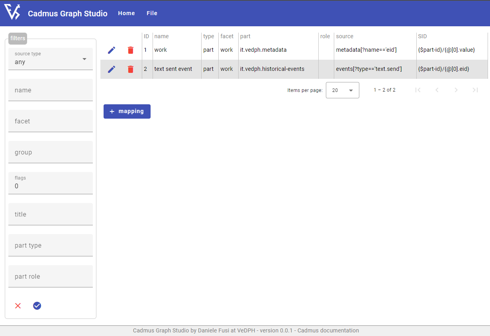
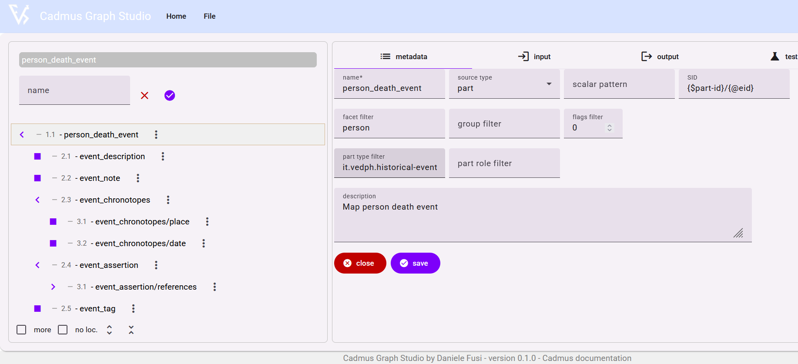
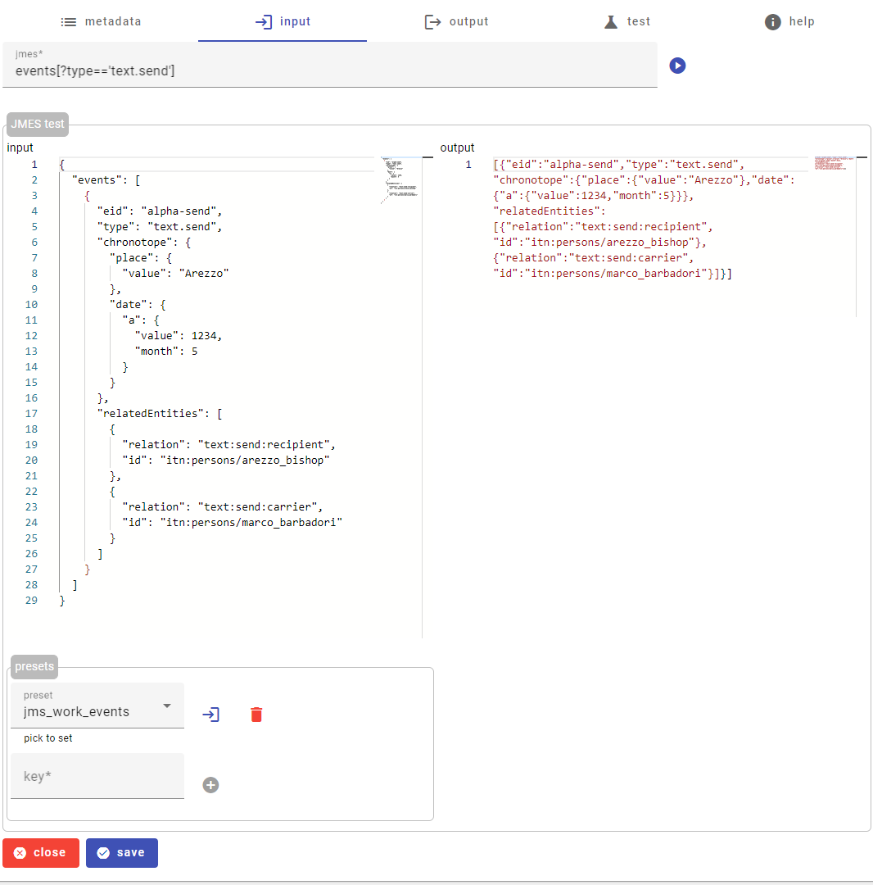
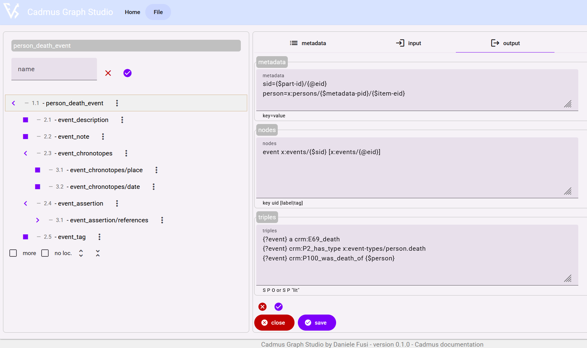
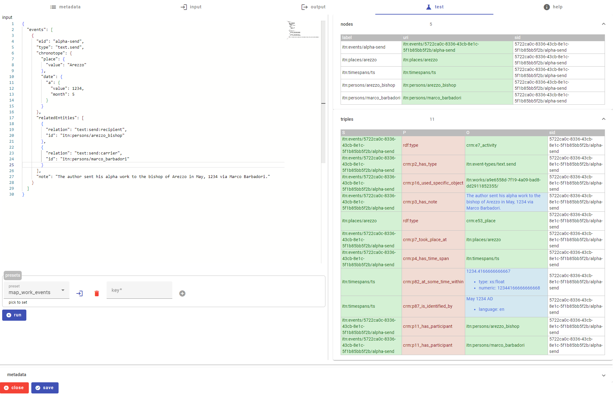

# Graph Studio

- 🛠️ [source code](https://github.com/vedph/cadmus-graph-studio-app-v2)
- 💼 [online tool](https://cadmus-graph-studio.fusi-soft.com/) ⚠️ This is a preview of the new app, which was being rebuilt for Angular 20+ and a newer set of libraries. Currently it's mostly used for testing mappings, as its editing functions have not yet been tested.

Cadmus Graph Studio is an essential tool designed to ease the creation of [graph mappings](mappings). This minimalist tool is almost server-less, except for the fact that an API backend is provided to test [JMES Path expressions](https://jmespath.org) and mappings.

No database is required; you just create your mappings, and get the corresponding JSON document defining them. You will then be able to use the [Cadmus CLI tool](https://github.com/vedph/cadmus_tool) to import mappings in the database from this document. You can also import such a JSON document, edit it in the tool, and export it again.

- to **view the JSON document** representing all the mappings, use command `File/View mappings`.
- to **download the JSON document** representing all the mappings, use command `File/Export mappings`.
- to **import mappings from a JSON document**, open the mappings view (`File/View mappings`), modify or replace the JSON code representing mappings, and click the import button.
- to **clear all the mappings**, use command `File/Clear mappings`.

## Mappings List

The tool's homepage provides a paged list of mappings. To start with, some preset mappings are used as examples. You can import your own mappings, or just delete these samples and start from scratch. Different preset mappings and sample data can be selected from the selectors at the top of the list.



If you have a lot of mappings, you can use the left filters pane to filter the list according to any combination of the available parameters.

From this list, you can edit or delete any existing mapping, or add new ones.

## Mapping Editor

The mapping editor includes the following sections:

- metadata: mapping's metadata.
- input: selection of mapping's input data.
- output: mapping's output.
- test: tester for the mapping.
- help: quick help text.

Also, as often mappings have descendant mappings, these are represented as a tree in the editor. You can edit any of the mappings in the tree by just clicking it. When switching between branches, your changes are automatically saved. From the same tree you can also remove mappings or add new mappings. Anyway, no edit is committed until you click the `save` button, which saves the root mapping with all its descendants.

### Metadata



The metadata section includes the mapping's metadata:

- a user-friendly name. It is suggested you apply some naming conventions for the mappings, as they can grow very quickly. Typically we name mappings after their source, e.g. `events` for an events part, `events - type` (or any other conventional syntax, e.g. `events.type`) for the `type` property of an event, and the like.
- the type of data source: item or part.
- the source ID (SID).
- the facet, group, and flags filters.
- the part type and role filters.
- a short description of the mapping. It is suggested you summarize here the mapping's task and its output.

### Input



The input section selects the input data for the mapping via a [JMES Path expression](https://jmespath.org). You can test your expressions directly in the UI, by setting an input JSON document, and clicking the _run_ button next to the expression. You will get the output in the corresponding pane.

Often you may want to reuse your test data; to this end, you can use presets. To define a new preset, just enter its text in input, and its key (any arbitrarily defined name); then click the _add preset_ button. Once added, the preset is available from the list of presets to be inserted in the input pane. If desired, you can remove a preset by selecting it and clicking the _delete_ button.

You are free to edit your presets, as none will survive the current edit session.

### Output



The output section defines the mapping's output, structured in 3 categories:

- **metadata**: add any number of metadata, each in a line with format `name=value`.
- **nodes**: add any number of nodes, each in a line with format `key UID label [tag]`, where only `key` and `UID` are required.
- **triples**: add any number of triples, each in a line with format `subject predicate object` or `subject predicate "literal object"`.

### Test



The test section allows you to test your mapping against some test data. As for JMES Path, you can use presets to store and reuse input data.

To test your mapping:

1. enter your source data (a JSON document) in the input pane. You can use the presets selector to pick a predefined document, or just paste or type something.
2. if required, enter the mock metadata for your data source: expand the `metadata` section, and enter those metadata you would require:

   - item ID: the item GUID. The default is just `IID` which is a placeholder, so that the output is more compact and readable.
   - part ID: the part GUID. As above, the default is just `PID`.
   - part type ID: the part type ID.
   - part role ID: the part role ID.
   - facet ID: the item's facet ID.
   - item title: the item's title.
   - item URI: the URI of the item, e.g. `x:persons/petrarch`. In real-world, this is built by the mapping infrastructure from item data, and passed to mappers via metadata.
   - item label: the item's label.
   - item EID: the item's EID (a human-friendly identifier for the item, typically used in linking or here to build user-friendly UIDs). This comes from the `eid` metadatum in the metadata part of any item.
   - metadata part ID: the ID of the metadata part of the item. This is a GUID, but again the default is just `MPID`.
   - group ID: the item's group ID.
   - flags: a numeric 32-bit unsigned integer corresponding to the item's flags value.

3. click the _run_ button: you will see the list of all the nodes and triples generated by the mapping rule and all its descendants. In the tables, green is used for URIs; red for predicates; and blue for literal objects.

## Presets

### Person

This rule is a minimalist mapping which maps a person item to a node via the item's EID extracted from its metadata part. It assumes you have:

- a Cadmus item representing a person, whose facet is named `person`.
- a [metadata part](https://github.com/vedph/cadmus-general/blob/master/docs/metadata.md) in this item, including an `eid` metadatum with the person's user-friendly ID.

The mapping has:

- **metadata**: it matches parts of type metadata in each item whose facet is `person`; the SID is the value of the metadatum with name=`eid`.
- **input**: `metadata[?name=='eid']` selects the metadatum object with name=`eid`.
- **output**:
  - **nodes**: `person x:persons/{$part-id}/{@value} [x:persons/{@value}]`. The format of the output node expression is `key uid [label|tag]`, i.e. here the node's key is `person`, its UID template is `x:persons/{$part-id}/{@value}`, and its label template is `x:persons/{@value}`. The key is used only during mapping to provide a quick refrence to the node in other mappings.
  - **triples**: `{?person} a crm:E21_person`: this says that the person node (here referred via its key) is of type `E21_person` using CIDOC-CRM.
- **test**: enter the JSON of a metadata part, e.g.:

```json
{
  "metadata": [
    {
      "name": "eid",
      "value": "alpha"
    },
    {
      "name": "copyright",
      "value": "(C) some guy 2023"
    }
  ]
}
```

When you click `run`, you get the output nodes and triples generated by this mapping.

### Person Birth Event

This rule maps a the birth event from an events part belonging to a person item. So this assumes you have:

- a Cadmus item representing a person, whose facet is named `person`.
- a [metadata part](https://github.com/vedph/cadmus-general/blob/master/docs/metadata.md) in this item, including an `eid` metadatum with the person's user-friendly ID.
- an [events part](https://github.com/vedph/cadmus-general/blob/master/docs/historical-events.md) in this item, including an event of type `person.birth`.

The mapping has:

- **metadata**: it matches parts of type metadata in each item whose facet is `person`; the SID is the `eid` property of the selected event.
- **input**: `events[?type=='person.birth']` selects the event object with type=`person.birth`.
- **output**:
  - **metadata**: these metadata are defined to support output mapping and are valid only within it:
    - `sid`: the SID of the event, as described above.
    - `person`: the person's human-friendly ID got from its metadata part.
  - **nodes**: `event x:events/{$sid} [x:events/{@eid}]`.
  - **triples**:
    - `{?event} a crm:E67_birth`: the event is of type birth in CIDOC-CRM.
    - `{?event} crm:P2_has_type x:event-types/person.birth`: the event has a specific custom type from the events thesaurus.
    - `{?event} crm:P98_brought_into_life {$person}`: the event brought our person (Petrarch) into life.
- **test**: pick from presets the `map_person_events` preset and enter it in the input box by clicking the button next to it. Then click the `run` button.

### Person Death Event

This rule maps a the death event from an events part belonging to a person item. It is similar to the birth event, except that it uses different predicates.

### Help

This pane contains quick information about the mapping model, with links to the full documentation.
