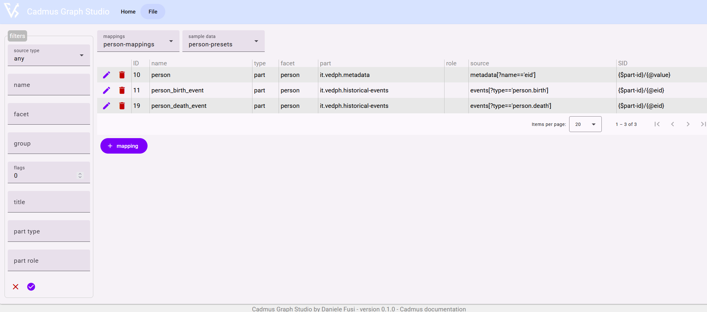
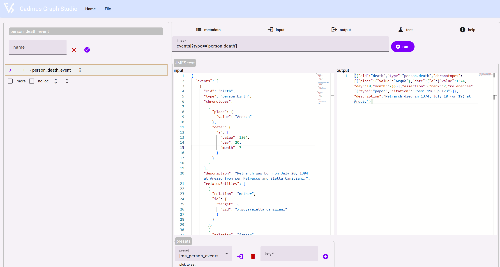

# Graph Studio

- 🛠️ [GitHub code repository](https://github.com/vedph/cadmus-graph-studio-app)
- 💼 [online tool](https://cadmus-graph-studio.fusi-soft.com/)

Cadmus Graph Studio is an essential tool designed to ease the creation of [graph mappings](mappings.md). This minimalist tool is almost server-less, except for the fact that an API backend is provided to test [JMES Path expressions](https://jmespath.org) and mappings.

No database is required; you just create your mappings, and get the corresponding JSON document defining them. You will then be able to use the [Cadmus CLI tool](https://github.com/vedph/cadmus_tool) to import mappings in the database from this document. You can also import such a JSON document, edit it in the tool, and export it again.

- to **view the JSON document** representing all the mappings, use command `File/View mappings`.
- to **download the JSON document** representing all the mappings, use command `File/Export mappings`.
- to **import mappings from a JSON document**, open the mappings view (`File/View mappings`), modify or replace the JSON code representing mappings, and click the import button.
- to **clear all the mappings**, use command `File/Clear mappings`.

## Mappings List

The tool's homepage provides a paged list of mappings. To start with, some preset mappings are used as examples. You can import your own mappings, or just delete these samples and start from scratch.

If you have a lot of mappings, you can use the left filters pane to filter the list according to any combination of the available parameters.

From this list, you can edit or delete any existing mapping, or add new ones.

## Mapping Editor

The mapping editor includes the following sections:

- metadata: mapping's metadata.
- input: selection of mapping's input data.
- output: mapping's output.
- test: tester for the mapping.
- help: quick help text.

Also, as often mappings have descendant mappings, these are represented as a tree in the editor. You can edit any of the mappings in the tree by just clicking it. When switching between branches, your changes are automatically saved. From the same tree you can also remove mappings or add new mappings. Anyway, no edit is committed until you click the `save` button, which saves the root mapping with all its descendants.

### Metadata

The metadata section includes the mapping's metadata:

- a user friendly name.
- the type of data source: item or part.
- the source ID (SID).
- the facet, group, and flags filters.
- the part type and role filters.
- a short description of the mapping.

### Input

The input section selects the input data for the mapping via a [JMES Path expression](https://jmespath.org). You can test your expressions directly in the UI, by setting an input JSON document, and clicking the _run_ button next to the expression. You will get the output in the corresponding pane.

Often you may want to reuse your test data; to this end, you can use presets. To define a new preset, just enter its text in input, and its key (any arbitrarily defined name); then click the _add preset_ button. Once added, the preset is available from the list of presets to be inserted in the input pane. If desired, you can remove a preset by selecting it and clicking the _delete_ button.

You are free to edit your presets, as none will survive the current edit session.

### Output

The output section defines the mapping's output, structured in 3 categories:

- **metadata**: add any number of metadata, each in a line with format `name=value`.
- **nodes**: add any number of nodes, each in a line with format `key UID label [tag]`, where only `key` and `UID` are required.
- **triples**: add any number of triples, each in a line with format `subject predicate object` or `subject predicate "literal object"`.

### Test

The test section allows you to test your mapping against some test data. As for JMES Path, you can use presets to store and reuse input data.

Once you have entered your data as a JSON document in the input pane, just click the _run_ button: you will see the list of all the nodes and triples generated by the mapping rule and all its descendants.

In the tables, green is used for URIs; red for predicates; and blue for literal objects.

### Help

This pane contains quick information about the mapping model, with links to the full documentation.
