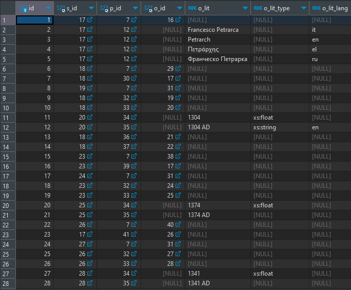

# Walking Graph Sample

The video below shows a sample walk session:

<iframe width="560" height="315" src="https://www.youtube.com/embed/P0TlqbOi590" title="YouTube video player" frameborder="0" allow="accelerometer; autoplay; clipboard-write; encrypted-media; gyroscope; picture-in-picture; web-share" allowfullscreen></iframe>

This demo relies on a mock dataset, whose nodes are listed in this picture:

In the video, we start walking from Petrarch node, whose ID is 17 in this table. Note that this node also has a [SID](graph-mappings.md#source-id-sid), because it was derived from mapping a Cadmus part. You can also see that a number of nodes represent predicates, and are thus tagged with `property`; while other nodes represent classes (`is_class`=1). Typically, predicates are injected in the graph at an earlier stage, and are used by mapping rules.

The nodes can then be used as the building blocks of triples:

As every node is identified by a numeric ID, and also predicates are represented here as nodes, a triple is just linking three different numeric IDs for subject (`s_id`), predicate (`p_id`), and object (`o_id`), unless the object is a literal, with its value and metadata like data type and language (`o_lit`, `o_lit_type`, `o_lit_lang`).

For instance, the first row having 17 (=`Petrarch`), 7 (`is-a`), and 16 (`Person class`) says that Petrarch is a person.

(1) If we start our walk from Petrarch, at first we get this graph:

Here the central node, Petrarch, is the origin; 3 groups of predicates start from it (outbound nodes), while 2 end into it (inbound nodes). In other terms, Petrarch is the subject of a number of triples having as predicates `rdf:type`, `rdfs:label`, and `crm:P11i_participated_in`; the numbers in the squares representing these groups of predicates tell how many triples are inside each group. This is much more compact than directly visualizing all the connections to other nodes stemming from Petrarch. Additionally, Petrarch is also the object of 2 other groups of predicates, `crm:P98_brought_into_life` and `crm:P93_took_out_of_existence`: it is easy to predict that their subjects will be a birth and a death event, respectively.

(2) we can now start exploring the graph in any direction. By double clicking node 4 from `rdfs:label` we get 4 literal nodes, each representing a literal value for a label in a given language. These are the labels attached to the Petrarch node (for Italian, Russian, Greek, and English).

>As you can see, literal nodes are gray.

Of course, literal nodes are terminal nodes, so no longer expansion is possible here. Also, note that each single node in the walker mantains a filters and paging data, so that at any time and from any node you can narrow the visualization to focus on what you are looking for. For instance, here we just have 4 languages: but it might happen that our node has dozens of different languages. Instead of visualizing all of them at once, the property group node shows a virtual "page" at a time; further, you can filter out all the unwanted nodes which might clutter the visualization. So, we might want to see only English labels; this is done by applying a filter at the level of the current node (square 4 from `rdfs:label`). Next to the graph the walker shows a number of tools, mostly including filters, which vary according to the selected node. In this case, we are applying a language filter in the group of literal filters, so that we see only English (`en`):

The result is now filtered to include only the English label:

(3) With just 4 languages this is not that useful, but it might be handy when dealing with a lot of them. Meanwhile, we remove the filter to get all the languages back, and continue walking. This time we expand the group from `rdf:type`, and we get to a `Person class node`. This visually reflects the triple with ID 1 we explained above:

(4) Again, we can expand the last outbound group, `crm:P11i_participated_in`, and we find a meeting node:

(5) We can now start expanding the inbound groups: `crm:P98_brought_into_life` takes us to the subject of this triple (whose object is Petrarch), a birth event:

(6) Similarly, we can expand the other inbound group, for death:

(7) There is no limit to expansion. We can continue by expanding the birth node. In this case, we get a number of outbound links: one of them already existed, and connected Petrarch to his birth; but the birth node has other outbound property groups: `crm:P96_by_mother`, `crm:P97_by_father`, `crm:P7_took_place_at`, and `crm:P4_has_time_span`. As you can guess, these links are going to specify Petrarch's mother and father, and his place and date of birth:

(8) We can now expand all these groups, to see the objects of each corresponding triple: so, the object of by-mother predicate is Eletta Canigiani; the object of by-father predicate is Ser Petracco; the object of took-place-at predicate is Arezzo; and the object of has-timespan is a time span:

(9) In turn, the timespan can be further expanded: we thus discover that it's the subject of two triples, one with predicate `crm:P82_at_some_time_within`, and another with predicate `crm:P87_is_identified_by`. This is because the timespan has a numeric value (expressed with P82) and a text value representing it (expressed with P87). This derives from mapping the Cadmus historical date model.

(10) In fact, if we further expand these predicates we end up with two literal values: a numeric value, `1304`, and a string value, `1304 AD`:

The process might continue indefinitely, but that's enough to show how the walker can be used in the context of a Cadmus-generated graph. We have started walking from a single node, and expanded all its connections up to other nodes of the graph, visually unveiling the data shown in the above tables. At any time, full filtering and pagins is available for each single node of the graph.

Typically, the walker is used to explore the graph and locate the node to edit, or see how all the nodes either created by projection or manually added get composed in the bigger picture.
