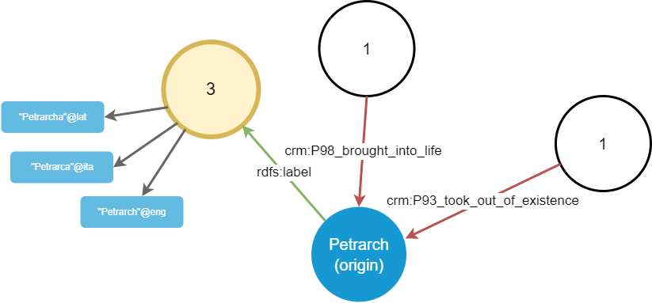
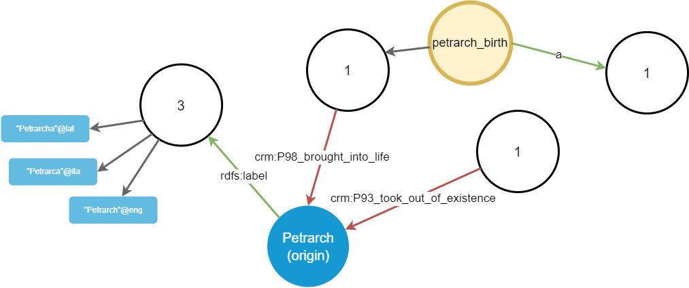
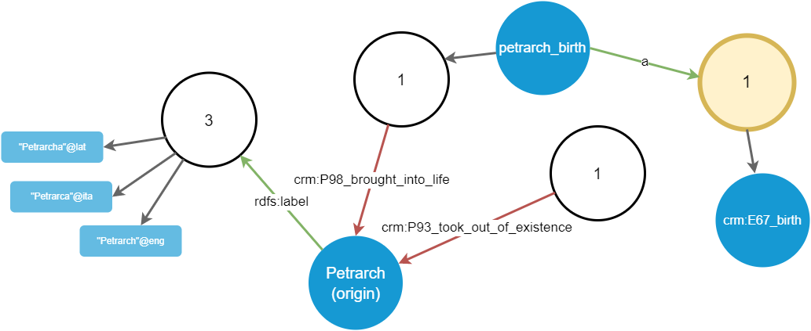

# Graph Walking

- [Graph Walking](#graph-walking)
  - [Example](#example)
    - [Step 1](#step-1)
    - [Step 2](#step-2)
    - [Step 3](#step-3)
    - [Step 4](#step-4)
    - [Step 5](#step-5)

The walker is used to traverse the graph by exploring the connections of an arbitrarily chosen starting node in it. Its UI provides an easy way of getting to the desired node, while also visualizing the connections of a specific node.

As the graph may quickly grow up in size, it would be impractical to represent all the nodes and their links (edges) at once; the graph would be barely readable, overcrowded by a high number of overlapping shapes and lines. The solution adopted in the editor, where users may want to explore the relations starting from an object towards any other object, is displaying nodes and edges as you walk across the graph. Also, all the edges of the same type are initially grouped under a single graphical element (a _properties group_).

So, you start from a single node, and just see all its "outbound" (i.e. where this node is the subject) and "inbound" (i.e. where this node is the object) links, grouped by type, with their counts. For instance, if the node has 4 labels in 4 different languages, you won't see 4 links, but just a node representing their group. When you double click it, it will expand into those 4 links, each leading to another node. In the same way, you will be able to walk along all the links, from node to node, progressively unveiling the graph.

Additionally, a number of [filters](walking-filters) are available to be freely combined, so that you see only those links or nodes you are interested in. These filters vary according to the node selected while walking, and each node retains its own filtering state.

For instance, say you start from the node representing Petrarch; you can see a list of links connected to it. As these might quickly grow, we cannot display all of them at once: it would be both confusing and slow. Rather, we adopt a filtering and paging strategy, consisting of three sets of links:

- "outbound" links: links to nodes, i.e. triples where our chosen origin node is the subject of a triple having a non-literal node as its object.
- "literal" links (always outbound by definition): links to literals, i.e. triples where our chosen origin node is the subject of a triple having a _literal_ node as its object.
- "inbound" links, i.e. triples where our chosen origin node is the _object_. On the other end (the subject end) we will necessarily have a non literal node.

Each of these sets has its filters and paging options, so that users can further refine the visualization by removing unnecessary links and nodes.

To avoid polluting the visualization and provide a visual anchor for filtering and paging, we don't directly represent links on the node; rather, we represent groups of links, each with a number equal to the count of all the links of a specific type.

## Example

As a simple example, say we have these triples connected to the origin node representing Petrarch:

```turtle
x:guys/francesco_petrarca rdfs:label "Petrarca"@ita
x:guys/francesco_petrarca rdfs:label "Petrarch"@eng
x:guys/francesco_petrarca rdfs:label "Petrarcha"@lat

x:events/birth crm:P98_brought_into_life x:guys/francesco_petrarca
x:events/death crm:P93_took_out_of_existence x:guys/francesco_petrarca
```

Of course, in turn these nodes are connected to other nodes in the graph; but at start we limit ourselves to the triples involving our origin node, either as a subject or as an object.

>👉 For a real-world walk example see [this page](walking-sample). Technical documentation about its API is [summarized here](walking-api).

### Step 1

This first step is shown in Figure 1:


Figure 1 - Walking from origin node

With relation to the origin node, the first 3 triples are outbound, while the last 2 triples are inbound:

- the outbound triples all share the same predicate (`rdfs:label`), so we just have a single shape out of the origin node, with its count=3. Optionally, we might also want to draw these shapes proportionally to their counts.
- the inbound triples have each one its own predicate; so we have two shapes connected to the origin node, with their count=1.

>Note: getting a page of groups of triples connected to an origin node is done via repository `GetTripleGroups`, which receives the paging, filtering, and sorting parameters, and returns the requested page with triple predicates and their totals.

So, we start with a minimalist visualization, where the origin node is linked to shapes representing groups of triples linked to that node, with their count. The user can now start walking in any direction.

### Step 2

Say that now the user picks the `rdfs:label` shape linked to the origin node. In this case, this expands into 3 literals, representing 3 labels attached to Petrarch in different languages. The result is represented in Figure 2.



Figure 2 - Walking from the rdfs:label group

>Note: this is done via repository `GetLinkedNodes` and `GetLinkedLiterals`.

Once we have nodes, the walking process can cyclically resume from them, by focusing on each desired node in turn.

### Step 3

Going on, the user now picks the `crm:P98_brought_into_life` property group, connected to the origin node as an inbound link. It projects a further node, which is the `petrarch_birth` event (Figure 3).


Figure 3 - Walking from the crm:P98_brought_into_life group

### Step 4

Again, the user picks the newly added `petrarch_birth` node. This projects another property group, corresponding to predicate `a` (Figure 4).



Figure 4 - Walking from the petrarch_birth node

### Step 5

Finally, the user picks this newly added `a` group, which in turn projects a `crm:E67_birth` node, which is the object of the triple. In other terms, this means that the `petrarch_birth` event is classified as a birth event (Figure 5).



Figure 5 - Walking from the a group of petrarch_birth node

The example might continue indefinitely, visualizing a graph built by progressive additions, yet compact and readable thanks to paging and filtering. We are thus walking the graph piece by piece, driven only by our choices. This helps users focus on their paths, without being confused by the huge amount of other connections. Each property group shape is the handle used to further refine filtering for its projections, and for navigating across their pages.

So, in the end we just have 3 types of shapes in this graph:

1. shapes representing non-literal nodes (N). These project groups of predicates from an origin node.
2. shapes representing property groups (P), i.e. groups of links sharing the same predicate, and the same node as one of the terms of the triple, either the subject ("outbound links") or the object ("inbound links"). These project nodes from a predicate (in turn connected to another node, being either its subject or its object).
3. shapes representing literals (L). These are terminals and do not project anything.
