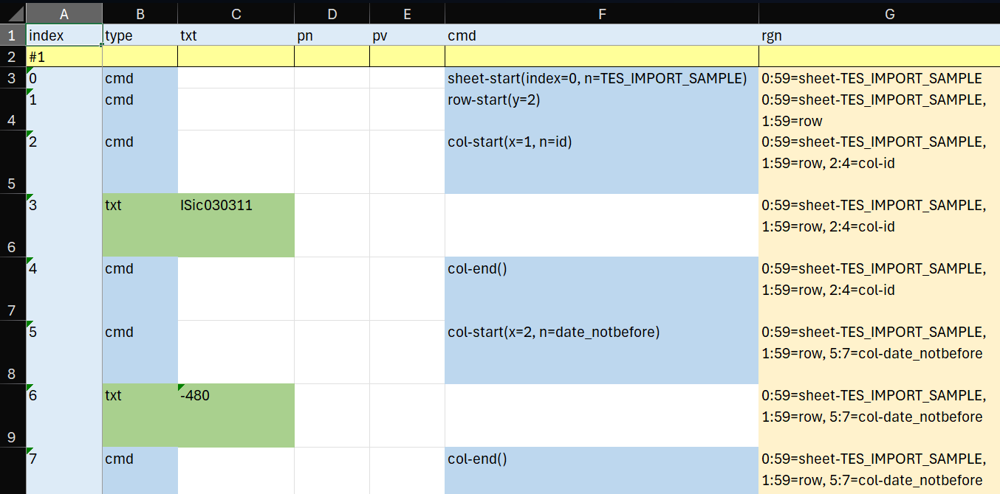

# Importing Excel Data

This procedure is an example of importing items from a spreadsheet into a Cadmus database via the Proteus conversion framework.

- [example: TES import tool](https://github.com/vedph/cadmus-tes/tree/master/tes-tool)

## Leveraging Proteus

In short, Proteus adapts any input source to a list of so-called decoded entries. A **decoded entry** is _the smallest meaningful unit of input for conversion_. There are three types of decoded entries:

- `T` (text entry) — raw text fragments.
- `P` (property entry) — simple style properties (bold, italic, color, etc.).
- `C` (command entry) — structural or metatextual commands with arguments.

The following list is a set of decoded entries from a text paragraph with the word "world" in bold:

```txt
C block(open=1)
T Hello, 
P bold=1
T world
P bold=0
T !
C block(open=0)
```

Here a command starts the block, followed by normal text; then bold opens, followed by bold text; and it closes after it, followed by normal text again. Finally, the block is closed.

In the case of a spreadsheet import, we assume that each record to import is a row in the source spreadsheet. Each row is decoded into a set of entries:

1. for each sheet: `C sheet-start(index=INDEX, n=NAME)` ... `C sheet-end()`.
2. for each row:  `row-start(y=N)` ... `C row-end()`.
3. for each column in each row: `C col-start(x=N, n=COLUMN_NAME)`, `T ...`, `C col-end()` where the text entry contains the cell's value.

For instance, these entries represent the first 3 cells of the first row of the first sheet in a source spreadsheet:

```txt
C sheet-start(index=0, n=Foglio1)

C row-start(y=2)

C col-start(x=1, n=object_name)
T ih00232000_00200777_a2r_(1)
C col-end()

C col-start(x=2, n=folio)
T a2r
C col-end()

C col-start(x=3, n=object_measures_(h_x_w))
T 48x75
C col-end()
```

So, the idea is to parse one row at a time, and within it one cell at a time; for each cell type, a specific logic can be used.

Proteus typically leverages a conversion pipeline which gets such entries as its input. Among its component, a core family of components is typically represented by **region detectors**. The task of these components is to detect semantically defined regions within the list of decoded entries.

In the case of the spreadsheet, a simple stock Proteus _region detector_ is used to define a region for each sheet, row, and column. Column region names start with `col-` followed by the column's label (where spaces are converted to `_` and text is lowercased).

So, if you want to process a cell labelled "Origin latitude" in your spreadsheet you just handle the region named `col-origin_latitude` via a corresponding region parser. The Proteus import infrastructure will use all the region parses you configure in the import profile, calling them in the order in which columns are read (from left to right: A, B, C, etc.).

Thus the import logic is a collection of very simple region parser modules. Each knows exactly how to parse the received cell, and what to do with its parsed data: typically it adds a part to the item being built, and fills some of its properties with parsed data.

This allows for a highly modular approach, where you just create a region parser for each region (=column) you want to import. Typically, each parser builds a part and adds it to the item corresponding to the current row; or just adds more metadata to the item; or build some temporary structure to be progressively completed while combining multiple cells together.

In the end, the item built can be exported both for dumping and for import purposes, using e.g. these **exporters** from their respective profiles:

- an _Excel dump exporter_, to see all the decoded entries with their regions.
- a _Markdown dump exporter_, to see all the items with their parts.
- a _MongoDB exporter_, to store the items in a target Cadmus database.

## Using Tool

To use any of the profiles for dumping or importing data, run your tool like:

```sh
./your-tool-name import YOUR_PROFILE_PATH
```

### Log File

Whenever you run the tool, it creates a plain text file in its executable folder, named after the Cadmus project plus suffix `-log` and the current date. You should first inspect it and consider any error or warnings found in it.

The log file contains one line per log message, with `[ERR]`=error, `[WRN]`=warning, `[INF]`=information (just an informative line), e.g.:

```txt
2026-07-27 09:35:12.925 +02:00 [INF] Reading set #1
2026-07-27 09:35:12.962 +02:00 [INF] -- ROW: 2
2026-07-27 09:35:12.993 +02:00 [ERR] Unknown value for col-material: "lead" at region 32:34=col-material
...
```

Whenever you find an error, it is either an error in the source data (the spreadsheet being imported) or a design or implementation bug in the corresponding parser. You need to fix it and re-run the importer until all errors are cleared.

### Excel Dump

The Excel dump shows the list of decoded entries (Figure 1).



- _Figure 1 - Excel dump_

- each entry is a row, and each set is introduced by a yellow header.
- the type column says the type of the entry: text, property or command.
- the text column shows the value of the text when the entry has this type.
- in a similar way, property name and value show the name and value of a property entry, and command shows the command.
- the rightmost column contains the list of all the regions which include the entry.

In Figure 1 the first two columns of the first row of an example import file appear, from top to bottom:

- a command for the sheet start;
- a command for the row start (with its row number);
- a command for the column start (with its ordinal number and name);
- a text with the cell's content;
- a command for the column end;
- a command for the start of another column, its text, and its corresponding close command.

In the yellow rightmost column each row lists all regions including it.

The dump continues showing all cells from all rows in the input spreadsheet.

>Note that in the default conversion approach there is no attempt to further parse the content of each cell into regions, because usually this is not required, a cell being considered as a simple unit of data. So, in this approach you can assume that each column region has exactly 3 entries: two command entries wrapping a single text entry.

### Markdown Dump

The Markdown dump focuses on the results of parsing the input rows and columns.
