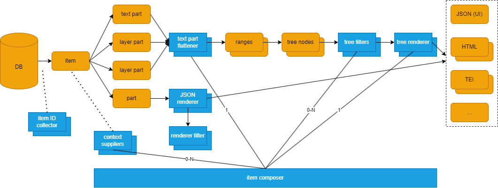
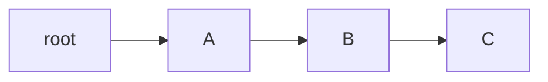
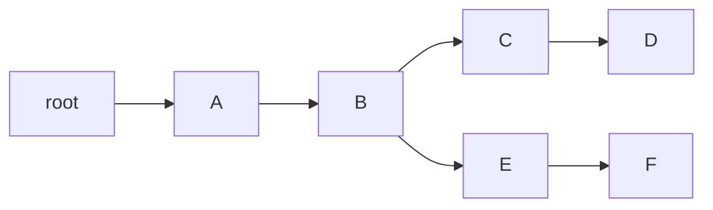
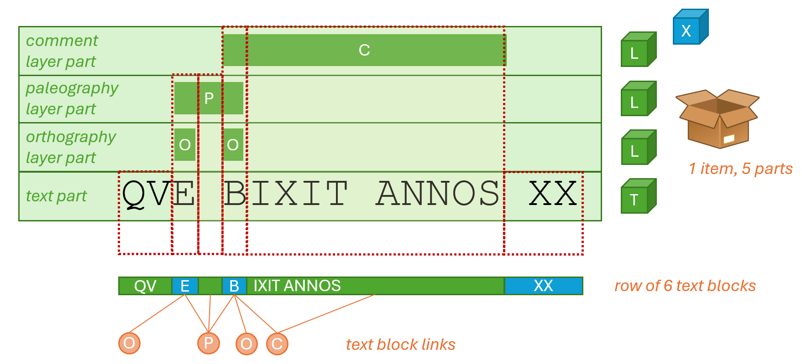
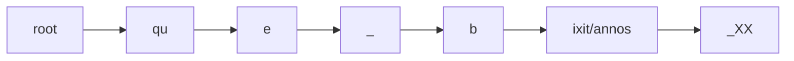
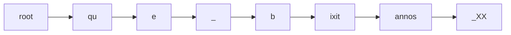

# Rendition Architecture

- [Rendition Architecture](#rendition-architecture)
  - [Flow](#flow)
    - [Non-Textual](#non-textual)
    - [Textual](#textual)
      - [Building Trees](#building-trees)
        - [Collecting Annotated Segments](#collecting-annotated-segments)
        - [Flattening Segments](#flattening-segments)
        - [Building Text Tree](#building-text-tree)
        - [Rendering Text Tree](#rendering-text-tree)

The easiest form of data export in Cadmus is based on rendering data, for both exporting data into files and providing a frontend interface with "previews", i.e. views which summarize structured data for human readers. For instance, in the former case you can export stand-off TEI documents from text items with layers; in the latter case, you can view a compact and human-friendly data summary inside the editor itself.

So, export may be done at different levels of granularity:

- you can export all the items or a subset of them;
- you can export a subset of parts of each item;
- you can export a single text part, with all its related layer parts, or a subset of them;
- you can export a single part.

The export process is driven by a JSON-based configuration, which assembles and configures its components. In most cases, it relies on a set of transformations.

As Cadmus data is based on objects (items, parts, and fragments), each of them can be serialized with an object notation, like JSON. This is what effectively happens when these objects are stored in the Cadmus database (which relies on MongoDB, even though via an intermediate layer which allows you to change the underlying store engine).

This means that any object, and thus any data, can be represented as a JSON document. So, the builtin export tools assume JSON documents as their input, while allowing you to produce any desired output.

In this context, producing output essentially means **transforming JSON** documents. This may be done with a mix of different technologies, chosen according to data structure and export purposes:

- as for the _architecture_, you can use builtin components, which are either generic components with a high level of customization, allowing you to get your output by just providing a configuration file; or specialized components, which, though still configurable, have a more specific logic (like the component used to generate a TEI apparatus). In most cases you can just combine generic and specialized builtin components to generate your desired output. Anyway, it is always possible to build your own components and use them as plugins.

- as for _transformation technologies_, given that we start with JSON and we usually end with a text-based format, you can mix a number of approaches, using what best fits your scenario:
  - [JMESPath](https://jmespath.org/tutorial.html), a powerful selection and transformation language for JSON.
  - [XSLT](https://developer.mozilla.org/en-US/docs/Web/XSLT), by using a [component](components/json-renderers#xslt-json-renderer) which automatically [converts JSON](json-rendering) into an XML dialect.
  - [filters](filters), a set of components used to post-process the transformation results by further changing it according to some logic, ranging from simple text replacements to database lookups.

## Flow

The data flow and the main components of the Cadmus export architecture are summarized in Figure 1:



- _Figure 1: Cadmus export architecture_

It all starts from the Cadmus **database**, including items with their parts. Some of these parts may represent text (with a text part) or layered text (with a text part and any number of text layer parts). Many other parts may well represent non-textual data (e.g. the codicological description of a manuscript).

When exporting into files, usually the entry point is represented by an **item ID collector**, which collects the IDs of all the matching items in their order. This is used to filter and order the items for export; currently, we just have a single [builtin collector](components/collectors).

Data are thus processed one item after another. Each item is handled by an **item composer**, which orchestrates all the components used in the rendering pipelines. Additionally, a simple data model, the rendering context, is shared across most of the components. The general flow is thus:

1. the item collector provides item IDs filtered and sorted as required.
2. for each ID, the corresponding item is loaded.
3. optionally, one or more context suppliers are used to inject from the item additional metadata into the rendering context.
4. according to the rendering type, textual or non-textual, two different branches are followed. Layered texts in fact require a more complex pipeline, because additional logic is required to flatten multiple layers of structured annotations into some target format, like TEI, HTML, etc.

>⚙️ Technically, the item composer (`IItemComposer`) is a very flexible component as rendition requirements vary a lot across projects. One or more composers are instantiated by a rendering factory (`CadmusRenderingFactory`), which can instantiate and configure context suppliers, text tree filters, text filters, JSON renderers for each part, text part flatteners, text tree renderers, and item composers themselves. All these components are configured in an external JSON document. Then, the logic in each composer can be totally custom and leverage any of these components as required for its purpose; the composer receives a data context including the input item with its parts, and then writes one or more text-based outputs representing its rendition. The standard Cadmus API contains this JSON configuration document in its `preview-profile.json` asset file, but does not include a composer because it is used only to preview parts in the UI; anyway, it can be extended per-project to provide full export functionality based on item composers, whether they write to file system, RAM, etc.

### Non-Textual

This rendering uses a single part as its source, and renders some of its data using a **JSON renderer** component.

A JSON renderer component gets some JSON code representing any Cadmus data object (part, fragment, or item), and renders it into some text-based format, like HTML, XML, etc. In Figure 1, you can see that a JSON renderer picked from a set of available renderers can be used to produce some text-based output from a Cadmus part, whatever its type.

The JSON renderer or the text block renderer may also use a set of **renderer filters**. Such filters are executed in the order they are defined for each renderer, just after its rendition completes. Each filter has a specific task, often general enough to be reused in other renderers.

For instance, some [prebuilt rendering filters](components/renderer-filters) allow you to lookup thesauri (resolving their IDs into values), convert Markdown text into HTML or plain text, perform text replacements (either based on literals, and on regular expressions), resolve ISO639 language codes, or the mapping between layer IDs and target IDs in text.

### Textual

As you can see from Figure 1, this pipeline uses:

1. a **text part flattener** (`ITextPartFlattener`), used to flatten a layered text (i.e. one text part, plus any number of text layer parts) into a set of _text segments_. Each segment is a text linked to zero or more annotations from layers. Text is segmented into segments according to the layer(s) selected for rendering. With no layer, we will have a single segment; with 1 layer only, the segmentation will reflect the distribution of its annotations; with multiple layers, the segmentation is the result of flattening the segments from annotations from all the layers. Once segments are defined, they get projected into a linear tree, where each segment is the child node of the node representing the previous segment.

2. zero or more **text tree filters** are applied to the tree to add metadata to its nodes or even reshape the tree as desired. Here we could also have branching, e.g. with binary trees to provide parallel segmentation strategies in TEI rendition.

3. a **text block renderer** is then used to generate a text-based output from these nodes. For the preview UI in the editor frontend, a linear tree is assumed and its nodes data are just serialized into an array containing arrays of nodes, each representing a line in the original text. Other outputs depend on the desired format and encoding strategies, which may vary even dramatically, especially when dealing with TEI and XML.

#### Building Trees

Trees are used as a middleware-like data structure which is particularly fit to most of the rendering output formats, like XML and HTML.

When there is no branching, we have a _linear tree_, which has a single branch starting from the root node and going down, child by child, until the end of the text. So for instance, say that our text has three segments named A, B, and C; its tree would be:



After the tree is first created from text segments, it always has this linear structure. Later, branching can be introduced by tree filters, which thus transform its shape at will. For instance, this tree starts with the same segments A, B; but then continues on the first branch with C and D; and on the second one with E and F:



Transforming the tree is done both to include new data about the text (e.g. variants from an apparatus layer), and to prepare an underlying structure which best fits the desired output. So, a lot of factors come into play in processing data for export; and this among others is a good reason for splitting its complex logic into a set of smaller, more agile components, each having only a specific task, and chaining them into a pipeline.

Thus, export is not a monolithic process, but a composable chain of components, working together to produce multiple output stages, each serving as the input of the next one, until we get to the end. To show an overview of this multi-stage process, let us start with a very simple example: a two-lines, token-based text like this mock Latin inscription fragment:

```txt
que bixit
annos XX
```

>Assume that this is a funerary inscription, with the deceased person's name at the beginning, following by this relative clause about the age. We are focusing on just 4 words to keep the example very simple. Also, note the forms `que`=`quae`, and `bixit`=`vixit`, reflecting the evolution of the language at that time.

Let us say that there are 3 annotation layers on top of this base text:

- **orthography** layer part:
  - fragment 0 on `qu[e]` (`1.1@3`), about the historical orthography QVE for our normalized QVAE.
  - fragment 1 on `[b]ixit` (`1.2@1`), about BIXIT for VIXIT.
- **paleography** layer part:
  - fragment 0 on `qu[e b]ixit` (a ligature: `1.1@3-1.2@1`), assuming there is a ligature between the final E and the initial B.
- **comment** layer part:
  - fragment 0 on `bixit annos` (`1.2-2.1`), about the rarer usage of accusative ("annos") instead of the more common ablative ("annis") in this expression.

>💡 Remember that in the Cadmus model a _layer part_ is a collection of specialized annotation models named _fragments_. Each fragment is linked to any specific segment of the base text. For instance, in a critical apparatus you might have two variants for the word `illud` chosen in the reconstructed critical text: `illuc` and `illic`. In the apparatus model, this would be a single fragment linked to `illud`, with 2 entries representing variants.

In this example we are going to render all these layers. We thus need to segment the base text so that we can link to each segment one or more fragments, whatever the layer they come from. Starting from this stage, we have 6 steps to get to our desired rendition, whatever its target format.

##### Collecting Annotated Segments

▶️ (1) **flatten layers**: use a text part flattener (`ITextPartFlattener`) to get the whole text into a multiline string, plus one range for the fragments in each of the picked layer parts.

The resulting text is (I add a ruler with index numbers at its bottom for better readability):

```txt
012345678901234567
que bixit|annos XX
```

Here `|` stands for a LF character, used as the line delimiter.

The resulting **segments** collected from all the layers are:

1. 2-2 for `qu[e]`: fragment ID=`it.vedph.token-text-layer:fr.it.vedph.orthography@0`;
2. 4-4 for `[b]ixit`: fragment ID=`it.vedph.token-text-layer:fr.it.vedph.orthography@1`;
3. 2-4 for `qu[e b]ixit`: fragment ID=`it.vedph.token-text-layer:fr.it.vedph.apparatus@0`;
4. 4-14 for `bixit|annos`: fragment ID=`it.vedph.token-text-layer:fr.it.vedph.comment@0`.

>Links to each layer's fragment are made via these fragment identifiers, built by concatenating the layer part type ID (`it.vedph.token-text-layer`) with its role ID (e.g. `fr.it.vedph.orthography`), separated by a colon, followed by `@` and the index of the fragment in the layer's fragments array. Optionally, these links can be expanded with an additional suffix which starts from any non-digit character after the fragment index. For instance, an apparatus fragment has an array of entries, and when we want to target each of them we add a suffix `.` plus the index of the entry in that array.

Each of the segments has a **model** including:

- the _start_ and _end_ indexes referred to the whole text.
- _fragment IDs_: the global ID of the corresponding fragment(s). After flattening, each range has just a single fragment ID, because by definition one fragment produces one range. Later, when segments are merged, they may carry more than a single fragment ID. Each fragment ID is built by concatenating the part type ID, followed by `:` and its role ID (which is always defined for a layer part), followed by `_` and the index of the fragment in its layer part.
- the _text_ corresponding to the range. This is assigned after flattening and merging, for performance reasons (it would be pointless to assign text to all the segments when many of them are going to be merged into new ones in the next step).

At this stage we have a string with the text on one side, and a bunch of freely overlapping segments referring to it on the other side. We are just saying that for that text, various portions of it are linked to various annotations, whatever their type, and without caring if the portions overlap.

We have thus collected all the annotations from their layers into one set; now we must find a way for representing all of them in a linear way, as an annotated text, even if they refer to many different and often overlapping portions of it.

So, the next step is merging these segments into a single linear, contiguous sequence.

##### Flattening Segments

▶️ (2) **flatten and merge segments** (via `FragmentTextRange.MergeRanges`) into a sequence of non-overlapping, contiguous segments, covering the whole text, from start to end. In our example, we are starting from this stage, where each line below the text represents a range with its fragment ID (Figure 2):



- Figure 2 - Flattening layer segments into merged segments

>In this figure we represent the data item (our inscription) as a box containing 5 objects: the green ones are text and text layer parts, each with a specific type and model annotations: orthography, paleography, comment; the base text itself is another object in the box, the one labelled with `T`. The blue object is another part which is not linked to specific portions of the text, just to show that the box might include any type of data, whether it is directly related text or not. For instance, this blue object might be a datation, or a description of the material support, or of its archaeological context, etc.

More schematically, these are our layers:

```txt
012345678901234567
que bixit|annos XX
..O............... fr1
....O............. fr2
..PPP............. fr3
....CCCCCCCCCCC... fr4
```

From here we get these segments (I am numbering the segments to make it easier to refer to them in this documentation):

1. 0-1 for `qu` = no fragments;
2. 2-2 for `e` = fr1, fr3;
3. 3-3 for space = fr3;
4. 4-4 for `b` = fr2, fr3, fr4;
5. 5-14 for `ixit|annos` = fr4;
6. 15-17 for space + `XX` = no fragments.

Here we have the text with indexes above, and range numbers below:

```txt
012345678901234567
que bixit|annos XX
112345555555555666
```

▶️ (3) **assign text values** to each merged range (via `ItemComposer`). This is trivial as it just means getting substrings from the whole text, as delimited by each range. As anticipated above, we defer this processing to this stage to avoid useless processing in previous stages.

##### Building Text Tree

▶️ (4) **build a text tree**: this tree is built (via `ItemComposer`) starting from a blank root node, from which a single branch stems, with descendant nodes corresponding to the merged segments. The first range is child of the blank root node; each following range is child of the previous range.

Each node has **payload data** with this model:

- _range_: the source merged range with its fragment ID(s).
- _type_: an optional string representing a node type when required.
- _before EOL_: true if node is appeared before a line end marker (LF) in the original text.
- _text_: the text corresponding to this node. Initially this is equal to the source range's text, but it might be changed by filters.
- _features_: a set of generic name=value pairs, where both are strings, plus a source identifier (equal to or derived from the fragment ID). Duplicate names are allowed and represent arrays. Initially these are empty, but they are going to be used later.

So the tree is:



>The tree structure may seem an overcomplication when dealing with a single linear branch, but it is really useful when rendering more complex data. For instance, we might be able to transform a linear tree into a binary branching tree, and adopt a parallel segmentation strategy, like in [this example](./samples/tei-simple-ps.md).

Note that here a node contains text with a LF character, which is used to mark the end of the original line. Typically this is adjusted in the next step so that such nodes are split.

▶️ (5) **apply text tree filters**: optionally, apply filters to the tree nodes. Each of the filters takes the input of the previous one and generates a new tree. Among these filters, you will almost always use the _block linear tree text filter_, which splits nodes wherever they include newlines. This ensures that each node has at most 1 newline, and that it appears at the end of its text. This is required to ensure that text blocks will be correctly rendered. For our example, the result of this filter is:



Note that here the `ixit/annos` node has been split into two nodes, `ixit` and `annos`; the first of them has also been marked as terminated by an end-of-line.

##### Rendering Text Tree

▶️ (6) **render the text tree** (via an `ITextTreeRenderer`). A text tree renderer traverses the tree and renders it into some specific format. This can be anything, from something as simple as plain text (by just concatenating text from each node) to HTML, TEI, etc.
