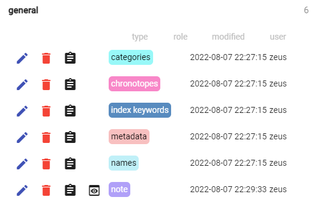
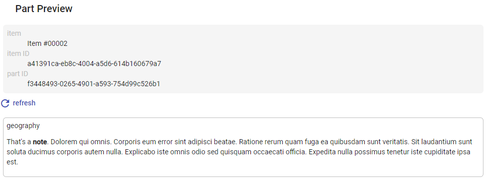
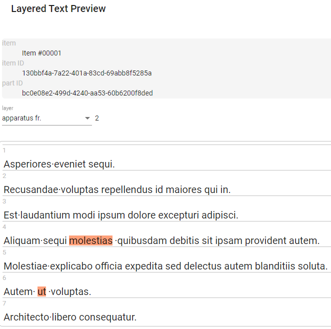
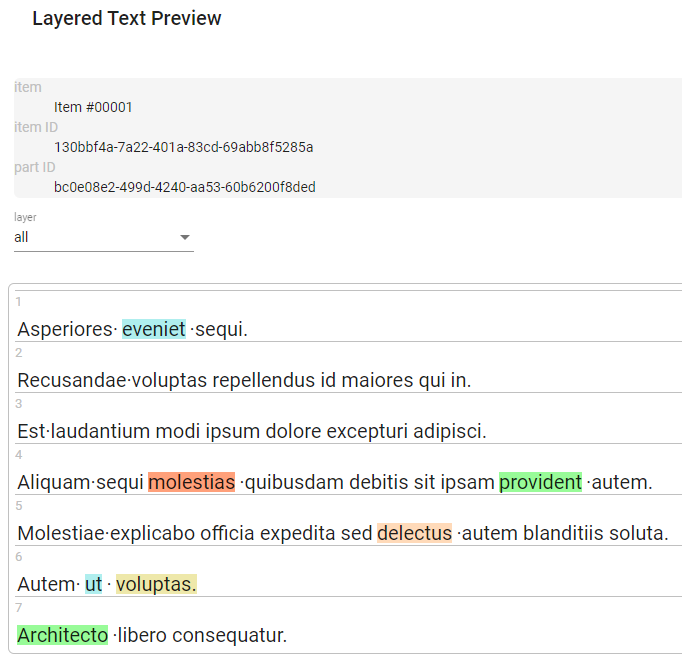
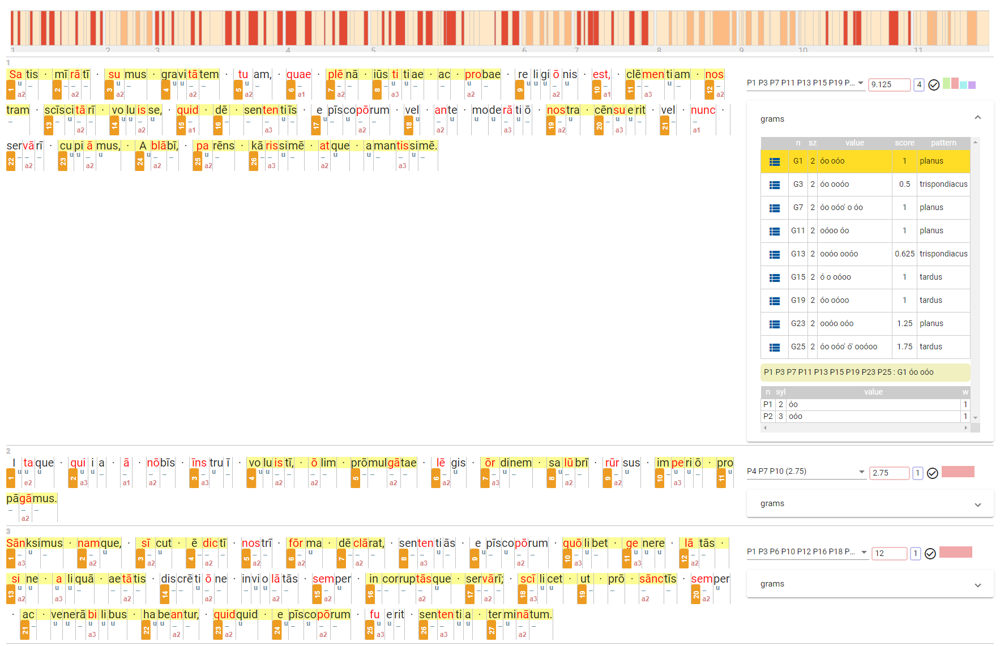

# Cadmus UI

- [Cadmus UI](#cadmus-ui)
  - [Generic Part](#generic-part)
  - [Layered Text Part](#layered-text-part)

The purpose of this section is showing how a UI client can use the migration capabilities provided by this Cadmus subsystem.

The standard [Cadmus UI](https://github.com/vedph/cadmus-shell) leverages a set of API endpoints related to preview to provide a visualization of each single part.


- `api/preview/keys` is an infrastructural endpoint. It is used to get the list of all the registered renderers, according to their category: text flatteneres, item compoers, JSON renderers. This can be used to let users select among several previews for the same data.
- `api/preview/parts/{id}` gets the rendition for the part with the specified ID. This uses a generic renderer, where any part, whatever its type, is handled in the same way: the renderer just gets its JSON, and transforms it.
- `api/preview/text-parts/{id}` gets the text blocks built by flattening the text part with the specified ID with all the layers specified in the query parameter `layerId` (an array of layer part IDs, eventually followed by `=` and an arbitrary ID to assign to the layer type of that part). This optional query parameter is used to rename the layer IDs into the combination of part type ID and fragment type ID, used to identify fragments and colorize them.
- `api/preview/parts/{id}/{frIndex}` gets the rendition of a single fragment at index `frIndex` in the layer part with ID equal to `id`.

## Generic Part

For a generic part, the UI just requests a rendition, which fetches the part's content in JSON, and transforms it into HTML.

For instance, say we have a note part with an available rendition:



The preview button next to the note part shows that a previewer is available. So, when the user clicks it, the UI requests the generic rendition of the part:

```txt
GET http://localhost:60380/api/preview/parts/08ec1b04-4bff-40a1-824e-f4fac0e90e80
```

The request just contains the ID of the part. The response is:

```json
{
  "result": "<p class=\"muted\" xmlns:tei=\"http://www.tei-c.org/ns/1.0\">history</p><div xmlns:tei=\"http://www.tei-c.org/ns/1.0\"><p>Quae ipsum debitis veniam impedit repudiandae et qui modi.\nMaiores possimus iusto ipsam possimus et iure dignissimos id.\nAut vel qui et.\nDolorem et et sit laudantium assumenda sequi omnis doloremque.\nVoluptas commodi soluta eveniet quod et delectus optio sed.</p>\n</div>"
}
```

The note renderer here generated some HTML code representing the note's text: its tag at the top, and its text at the bottom. Note that the original Markdown text has been rendered in HTML (`note` is bold):



In the API backend, preview capabilities are configured in a dedicated JSON document, which in the case of this demo is:

```json
{
  "RendererFilters": [
    {
      "Keys": "markdown",
      "Id": "it.vedph.renderer-filter.markdown",
      "Options": {
        "MarkdownOpen": "<_md>",
        "MarkdownClose": "</_md>",
        "Format": "html"
      }
    }
  ],
  "JsonRenderers": [
    {
      "Keys": "it.vedph.note",
      "Id": "it.vedph.json-renderer.xslt",
      "Options": {
        "QuoteStripping ": true,
        "Xslt": "<?xml version=\"1.0\" encoding=\"UTF-8\"?><xsl:stylesheet xmlns:xsl=\"http://www.w3.org/1999/XSL/Transform\" xmlns:tei=\"http://www.tei-c.org/ns/1.0\" version=\"1.0\"><xsl:output method=\"html\" encoding=\"UTF-8\" omit-xml-declaration=\"yes\"/><xsl:template match=\"tag\"><p class=\"muted\"><xsl:value-of select=\".\"/></p></xsl:template><xsl:template match=\"text\"><div><_md><xsl:value-of select=\".\"/></_md></div></xsl:template><xsl:template match=\"root\"><xsl:apply-templates/></xsl:template><xsl:template match=\"*\"/></xsl:stylesheet>",
        "FilterKeys": "markdown"
      }
    },
    {
      "Keys": "it.vedph.token-text",
      "Id": "it.vedph.json-renderer.null"
    },
    {
      "Keys": "it.vedph.token-text-layer|fr.it.vedph.comment",
      "Id": "it.vedph.json-renderer.null"
    },
    {
      "Keys": "it.vedph.token-text-layer|fr.it.vedph.orthography",
      "Id": "it.vedph.json-renderer.null"
    }
  ],
  "TextPartFlatteners": [
    {
      "Keys": "it.vedph.token-text",
      "Id": "it.vedph.text-flattener.token"
    }
  ]
}
```

Here, we first define a renderer filter to handle Markdown after the renderer has completed: it renders it into HTML (cf. `Format`), and uses a mock escape `<_md>...</_md>` to signal which parts of the string being processed require this rendition.

Then, we define 4 generic renderers (`JsonRenderers`):

- a renderer for the _note_ part. This is the only true renderer; all the others are just mock renderers, added for testing purposes, and using a null renderer which just returns an empty string.
- a mock renderer for the _base text_ part.
- a mock renderer for the _comment layer_ part.
- a mock renderer for the _orthography layer_ part.

The renderer for the note part is configured as follows:

- it uses an XSLT-based renderer.
- it trims the wrapper quotes (`"..."`) once JSON transforms have completed.
- it uses the markdown filter defined above for rendering Markdown text regions into HTML.
- it uses the following XSLT script for rendering the JSON code representing the part once automatically transformed into XML. The note model just includes an optional `tag` property (string) with some classification for the note, and a `text` property (Markdown string) with the note's content. The transform just renders the tag with some specific style in its own `div`, and the text included in a mock `<_md>` element used to signal to the Markdown filter where it should be applied.

```xml
<?xml version="1.0" encoding="UTF-8"?>
<xsl:stylesheet xmlns:xsl="http://www.w3.org/1999/XSL/Transform" xmlns:tei="http://www.tei-c.org/ns/1.0" version="1.0">
    <xsl:output method="html" encoding="UTF-8" omit-xml-declaration="yes" />
    <xsl:template match="tag">
        <p class="muted">
            <xsl:value-of select="." />
        </p>
    </xsl:template>
    <xsl:template match="text">
        <div>
            <_md>
                <xsl:value-of select="." />
            </_md>
        </div>
    </xsl:template>
    <xsl:template match="root">
        <xsl:apply-templates />
    </xsl:template>
    <xsl:template match="*" />
</xsl:stylesheet>
```

## Layered Text Part

For a text part (or a text layer part), the text with the available layers will be visualized in an interactive viewer.

When editing an item, in the list of its parts a preview button is displayed whenever the UI detects that the backend has preview capabilities for that part's type:


In this figure, you can see that the base text and one of its layers have preview capabilities, and thus get an additional button to open their preview.

When the user clicks on this button, e.g. for the base text, the UI first requests a list of all the item's layer parts, with their fragments count, like this:

```txt
GET http://localhost:60380/api/items/130bbf4a-7a22-401a-83cd-69abb8f5285a/layers
```

where the GUID after `items` is the item's ID. The result is an array like this:

```json
[
  {
    "fragmentCount": 2,
    "isAbsent": false,
    "id": "bf50d803-707a-47f4-bdfe-2e82c2d7147f",
    "itemId": "130bbf4a-7a22-401a-83cd-69abb8f5285a",
    "typeId": "it.vedph.token-text-layer",
    "roleId": "fr.it.vedph.apparatus",
    "thesaurusScope": null,
    "timeCreated": "2022-08-07T20:27:14.018Z",
    "creatorId": "zeus",
    "timeModified": "2022-08-07T20:27:14.212Z",
    "userId": "zeus"
  },
  {
    "fragmentCount": 1,
    "isAbsent": false,
    "id": "ced23012-088f-4820-a58f-c2936b97fedc",
    "itemId": "130bbf4a-7a22-401a-83cd-69abb8f5285a",
    "typeId": "it.vedph.token-text-layer",
    "roleId": "fr.it.vedph.chronology",
    "thesaurusScope": null,
    "timeCreated": "2022-08-07T20:27:13.969Z",
    "creatorId": "zeus",
    "timeModified": "2022-08-07T20:27:14.206Z",
    "userId": "zeus"
  },
  {
    "fragmentCount": 2,
    "isAbsent": false,
    "id": "b7af6eed-77d9-4af0-9867-755e8950b141",
    "itemId": "130bbf4a-7a22-401a-83cd-69abb8f5285a",
    "typeId": "it.vedph.token-text-layer",
    "roleId": "fr.it.vedph.comment",
    "thesaurusScope": null,
    "timeCreated": "2022-08-07T20:27:13.944Z",
    "creatorId": "zeus",
    "timeModified": "2022-08-07T20:27:14.2Z",
    "userId": "zeus"
  },
  {
    "fragmentCount": 2,
    "isAbsent": false,
    "id": "3d53a540-61e3-4f16-a30b-8e3c55e0e56e",
    "itemId": "130bbf4a-7a22-401a-83cd-69abb8f5285a",
    "typeId": "it.vedph.token-text-layer",
    "roleId": "fr.it.vedph.quotations",
    "thesaurusScope": null,
    "timeCreated": "2022-08-07T20:27:14.026Z",
    "creatorId": "zeus",
    "timeModified": "2022-08-07T20:27:14.23Z",
    "userId": "zeus"
  },
  {
    "fragmentCount": 1,
    "isAbsent": false,
    "id": "f3d0a446-1c3e-4dc7-9b2c-2fa36021bbc3",
    "itemId": "130bbf4a-7a22-401a-83cd-69abb8f5285a",
    "typeId": "it.vedph.token-text-layer",
    "roleId": "fr.it.vedph.witnesses",
    "thesaurusScope": null,
    "timeCreated": "2022-08-07T20:27:14.033Z",
    "creatorId": "zeus",
    "timeModified": "2022-08-07T20:27:14.235Z",
    "userId": "zeus"
  }
]
```

The result contains information about all the layer parts in the item. Each of the entries refers to a layer, and contains also the count of fragments in the layer.

These data are used to build a visualization changing according to the selected layer. For instance, when we select the apparatus layer, the UI fetches the corresponding text blocks from the server:

```txt
GET http://localhost:60380/api/preview/text-parts/bc0e08e2-499d-4240-aa53-60b6200f8ded?layerId=bf50d803-707a-47f4-bdfe-2e82c2d7147f=it.vedph.token-text-layer|fr.it.vedph.apparatus
```

The result is an array of 7 entries, one for each line in the text. Each line is a row of text blocks, listed in the `blocks` property.

Every block has an ID, a text, and an array of layer IDs. As you can see, this array is empty when there is no fragment linked to any portion of the line. This happens for row 1-3.

At row 4 instead, we find a fragment linked to `molestias`. This means that we have 3 blocks in this row: one with the text preceding `molestias` (ID=4: `Aliquam sequi`), with 0 layer IDs; another (ID=5) for `molestias`, with a single layer ID; and a third one (ID=6) for the text following `molestias` (`quibusdam... autem`).

If you examine the layer ID of `molestias`, `it.vedph.token-text-layer|fr.it.vedph.apparatus0`, you can see that it is built of 3 components:

1. the type ID of the layer part (`it.vedph.token-text-layer`).
2. the type ID of the fragment, preceded by `|` (`fr.it.vedph.apparatus`).
3. the index of the fragment in the layer part (`0`=first fragment).

The same happens for the other rows and their blocks.

```json
[
  {
    "blocks": [
      {
        "id": "1",
        "text": "Asperiores eveniet sequi.",
        "decoration": null,
        "htmlDecoration": false,
        "tip": null,
        "layerIds": []
      }
    ]
  },
  {
    "blocks": [
      {
        "id": "2",
        "text": "Recusandae voluptas repellendus id maiores qui in.",
        "decoration": null,
        "htmlDecoration": false,
        "tip": null,
        "layerIds": []
      }
    ]
  },
  {
    "blocks": [
      {
        "id": "3",
        "text": "Est laudantium modi ipsum dolore excepturi adipisci.",
        "decoration": null,
        "htmlDecoration": false,
        "tip": null,
        "layerIds": []
      }
    ]
  },
  {
    "blocks": [
      {
        "id": "4",
        "text": "Aliquam sequi ",
        "decoration": null,
        "htmlDecoration": false,
        "tip": null,
        "layerIds": []
      },
      {
        "id": "5",
        "text": "molestias",
        "decoration": null,
        "htmlDecoration": false,
        "tip": null,
        "layerIds": [
          "it.vedph.token-text-layer|fr.it.vedph.apparatus0"
        ]
      },
      {
        "id": "6",
        "text": " quibusdam debitis sit ipsam provident autem.",
        "decoration": null,
        "htmlDecoration": false,
        "tip": null,
        "layerIds": []
      }
    ]
  },
  {
    "blocks": [
      {
        "id": "7",
        "text": "Molestiae explicabo officia expedita sed delectus autem blanditiis soluta.",
        "decoration": null,
        "htmlDecoration": false,
        "tip": null,
        "layerIds": []
      }
    ]
  },
  {
    "blocks": [
      {
        "id": "8",
        "text": "Autem ",
        "decoration": null,
        "htmlDecoration": false,
        "tip": null,
        "layerIds": []
      },
      {
        "id": "9",
        "text": "ut",
        "decoration": null,
        "htmlDecoration": false,
        "tip": null,
        "layerIds": [
          "it.vedph.token-text-layer|fr.it.vedph.apparatus1"
        ]
      },
      {
        "id": "10",
        "text": " voluptas.",
        "decoration": null,
        "htmlDecoration": false,
        "tip": null,
        "layerIds": []
      }
    ]
  },
  {
    "blocks": [
      {
        "id": "11",
        "text": "Architecto libero consequatur.",
        "decoration": null,
        "htmlDecoration": false,
        "tip": null,
        "layerIds": []
      }
    ]
  }
]
```

The corresponding visualization is:



As shown by the highlights, here we have 2 fragments, one on `molestias`, and another on `ut`.

If now the user clicks on one of the fragments, e.g. `molestias`, the UI asks for the preview of that specific fragment:

```txt
GET http://localhost:60380/api/preview/parts/bf50d803-707a-47f4-bdfe-2e82c2d7147f/0
```

In this request, the part ID is followed by the fragment's index (`0`). The result is a JSON response with the rendition. In this sample, the renderer for the comment fragment is a mock placeholder which just returns an empty string; so the result is:

```json
{"result":""}
```

If we select all the layers, the resulting visualization is the text with different color highlights:



Colors are assigned to layers according to the styles defined in `preview-styles.css` in the Cadmus editor app. In this sample, the styles are:

```css
.pv-muted {
  color: silver;
}
.cadmus-text-block-view-col {
  border: 1px solid transparent;
  padding: 1px;
}
.cadmus-text-block-view-col:hover {
  border: 1px solid #ffdd26;
  padding: 1px;
}

/* layer ID-based styles */

div[class^="it.vedph.token-text-layer|fr.it.vedph.apparatus"],
div[class*=" it.vedph.token-text-layer|fr.it.vedph.apparatus"] {
  background-color: lightsalmon;
}

div[class^="it.vedph.token-text-layer|fr.it.vedph.chronology"],
div[class*=" it.vedph.token-text-layer|fr.it.vedph.chronology"] {
  background-color: palegoldenrod;
}

div[class^="it.vedph.token-text-layer|fr.it.vedph.comment"],
div[class*=" it.vedph.token-text-layer|fr.it.vedph.comment"] {
  background-color: palegreen;
}

div[class^="it.vedph.token-text-layer|fr.it.vedph.orthography"],
div[class*=" it.vedph.token-text-layer|fr.it.vedph.orthography"] {
  background-color: palevioletred;
}

div[class^="it.vedph.token-text-layer|fr.it.vedph.quotations"],
div[class*=" it.vedph.token-text-layer|fr.it.vedph.quotations"] {
  background-color: paleturquoise;
}

div[class^="it.vedph.token-text-layer|fr.it.vedph.witnesses"],
div[class*=" it.vedph.token-text-layer|fr.it.vedph.witnesses"] {
  background-color: peachpuff;
}
```

As you can see, all the layer ID-based styles have selectors which apply whenever a `div`'s `class` attribute contains the combined type IDs of the layer part and its fragment type.

This is because in the rendered result each block is a `div` with a class containing the layer ID, as received by the backend server. Consider this Angular template:

```html
<!-- preview -->
<div id="preview" *ngIf="rows?.length">
  <div *ngFor="let row of rows; let i = index">
    <div class="row-nr">{{ i + 1 }}</div>
    <cadmus-text-block-view
      [blocks]="row.blocks"
      (blockClick)="onBlockClick($event)"
    ></cadmus-text-block-view>
  </div>
</div>
```

Here we have a `div` for each row, which includes another `div` with the row number, and a custom element to display text blocks. This comes directly from [Cadmus UI bricks](https://github.com/vedph/cadmus-bricks-shell/tree/master/projects/myrmidon/cadmus-text-block-view).

The UI component in bricks is a more general purpose component which can be reused in other contexts. Here we are using it for the editor's preview, but it can be applied to any UI requiring to show several layers on a text. For instance, the figure below shows the rendition of a complex set of data from another project of mine, related to the analysis of prose rhythm:



Note here that this time the backend also provides some "decorations" for each block. These decorations are defined via SVG code, and are a way for summarizing data in a visual manner.

For instance, here the orange rectangles label rhythmic bigrams, while other renditions show in the upper part syllabic quantity, and in the lower part (with a different color) the Latin accent type and position in the corresponding word.

The other elements of this UI, like the top bar with a heat map of the distribution and extent of rhythmic cadences in each sentence, or the side panel with the details about cadences, are independent from the blocks view at the center of the page. This is based on the same bricks used by Cadmus.
