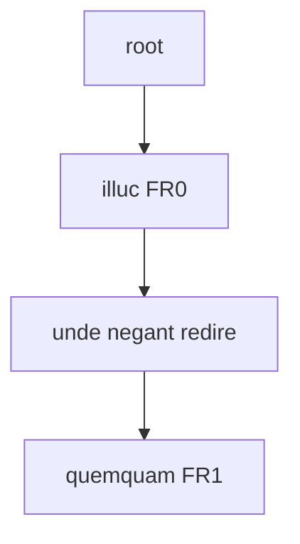
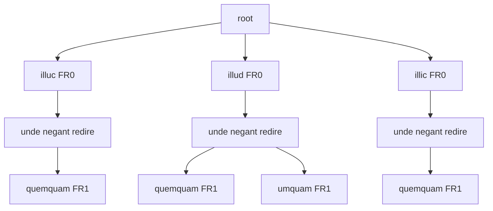

⚠️ WARNING This page is just a draft!

# Rendering Sample - Simple TEI with Parallel Segmentation

In this rendering example, we want to output a TEI document with just the apparatus layer; but this time we want to represent all the versions of a text, as defined by the apparatus, while avoiding overlap, adopting the so-called _parallel segmentation method_.

In this method, the texts compared are split into matching segments in synch with one another. Whenever there is a branching, we wrap variants in an `app` element, including each one in `rdg` (or in `lem` when this is a preferred variant). This makes it easy to compare different readings side by side, and also to extract the full text of any witness (or version, in our scenario).

Of course, its drawback is that this encoding may quickly become highly nested and redundant; and there might be issues when trying to adopt different levels of granularity in segmenting text, because we need to keep the branches in synch.

While high nesting and redundancy can be mitigated by generating XML encoding via software, like we are doing here, segmentation issues are effectively resolved by the flattening process.

Consider a text like this, where I underline the portion corresponding to a first apparatus fragment with A, and that corresponding to a second apparatus fragment with B:

```txt
illuc unde negant redire quemquam
AAAAA                    BBBBBBBB
```

The fragments linked to the apparatus layer are:

- fragment 0:
  - entry 0 (note to `illuc`): witnesses=`O1`;
  - entry 1 (replacement): value=`illud`, witnesses=`O`, `G`, `R`;
  - entry 2 (replacement): value=`illic`, authors=`Fruterius`.
- fragment 1:
  - entry 0 (note to `quemquam`): witnesses=`O`, `G`;
  - entry 1 (replacement): value=`umquam`, witnesses=`R`.

So here (assuming that we have fully provided all the variants in the apparatus) we are encoding these versions of the text:

- `O1`: illuc unde negant redire quemquam.
- `O`: illud unde negant redire quemquam.
- `G`: illud unde negant redire quemquam.
- `R`: illud unde negant redire umquam.
- `Fruterius`: illic unde negant redire quemquam.

## Flattening

As we are selecting only the apparatus layer fragment, our flattened tree will just reflect the segmentation derived from it (I mark with `FR0` and `FR1` the nodes linked to those fragments):



## Filtering: Merge

We now use a version merging filter which builds a new tree starting from a blank root node, and then adding one version of the text at a time, deducing it from combining the base text with the apparatus. Whenever it adds a version, it walks across the existing nodes until there is a variant; at that point, the last matching node will get a new child node with that variant.

Of course, given that in a tree each node can have only 1 parent, this means that whenever we branch we must duplicate all the successive nodes for that branch.

The result is:



Here we have projected the variants from apparatus fragments to each node: whenever some text is followed by more than a single variant, it branches into many children, one per variant.

So, we may multiply the number of children at each level: for instance, from the root node at level 1 we have 3 children for 3 variants (illuc, illud, illic). Yet, it's important to note that the tree's depth remains the same as the original linear tree, where each depth level corresponds to a segment, linked to 0 or 1 apparatus fragments.

We can thus say that (skipping the root level 1 and counting downwards):

- level 2 corresponds to the segment linked to fragment 0.
- level 3 corresponds to the segment not linked to any fragments.
- level 4 corresponds to the segment linked to fragment 1.

This way, the texts which can be constructed by walking across all the branches from top to bottom are all parallel, segment by segment (=level by level). That's right what the parallel segmentation method requires.

## Rendering

We can now use a tree renderer to materialize this logical model into XML. The logic of this renderer is very simple, as the underlying tree structure has already been prepared by the tree filter:

- traverse the tree breadth-first, collecting the nodes of each level while removing duplicates (based on the comparison of node's text);
- for each level collected, if it contains a single node, output its text; else, output an `app` element having as many children elements as nodes. Among them, one, whose text corresponds to the original text, is the `lem` element; all the others are `rdg` elements.

So, in the above example we would have:

- level 2: 3 nodes for `illuc`, `illud`, `illic`, whence `app` with 3 children (`lem` and `rdg`).
- level 3: 1 node once duplicates are removed: ` unde negant redire `. As it's a single node, the output will just be the text value.
- level 4: 2 nodes once duplicates are removed: `quemquam` and `umquam`, whence another `app` with 2 children (`lem` and `rdg`).

💡 At this stage, one might wonder why we are taking this route, when all what we need in this case is just this simple rendition logic. Given that we are picking a single layer (the apparatus), we could just use the linear tree derived from flattening and directly generate XML from its segments. This would spare us from having to remove the duplicate nodes introduced in the filtering process.

While it could be perfectly possible to add a tree renderer working this way, we are not doing this here to improve integration and flexibility:

- the filtering process implies an explicit generation of each text version, implicitly defined by the apparatus. Detaching this logic from a hypothetical direct renderer (which directly generates XML from the flattened tree, bypassing filters) and isolating it in a filter allows us to reuse it in other contexts.

- the export pipeline used here is not limited to sources like Cadmus layered texts. In these texts, we start from a base text whose portions are variously linked to layers of annotations. In other projects, like [GVE](https://vedph.github.io/gve-doc/), we start from a graph-like structure representing multiple versions of a text at the same time. There, each text version is built dynamically by walking the graph according to version metadata set in the edges. So, there is no base text linked to annotations to start with; rather, there is an unordered set of text nodes, variously linked to build different sequences. Yet, this structure can be conveyed into this pipeline using the merge logic shared by merge filters like the one cited above: the merger will just start with a blank root node, and build it branch by branch whenever a new version is added. So, the graph there will be the source of versions, and adding them one after another to the merger will get us our tree. Once this is done, the pipeline will continue with all the components we need to build our desired output.

TODO
