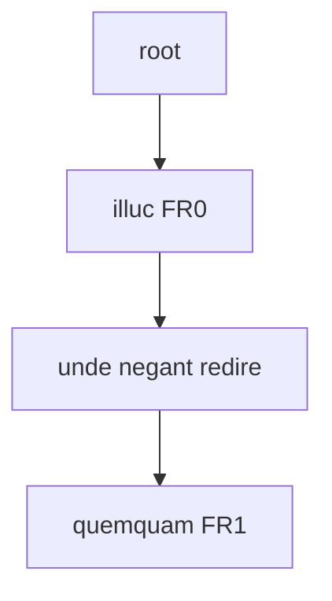
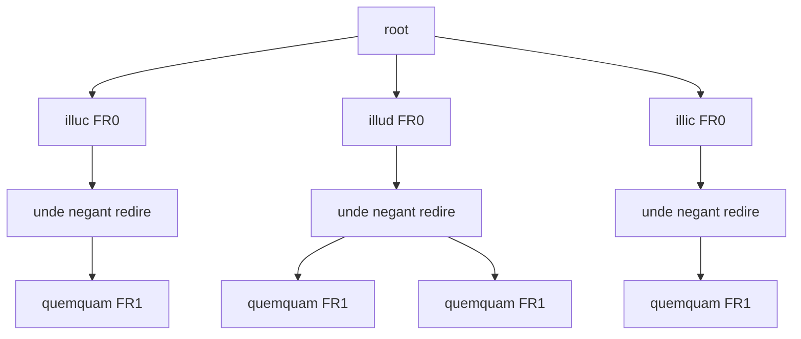

⚠️ WARNING This page is just a draft!

# Rendering Sample - Simple TEI with Parallel Segmentation

In this rendering example, we want to output a TEI document with just the apparatus layer; but this time we want to represent all the versions of a text, as defined by the apparatus, while avoiding overlap, adopting the so-called _parallel segmentation method_.

In this method, the texts compared are split into matching segments in synch with one another. Whenever there is a branching, we wrap variants in an `app` element, including each one in `rdg` (or in `lem` when this is a preferred variant). This makes it easy to compare different readings side by side, and also to extract the full text of any witness (or version, in our scenario).

Of course, its drawback is that this encoding may quickly become highly nested and redundant; and there might be issues when trying to adopt different levels of granularity in segmenting text, because we need to keep the branches in synch.

While high nesting and redundancy can be mitigated by generating XML encoding via software, like we are doing here, segmentation issues are effectively resolved by the flattening process.

Consider a text like this, where I underline the portion corresponding to a first apparatus fragment with A, and that corresponding to a second apparatus fragment with B:

```txt
illuc unde negant redire quemquam
AAAAA                    BBBBBBBB
```

The fragments linked to the apparatus layer are:

- fragment 0:
  - entry 0 (note to `illuc`): witnesses=`O1`;
  - entry 1 (replacement): value=`illud`, witnesses=`O`, `G`, `R`;
  - entry 2 (replacement): value=`illic`, authors=`Fruterius`.
- fragment 1:
  - entry 0 (note to `quemquam`): witnesses=`O`, `G`;
  - entry 1 (replacement): value=`umquam`, witnesses=`R`.

So here (assuming that we have fully provided all the variants in the apparatus) we are encoding these versions of the text:

- `O1`: illuc unde negant redire quemquam.
- `O`: illud unde negant redire quemquam.
- `G`: illud unde negant redire quemquam.
- `R`: illud unde negant redire umquam.
- `Fruterius`: illic unde negant redire quemquam.

## Flattening

As we are selecting only the apparatus layer fragment, our flattened tree will just reflect the segmentation derived from it (I mark with `FR0` and `FR1` the nodes linked to those fragments):



## Filtering

We now use a merging filter which builds a new tree starting from a blank root node, and then adding one version of the text at a time, deducing it from combining the base text with the apparatus. Whenever it adds a version, it walks across the existing nodes until there is a variant; at that point, the last matching node will get a new child node with that variant.

The result is:



As you can see, we have projected the variants from apparatus fragments to each node: whenever some text is followed by more than a single variant, it branches into many children, one per variant.

So, we may multiply the number of children at each level: for instance, from the root node at level 1 we have 3 children for 3 variants (illuc, illud, illic). Yet, it's important to note that the tree's depth remains the same as the original linear tree, where each depth level corresponds to a segment, linked to 0 or 1 apparatus fragments.

We can thus say that (skipping the root level 1 and counting downwards):

- level 2 corresponds to the segment linked to fragment 0.
- level 3 corresponds to the segment not linked to any fragments.
- level 4 corresponds to the segment linked to fragment 1.
