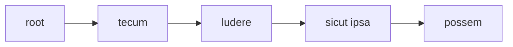
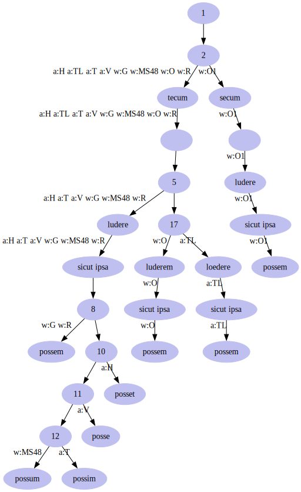

# Rendering Sample - Simple TEI with Parallel Segmentation

⚠️ WARNING This page is just a draft!

- [Rendering Sample - Simple TEI with Parallel Segmentation](#rendering-sample---simple-tei-with-parallel-segmentation)
  - [Text and Apparatus](#text-and-apparatus)
  - [Flattening](#flattening)
  - [Filtering](#filtering)
    - [1. Base Text](#1-base-text)
    - [2. Version O](#2-version-o)
    - [3. Version G](#3-version-g)
    - [4. Version R](#4-version-r)
    - [5. Version O1](#5-version-o1)
    - [6. Version Trappers-Lomax](#6-version-trappers-lomax)
    - [7. Version MS48](#7-version-ms48)
    - [8. Version Turnebus](#8-version-turnebus)
    - [9. Version Vossius](#9-version-vossius)
    - [10. Version Heinsius](#10-version-heinsius)
  - [Tree Renderer](#tree-renderer)

In this rendering example, we want to output a TEI document with just the apparatus layer; but this time we want to represent all the versions of a text, as defined by the apparatus, while avoiding overlap, adopting the so-called _parallel segmentation method_.

In this method, the texts compared are split into matching segments in synch with one another. Whenever there is a branching, we wrap variants in an `app` element, including each one in `rdg` (or in `lem` when this is a preferred variant). This makes it easy to compare different readings side by side, and also to extract the full text of any witness (or version, in our scenario).

Of course, its drawback is that this encoding may quickly become highly nested and redundant; and there might be issues when trying to adopt different levels of granularity in segmenting text, because we need to keep the branches in synch.

Apart from segmentation issues anyway (which here are removed by the flattening process), high nesting and redundancy can be mitigated by generating XML encoding via software, like we are doing here.

## Text and Apparatus

Let us consider this critical text (extracted with simplifications from a real world example; I include portions of text attached to the [apparatus layer](https://github.com/vedph/cadmus-philology/blob/master/docs/fr.apparatus.md) in square brackets):

```txt
[tecum] [ludere] sicut ipsa [possem]
```

with these fragments linked to the apparatus layer:

- fragment 0:
  - entry 0 (note to `tecum`): witnesses=`O`, `G`, `R`;
  - entry 1 (replacement): value=`secum`, witnesses=`O1`.
- fragment 1:
  - entry 0 (note to `ludere`): witnesses=`O1`, `G`, `R`;
  - entry 1 (replacement): value=`luderem`, witnesses=`O`;
  - entry 2 (replacement): value=`loedere`, authors=`Trappes-Lomax`.
- fragment 2:
  - entry 0 (note to `possem`): witnesses=`O`, `G`, `R`;
  - entry 1 (replacement): value=`possum`, witnesses=`MS48`;
  - entry 2 (replacement): value=`possim`, authors=`Turnebus`;
  - entry 3 (replacement): value=`posse`, authors=`Vossius`;
  - entry 4 (replacement): value=`posset`, authors=`Heinsius`.

Say we are still using a single layer, the apparatus, to render this text. This time we want to adopt the parallel segmentation method.

## Flattening

The first step is flattening the text, while segmenting it into the maximum extent spans covering each a distinct set of fragment links. After flattening the apparatus layer, we end up with a linear tree, where each node represents a segment, and each segment is modeled as the child of the previous one:



## Filtering

We now apply to this tree a filter whose task is to add branching at each point where the text of each source (witness or author) diverges from the base text, limiting the children of each node to maximum two. To this end, whenever a branching occurs the filter inserts a new blank node which forks into two branches.

This _apparatus layer merger tree filter_ collects variants from apparatus fragments, merging into a single tree each version of the text as deduced from the apparatus (of course we are assuming that such information is present). The procedure is:

1. collect all the unique source identifiers from witnesses and authors. Each of these sources corresponds to a text version. The result is:

   - `O` (witness)
   - `G` (witness)
   - `R` (witness)
   - `O1` (witness)
   - `Trappes-Lomax` (author)
   - `MS48` (witness)
   - `Turnebus` (author)
   - `Vossius` (author)
   - `Heinsius` (author)

2. merge the base text version into a newly created empty root node, tagging this version with an empty tag.
3. for each collected source, build a corresponding linear tree, whose text is determined by the apparatus entries it is linked to. For instance, for source `O1` the first segment will be `secum` instead of `tecum`, because that's the variant in `O1`. Each of the nodes generated here will bear a version tag feature (`tag`) with the value equal to the source identifier, and a prefix `w:` for witnesses or `a:` for authors. Then, merge the resulting tree.

The result will be a highly nested tree, representing all the versions defined by our variants. There will be one version for each source. Version tags will be stored as metadata of each node. This way, traversing the tree while filtering nodes by tag will allow us to get the text of each version.

Let us follow this procedure, showing a compact ASCII dump for each tree.

### 1. Base Text

We start with the base text tree, a linear tree directly derived from flattening our layers:

```txt
BASE
+ ⯈ [1.1] #1
 + ⯈ [2.1] tecum #1 → tecum F1: tag=
  + ⯈ [3.1]   #2 →   F1: tag=
   + ⯈ [4.1] ludere #3 → ludere F1: tag=
    + ⯈ [5.1]  sicut ipsa  #4 →  sicut ipsa  F1: tag=
     - ■ [6.1] possem #5 → possem F1: tag=
```

>In this dump the text after the arrow is the payload carried by the node; `F` is followed by the total count of features and the features themselves (when they are not too many). Here, the base text tag is just an empty string. The number after `#` is a numeric ID automatically assigned to each node, unique within the context of the tree.

### 2. Version O

The nodes corresponding to the first version (`O`) are:

```txt
VERSION O
+ ⯈ [1.1] #6
 + ⯈ [2.1] tecum #1 → tecum F1: tag=w:O
  + ⯈ [3.1]   #2 →   F1: tag=w:O
   + ⯈ [4.1] luderem #3 → luderem F1: tag=w:O
    + ⯈ [5.1]  sicut ipsa  #4 →  sicut ipsa  F1: tag=w:O
     - ■ [6.1] possem #5 → possem F1: tag=w:O
```

As you can see, the only difference for `O` is `luderem` for `ludere`. By merging this version into our tree with the base text, we get this result:

```txt
MERGED O
+ ⯈ [1.1] #1
 + ⯈ [2.1] tecum #1 → tecum F2: tag=, tag=w:O
  + ⯈ [3.1]   #2 →   F2: tag=, tag=w:O
   + ⯈ [4.1] #2
    + ⯈ [5.1] ludere #3 → ludere F1: tag=
     + ⯈ [6.1]  sicut ipsa  #4 →  sicut ipsa  F1: tag=
      - ■ [7.1] possem #5 → possem F1: tag=
    + ⯈ [5.2] luderem #3 → luderem F1: tag=w:O
     + ⯈ [6.1]  sicut ipsa  #4 →  sicut ipsa  F1: tag=w:O
      - ■ [7.1] possem #5 → possem F1: tag=w:O
```

As you can see we are now branching after the blank fork node inserted as a child of the space following `tecum`: the first child of the fork node is `ludere`, and the second one is `luderem`. Both are then followed by the rest of the nodes, which are duplicated. We are thus representing two versions. To read them, just start from the root node, and walk downwards by selecting all the nodes having the tag feature with the value corresponding to the desired version:

- base (empty tag): `tecum ludere sicut ipsa possem`.
- `O`: `tecum luderem sicut ipsa possem`.

### 3. Version G

The nodes for version `G` are equal to those of version `O`:

```txt
VERSION G
 + ⯈ [1.1] #6
 + ⯈ [2.1] tecum #1 → tecum F1: tag=w:G
  + ⯈ [3.1]   #2 →   F1: tag=w:G
   + ⯈ [4.1] ludere #3 → ludere F1: tag=w:G
    + ⯈ [5.1]  sicut ipsa  #4 →  sicut ipsa  F1: tag=w:G
     - ■ [6.1] possem #5 → possem F1: tag=w:G
 ``

So, in this case merging simply consists in adding version `G` tags to the nodes representing it:

```txt
MERGED G
+ ⯈ [1.1] #1
 + ⯈ [2.1] tecum #1 → tecum F3: tag=, tag=w:O, tag=w:G
  + ⯈ [3.1]   #2 →   F3: tag=, tag=w:O, tag=w:G
   + ⯈ [4.1] #2
    + ⯈ [5.1] ludere #3 → ludere F2: tag=, tag=w:G
     + ⯈ [6.1]  sicut ipsa  #4 →  sicut ipsa  F2: tag=, tag=w:G
      - ■ [7.1] possem #5 → possem F2: tag=, tag=w:G
    + ⯈ [5.2] luderem #3 → luderem F1: tag=w:O
     + ⯈ [6.1]  sicut ipsa  #4 →  sicut ipsa  F1: tag=w:O
      - ■ [7.1] possem #5 → possem F1: tag=w:O
```

The resulting versions now are:

- base (empty tag): `tecum ludere sicut ipsa possem`.
- `O`: `tecum luderem sicut ipsa possem`.
- `G`: like base.

### 4. Version R

Again, nodes for version R are equal to those of `OG`:

```txt
VERSION R
+ ⯈ [1.1] #6
 + ⯈ [2.1] tecum #1 → tecum F1: tag=w:R
  + ⯈ [3.1]   #2 →   F1: tag=w:R
   + ⯈ [4.1] ludere #3 → ludere F1: tag=w:R
    + ⯈ [5.1]  sicut ipsa  #4 →  sicut ipsa  F1: tag=w:R
     - ■ [6.1] possem #5 → possem F1: tag=w:R
```

So, here too we just add version tags:

```txt
MERGED R
+ ⯈ [1.1] #1
 + ⯈ [2.1] tecum #1 → tecum F4: tag=, tag=w:O, tag=w:G, tag=w:R
  + ⯈ [3.1]   #2 →   F4: tag=, tag=w:O, tag=w:G, tag=w:R
   + ⯈ [4.1] #2
    + ⯈ [5.1] ludere #3 → ludere F3: tag=, tag=w:G, tag=w:R
     + ⯈ [6.1]  sicut ipsa  #4 →  sicut ipsa  F3: tag=, tag=w:G, tag=w:R
      - ■ [7.1] possem #5 → possem F3: tag=, tag=w:G, tag=w:R
    + ⯈ [5.2] luderem #3 → luderem F1: tag=w:O
     + ⯈ [6.1]  sicut ipsa  #4 →  sicut ipsa  F1: tag=w:O
      - ■ [7.1] possem #5 → possem F1: tag=w:O
```

The resulting versions are:

- base (empty tag): `tecum ludere sicut ipsa possem`.
- `O`: `tecum luderem sicut ipsa possem`.
- `G`: like base.
- `R`: like base.

### 5. Version O1

Version O1 differs only by its node `secum` instead of `tecum`:

```txt
VERSION O1
+ ⯈ [1.1] #6
 + ⯈ [2.1] secum #1 → secum F1: tag=w:O1
  + ⯈ [3.1]   #2 →   F1: tag=w:O1
   + ⯈ [4.1] ludere #3 → ludere F1: tag=w:O1
    + ⯈ [5.1]  sicut ipsa  #4 →  sicut ipsa  F1: tag=w:O1
     - ■ [6.1] possem #5 → possem F1: tag=w:O1
```

This branching happens at the very beginning of the node, so we will have a blank fork node as the child of the root. The result of merging is:

```txt
MERGED O1
+ ⯈ [1.1] #1
 + ⯈ [2.1] #3
  + ⯈ [3.1] tecum #1 → tecum F4: tag=, tag=w:O, tag=w:G, tag=w:R
   + ⯈ [4.1]   #2 →   F4: tag=, tag=w:O, tag=w:G, tag=w:R
    + ⯈ [5.1] #2
     + ⯈ [6.1] ludere #3 → ludere F3: tag=, tag=w:G, tag=w:R
      + ⯈ [7.1]  sicut ipsa  #4 →  sicut ipsa  F3: tag=, tag=w:G, tag=w:R
       - ■ [8.1] possem #5 → possem F3: tag=, tag=w:G, tag=w:R
     + ⯈ [6.2] luderem #3 → luderem F1: tag=w:O
      + ⯈ [7.1]  sicut ipsa  #4 →  sicut ipsa  F1: tag=w:O
       - ■ [8.1] possem #5 → possem F1: tag=w:O
  + ⯈ [3.2] secum #1 → secum F1: tag=w:O1
   + ⯈ [4.1]   #2 →   F1: tag=w:O1
    + ⯈ [5.1] ludere #3 → ludere F1: tag=w:O1
     + ⯈ [6.1]  sicut ipsa  #4 →  sicut ipsa  F1: tag=w:O1
      - ■ [7.1] possem #5 → possem F1: tag=w:O1
```

The resulting versions are:

- base (empty tag): `tecum ludere sicut ipsa possem`.
- `O`: `tecum luderem sicut ipsa possem`.
- `G`: like base.
- `R`: like base.
- `O1`: `secum ludere sicut ipsa possem`.

### 6. Version Trappers-Lomax

Nodes:

```txt
VERSION TRAPPERS-LOMAX
+ ⯈ [1.1] #6
 + ⯈ [2.1] tecum #1 → tecum F1: tag=a:Trappers-Lomax
  + ⯈ [3.1]   #2 →   F1: tag=a:Trappers-Lomax
   + ⯈ [4.1] loedere #3 → loedere F1: tag=a:Trappers-Lomax
    + ⯈ [5.1]  sicut ipsa  #4 →  sicut ipsa  F1: tag=a:Trappers-Lomax
     - ■ [6.1] possem #5 → possem F1: tag=a:Trappers-Lomax
```

Merge result:

```txt
MERGED TRAPPERS-LOMAX
+ ⯈ [1.1] #1
 + ⯈ [2.1] #3
  + ⯈ [3.1] tecum #1 → tecum F5: tag=, tag=w:O, tag=w:G, tag=w:R, tag=a:Trappers-Lomax
   + ⯈ [4.1]   #2 →   F5: tag=, tag=w:O, tag=w:G, tag=w:R, tag=a:Trappers-Lomax
    + ⯈ [5.1] #2
     + ⯈ [6.1] ludere #3 → ludere F3: tag=, tag=w:G, tag=w:R
      + ⯈ [7.1]  sicut ipsa  #4 →  sicut ipsa  F3: tag=, tag=w:G, tag=w:R
       - ■ [8.1] possem #5 → possem F3: tag=, tag=w:G, tag=w:R
     + ⯈ [6.2] #4
      + ⯈ [7.1] luderem #3 → luderem F1: tag=w:O
       + ⯈ [8.1]  sicut ipsa  #4 →  sicut ipsa  F1: tag=w:O
        - ■ [9.1] possem #5 → possem F1: tag=w:O
      + ⯈ [7.2] loedere #3 → loedere F1: tag=a:Trappers-Lomax
       + ⯈ [8.1]  sicut ipsa  #4 →  sicut ipsa  F1: tag=a:Trappers-Lomax
        - ■ [9.1] possem #5 → possem F1: tag=a:Trappers-Lomax
  + ⯈ [3.2] secum #1 → secum F1: tag=w:O1
   + ⯈ [4.1]   #2 →   F1: tag=w:O1
    + ⯈ [5.1] ludere #3 → ludere F1: tag=w:O1
     + ⯈ [6.1]  sicut ipsa  #4 →  sicut ipsa  F1: tag=w:O1
      - ■ [7.1] possem #5 → possem F1: tag=w:O1
```

The resulting versions are:

- base (empty tag): `tecum ludere sicut ipsa possem`.
- `O`: `tecum luderem sicut ipsa possem`.
- `G`: like base.
- `R`: like base.
- `O1`: `secum ludere sicut ipsa possem`.
- Trappers-Lomax: `tecum loedere sicut ipsa possem`.

### 7. Version MS48

Nodes:

```txt
VERSION MS48
+ ⯈ [1.1] #6
 + ⯈ [2.1] tecum #1 → tecum F1: tag=w:MS48
  + ⯈ [3.1]   #2 →   F1: tag=w:MS48
   + ⯈ [4.1] ludere #3 → ludere F1: tag=w:MS48
    + ⯈ [5.1]  sicut ipsa  #4 →  sicut ipsa  F1: tag=w:MS48
     - ■ [6.1] possum #5 → possum F1: tag=w:MS48
```

Merge result:

```txt
MERGED MS48
+ ⯈ [1.1] #1
 + ⯈ [2.1] #3
  + ⯈ [3.1] tecum #1 → tecum F6: tag=, tag=w:O, tag=w:G, tag=w:R, tag=a:Trappers-Lomax, tag=w:MS48
   + ⯈ [4.1]   #2 →   F6: tag=, tag=w:O, tag=w:G, tag=w:R, tag=a:Trappers-Lomax, tag=w:MS48
    + ⯈ [5.1] #2
     + ⯈ [6.1] ludere #3 → ludere F4: tag=, tag=w:G, tag=w:R, tag=w:MS48
      + ⯈ [7.1]  sicut ipsa  #4 →  sicut ipsa  F4: tag=, tag=w:G, tag=w:R, tag=w:MS48
       + ⯈ [8.1] #5
        - ■ [9.1] possem #5 → possem F3: tag=, tag=w:G, tag=w:R
        - ■ [9.2] possum #5 → possum F1: tag=w:MS48
     + ⯈ [6.2] #4
      + ⯈ [7.1] luderem #3 → luderem F1: tag=w:O
       + ⯈ [8.1]  sicut ipsa  #4 →  sicut ipsa  F1: tag=w:O
        - ■ [9.1] possem #5 → possem F1: tag=w:O
      + ⯈ [7.2] loedere #3 → loedere F1: tag=a:Trappers-Lomax
       + ⯈ [8.1]  sicut ipsa  #4 →  sicut ipsa  F1: tag=a:Trappers-Lomax
        - ■ [9.1] possem #5 → possem F1: tag=a:Trappers-Lomax
  + ⯈ [3.2] secum #1 → secum F1: tag=w:O1
   + ⯈ [4.1]   #2 →   F1: tag=w:O1
    + ⯈ [5.1] ludere #3 → ludere F1: tag=w:O1
     + ⯈ [6.1]  sicut ipsa  #4 →  sicut ipsa  F1: tag=w:O1
      - ■ [7.1] possem #5 → possem F1: tag=w:O1
```

The resulting versions are:

- base (empty tag): `tecum ludere sicut ipsa possem`.
- `O`: `tecum luderem sicut ipsa possem`.
- `G`: like base.
- `R`: like base.
- `O1`: `secum ludere sicut ipsa possem`.
- Trappers-Lomax: `tecum loedere sicut ipsa possem`.
- MS48: `tecum ludere sicut ipsa possum`.

### 8. Version Turnebus

Nodes:

```txt
VERSION TURNEBUS
+ ⯈ [1.1] #6
 + ⯈ [2.1] tecum #1 → tecum F1: tag=a:Turnebus
  + ⯈ [3.1]   #2 →   F1: tag=a:Turnebus
   + ⯈ [4.1] ludere #3 → ludere F1: tag=a:Turnebus
    + ⯈ [5.1]  sicut ipsa  #4 →  sicut ipsa  F1: tag=a:Turnebus
     - ■ [6.1] possim #5 → possim F1: tag=a:Turnebus
```

Merge result:

```txt
MERGED TURNEBUS
+ ⯈ [1.1] #1
 + ⯈ [2.1] #3
  + ⯈ [3.1] tecum #1 → tecum F7: tag=, tag=w:O, tag=w:G, tag=w:R, tag=a:Trappers-Lomax, tag=w:MS48, tag=a:Turnebus
   + ⯈ [4.1]   #2 →   F7: tag=, tag=w:O, tag=w:G, tag=w:R, tag=a:Trappers-Lomax, tag=w:MS48, tag=a:Turnebus
    + ⯈ [5.1] #2
     + ⯈ [6.1] ludere #3 → ludere F5: tag=, tag=w:G, tag=w:R, tag=w:MS48, tag=a:Turnebus
      + ⯈ [7.1]  sicut ipsa  #4 →  sicut ipsa  F5: tag=, tag=w:G, tag=w:R, tag=w:MS48, tag=a:Turnebus
       + ⯈ [8.1] #5
        - ■ [9.1] possem #5 → possem F3: tag=, tag=w:G, tag=w:R
        + ⯈ [9.2] #6
         - ■ [10.1] possum #5 → possum F1: tag=w:MS48
         - ■ [10.2] possim #5 → possim F1: tag=a:Turnebus
     + ⯈ [6.2] #4
      + ⯈ [7.1] luderem #3 → luderem F1: tag=w:O
       + ⯈ [8.1]  sicut ipsa  #4 →  sicut ipsa  F1: tag=w:O
        - ■ [9.1] possem #5 → possem F1: tag=w:O
      + ⯈ [7.2] loedere #3 → loedere F1: tag=a:Trappers-Lomax
       + ⯈ [8.1]  sicut ipsa  #4 →  sicut ipsa  F1: tag=a:Trappers-Lomax
        - ■ [9.1] possem #5 → possem F1: tag=a:Trappers-Lomax
  + ⯈ [3.2] secum #1 → secum F1: tag=w:O1
   + ⯈ [4.1]   #2 →   F1: tag=w:O1
    + ⯈ [5.1] ludere #3 → ludere F1: tag=w:O1
     + ⯈ [6.1]  sicut ipsa  #4 →  sicut ipsa  F1: tag=w:O1
      - ■ [7.1] possem #5 → possem F1: tag=w:O1
```

The resulting versions are:

- base (empty tag): `tecum ludere sicut ipsa possem`.
- `O`: `tecum luderem sicut ipsa possem`.
- `G`: like base.
- `R`: like base.
- `O1`: `secum ludere sicut ipsa possem`.
- Trappers-Lomax: `tecum loedere sicut ipsa possem`.
- MS48: `tecum ludere sicut ipsa possum`.
- Turnebus: `tecum ludere sicut ipsa possim`.

### 9. Version Vossius

Nodes:

```txt
VERSION VOSSIUS
+ ⯈ [1.1] #6
 + ⯈ [2.1] tecum #1 → tecum F1: tag=a:Vossius
  + ⯈ [3.1]   #2 →   F1: tag=a:Vossius
   + ⯈ [4.1] ludere #3 → ludere F1: tag=a:Vossius
    + ⯈ [5.1]  sicut ipsa  #4 →  sicut ipsa  F1: tag=a:Vossius
     - ■ [6.1] posse #5 → posse F1: tag=a:Vossius
```

Merge result:

```txt
MERGED VOSSIUS
+ ⯈ [1.1] #1
 + ⯈ [2.1] #3
  + ⯈ [3.1] tecum #1 → tecum F8: tag=, tag=w:O, tag=w:G, tag=w:R, tag=a:Trappers-Lomax, tag=w:MS48, tag=a:Turnebus, tag=a:Vossius
   + ⯈ [4.1]   #2 →   F8: tag=, tag=w:O, tag=w:G, tag=w:R, tag=a:Trappers-Lomax, tag=w:MS48, tag=a:Turnebus, tag=a:Vossius
    + ⯈ [5.1] #2
     + ⯈ [6.1] ludere #3 → ludere F6: tag=, tag=w:G, tag=w:R, tag=w:MS48, tag=a:Turnebus, tag=a:Vossius
      + ⯈ [7.1]  sicut ipsa  #4 →  sicut ipsa  F6: tag=, tag=w:G, tag=w:R, tag=w:MS48, tag=a:Turnebus, tag=a:Vossius
       + ⯈ [8.1] #5
        - ■ [9.1] possem #5 → possem F3: tag=, tag=w:G, tag=w:R
        + ⯈ [9.2] #7
         + ⯈ [10.1] #6
          - ■ [11.1] possum #5 → possum F1: tag=w:MS48
          - ■ [11.2] possim #5 → possim F1: tag=a:Turnebus
         - ■ [10.2] posse #5 → posse F1: tag=a:Vossius
     + ⯈ [6.2] #4
      + ⯈ [7.1] luderem #3 → luderem F1: tag=w:O
       + ⯈ [8.1]  sicut ipsa  #4 →  sicut ipsa  F1: tag=w:O
        - ■ [9.1] possem #5 → possem F1: tag=w:O
      + ⯈ [7.2] loedere #3 → loedere F1: tag=a:Trappers-Lomax
       + ⯈ [8.1]  sicut ipsa  #4 →  sicut ipsa  F1: tag=a:Trappers-Lomax
        - ■ [9.1] possem #5 → possem F1: tag=a:Trappers-Lomax
  + ⯈ [3.2] secum #1 → secum F1: tag=w:O1
   + ⯈ [4.1]   #2 →   F1: tag=w:O1
    + ⯈ [5.1] ludere #3 → ludere F1: tag=w:O1
     + ⯈ [6.1]  sicut ipsa  #4 →  sicut ipsa  F1: tag=w:O1
      - ■ [7.1] possem #5 → possem F1: tag=w:O1
```

The resulting versions are:

- base (empty tag): `tecum ludere sicut ipsa possem`.
- `O`: `tecum luderem sicut ipsa possem`.
- `G`: like base.
- `R`: like base.
- `O1`: `secum ludere sicut ipsa possem`.
- Trappers-Lomax: `tecum loedere sicut ipsa possem`.
- MS48: `tecum ludere sicut ipsa possum`.
- Turnebus: `tecum ludere sicut ipsa possim`.
- Vossius: `tecum ludere sicut ipsa posse`.

### 10. Version Heinsius

Nodes:

```txt
VERSION HEINSIUS
+ ⯈ [1.1] #6
 + ⯈ [2.1] tecum #1 → tecum F1: tag=a:Heinsius
  + ⯈ [3.1]   #2 →   F1: tag=a:Heinsius
   + ⯈ [4.1] ludere #3 → ludere F1: tag=a:Heinsius
    + ⯈ [5.1]  sicut ipsa  #4 →  sicut ipsa  F1: tag=a:Heinsius
     - ■ [6.1] posset #5 → posset F1: tag=a:Heinsius
```

Merge results:

```txt
MERGED HEINSIUS
+ ⯈ [1.1] #1
 + ⯈ [2.1] #3
  + ⯈ [3.1] tecum #1 → tecum F9: tag=, tag=w:O, tag=w:G, tag=w:R, tag=a:Trappers-Lomax, tag=w:MS48, tag=a:Turnebus, tag=a:Vossius, tag=a:Heinsius
   + ⯈ [4.1]   #2 →   F9: tag=, tag=w:O, tag=w:G, tag=w:R, tag=a:Trappers-Lomax, tag=w:MS48, tag=a:Turnebus, tag=a:Vossius, tag=a:Heinsius
    + ⯈ [5.1] #2
     + ⯈ [6.1] ludere #3 → ludere F7: tag=, tag=w:G, tag=w:R, tag=w:MS48, tag=a:Turnebus, tag=a:Vossius, tag=a:Heinsius
      + ⯈ [7.1]  sicut ipsa  #4 →  sicut ipsa  F7: tag=, tag=w:G, tag=w:R, tag=w:MS48, tag=a:Turnebus, tag=a:Vossius, tag=a:Heinsius
       + ⯈ [8.1] #5
        - ■ [9.1] possem #5 → possem F3: tag=, tag=w:G, tag=w:R
        + ⯈ [9.2] #8
         + ⯈ [10.1] #7
          + ⯈ [11.1] #6
           - ■ [12.1] possum #5 → possum F1: tag=w:MS48
           - ■ [12.2] possim #5 → possim F1: tag=a:Turnebus
          - ■ [11.2] posse #5 → posse F1: tag=a:Vossius
         - ■ [10.2] posset #5 → posset F1: tag=a:Heinsius
     + ⯈ [6.2] #4
      + ⯈ [7.1] luderem #3 → luderem F1: tag=w:O
       + ⯈ [8.1]  sicut ipsa  #4 →  sicut ipsa  F1: tag=w:O
        - ■ [9.1] possem #5 → possem F1: tag=w:O
      + ⯈ [7.2] loedere #3 → loedere F1: tag=a:Trappers-Lomax
       + ⯈ [8.1]  sicut ipsa  #4 →  sicut ipsa  F1: tag=a:Trappers-Lomax
        - ■ [9.1] possem #5 → possem F1: tag=a:Trappers-Lomax
  + ⯈ [3.2] secum #1 → secum F1: tag=w:O1
   + ⯈ [4.1]   #2 →   F1: tag=w:O1
    + ⯈ [5.1] ludere #3 → ludere F1: tag=w:O1
     + ⯈ [6.1]  sicut ipsa  #4 →  sicut ipsa  F1: tag=w:O1
      - ■ [7.1] possem #5 → possem F1: tag=w:O1
```

The resulting versions are:

- base (empty tag): `tecum ludere sicut ipsa possem`.
- `O`: `tecum luderem sicut ipsa possem`.
- `G`: like base.
- `R`: like base.
- `O1`: `secum ludere sicut ipsa possem`.
- Trappers-Lomax: `tecum loedere sicut ipsa possem`.
- MS48: `tecum ludere sicut ipsa possum`.
- Turnebus: `tecum ludere sicut ipsa possim`.
- Vossius: `tecum ludere sicut ipsa posse`.
- Heinsius: `tecum ludere sicut ipsa posset`.

The corresponding diagram shows the final result:



## Tree Renderer

At this stage, a tree renderer kicks in and just renders the filtered tree into TEI, using:

- an `app` element at each fork node;
- inside it, add either `lem` or `rdg` according to whether the node being traversed has `lem` among its version tags. The value of this element is the text value of the node.

Now that the tree structure has been prepared via filtering, the task of this renderer is thus trivial: it just has to traverse the tree, and insert these elements with the text of each node. The result will be a highly nested TEI document with parallel segmentation. If you look at its code, you can easily understand that it would be too complex to deal with manually. Yet, this is a generated output, whose primary target is some other third-party software, like a TEI publishing tool. This destination which makes this output useful, despite its complexity, and poses no maintenance issues because we can fully regenerate it whenever we change something in the source data.

TODO add XML code
