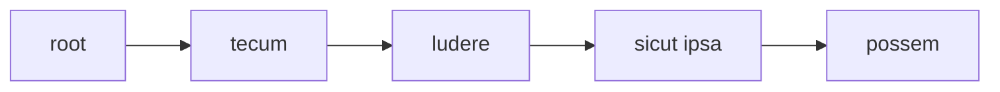

TODO

# Rendering Sample - Simple TEI with Parallel Segmentation

Consider this critical text (extracted with simplifications from a real world example; I include portions of text attached to the apparatus layer in square brackets):

```txt
[tecum] [ludere] sicut ipsa [possem]
```

with these fragments linked to the apparatus layer:

- fragment 0:
  - entry 0 (note to `tecum`): witnesses=`O`, `G`, `R`;
  - entry 1 (replacement): value=`secum`, witnesses=`O1`.
- fragment 1:
  - entry 0 (note to `ludere`): witnesses=`O1`, `G`, `R`;
  - entry 1 (replacement): value=`luderem`, witnesses=`O`;
  - entry 2 (replacement): value=`loedere`, authors=Trappes-Lomax.
- fragment 2:
  - entry 0 (note to `possem`): witnesses=`O`, `G`, `R`;
  - entry 1 (replacement): value=`possum`, witnesses=`MS48`;
  - entry 2 (replacement): value=`possim`, authors=`Turnebus`;
  - entry 3 (replacement): value=`posse`, authors=`Vossius`;
  - entry 4 (replacement): value=`posset`, authors=`Heinsius`.

Say we are still using a single layer, the apparatus, to render this text. This time we want to adopt the parallel segmentation method.

TODO

After flattening the apparatus layer, we end up with a tree:



We now apply to this tree a filter whose task is to add branching at each point where the text of each source (witness or author) diverges from the base text, limiting the children of each node to maximum two. To this end, whenever a branching occurs the filter inserts a new blank node which forks into two branches.

This apparatus layer merger tree filter collects variants from apparatus fragments, merging into a single tree each version of the text as deduced from the apparatus (of course we are assuming that such information is present). The procedure is:

1. assign an empty version tag to each node of the input linear tree. This will allow us to get the base text back when traversing the newly created tree.
2. collect the text for each single source, whether it's a witness or an author. This implies traversing the original tree, and for each node append either its text value, when it's not linked to any fragments; or the value derived from the fragment, when it's linked to it.
3. merge all these versions using each source ID as the tag for each version.

The result will be a highly nested tree, representing all the versions defined by our variants. There will be one version for each source. Version tags will be stored as metadata of each node. This way, traversing the tree while filtering nodes by tag will allow us to get the text of each version.

TODO

At this stage, a tree renderer kicks in and just renders the filtered tree into TEI, using:

- an `app` element at each fork node;
- inside it, add either `lem` or `rdg` according to whether the node being traversed has `lem` among its version tags. The value of this element is the text value of the node.

TODO
