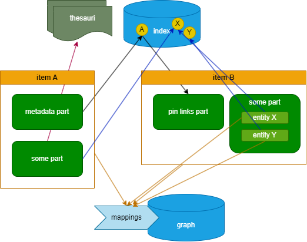

# Dynamic Lookup

- [Dynamic Lookup](#dynamic-lookup)
  - [Concept and Issues](#concept-and-issues)
  - [Data Pins at Rescue](#data-pins-at-rescue)
  - [Implementation Details](#implementation-details)
    - [Developer's Hints](#developers-hints)
    - [Linking Items: Pin-based Links](#linking-items-pin-based-links)
    - [Linking Entities: Asserted ID Brick](#linking-entities-asserted-id-brick)
      - [External Targets](#external-targets)
      - [Internal Targets](#internal-targets)
      - [Asserted Composite ID Components](#asserted-composite-id-components)
  - [Linking Recap](#linking-recap)

_Dynamic lookup_ refers to a feature of the system providing lookup data sets dynamically built from searching the underlying index. This feature stands side to side to the _static lookup_ data sets provided by [thesauri](thesauri).

## Concept and Issues

Thesauri provide closed sets of _name=value_ pairs, used in taxonomies of whatever type. These sets are closed in the sense that they represent a predefined set of pairs, which is entirely loaded and used by UI components. "Closed" here does not mean that they cannot be changed. Thesauri sets can be modified at any time, either on the database, or from the Cadmus UI. Anyway, the list provided by each set is defined independently from the edited data, and usually before it.

In some circumstances, UI components might need another kind of lookup data, not derived from a small, prebuilt set of taxonomies, but rather from the edited data themselves. This happens when we want to refer to data across different parts. Given that a part is an independent document, this is not frequent; but in some cases data happens to have some level of normalization to avoid repetitions. In most cases, relations among objects are encoded in the form of a graph, usually when projecting data into a semantic graph, where every entity has its own global ID. Yet, occasional links with a more rigid structure can be implemented in another way.

For instance, say we have a set of letters into Cadmus items, and we want to collect all the names of the persons cited in each of them. We want to add some metadata about each name, and possibly one or more identifications with known persons. We could thus provide a cited-persons part, with a list of names and other attached metadata.

Now, it might well happen the person cited in a letter might appear also in another one; in this case, we would not want to repeat our identifications and metadata about that person in two different cited-persons parts of two different items. Rather, we could rework our model as follows:

- make each person an _item_, rather than an entry in an item's part.
- for each person item, provide names, identifications, biography, and whatever we want to say about that person in a number of specialized parts. One of these parts (e.g. that with names) can provide an internal, human-friendly ID for that person (e.g. `barbato` for Scipione Barbato).
- in the letter's cited persons part, just use the internal ID to refer to a known person, which will appear as an item. When the cited person is just a name, the list will only include his metadata, but no such ID, as there is no possible identification for him. When instead the person is known, we will just add his ID (`barbato`), implicitly referring to an independent, full-fledged person item somewhere in the database.

This is similar to RDBMS normalization, but there is no real enforcement about such relationship: we might well use the internal ID in the cited persons part, and yet have no corresponding item; either because we still have to enter it, or because we are not going to enter it at all, as we are using an ID which refers to some external prosopographic resource.

In this scenario, it would be desirable to have a lookup mechanism for UI components, so that for instance in our cited persons part we can just type the first letters of a person ID (e.g. `bar` for `barbato`) and get the full ID to pick. This would speed up the data entry process, and also ensure that we are not entering a wrong ID by mistake.

In this sample, data is distributed as follows:

- the _cited persons_ part (belonging to a _letter_ item) uses an internal person ID to reference that person.
- the _person names_ part (belonging to a _person_ item) contains among other data also the internal person ID.

So this is a situation where a part (the cited persons part) needs to reference to data found in another part (the person names part); and of course, parts may change at any time, by any user having write access to the database.

## Data Pins at Rescue

Parts are modeled and entered in an independent way; and every part has its own data model, and can be added to the database at any time. So this is not a trivial task. Seen from outside (e.g. from another part), the part is like a black box; so there is no way of knowing where in its model the internal person ID is found, and what's its value.

This situation presents issues which are similar to those faced when indexing data for in-editor searches: the only component knowing about the model of each part is the part itself, and this is what grants our system its required modularity.

Now, as we have seen, each part has the possibility of exposing from its own model a flat list of name=value pairs known as _data pins_. This allows Cadmus indexing the inner, relevant contents of each part, and then provide an in-editor search function based on that index.

Thus, in our scenario we can take advantage of the part's data pins to solve our lookup problem. The cited persons part cannot know anything about the model of the person's names part. Yet, as any other part, the person's names part exposes its data pins. Among them, a pin exposed also the internal person ID. We would thus have a data pin from a specific person's names part, with e.g. name equal to `id`, and value equal to `barbato`. That pin would be indexed as any other.

Now, if in our cited persons part we want to allow users to lookup persons and pick one of them, we can leverage the index for that: we thus collect from it all the unique values from pins exposed by person's names parts, having as name `id`. This provides our component with an effective lookup capability, based on an index which gets updated in real time whenever a part gets saved, whoever is the user editing it.

All what is required for our cited persons part is thus knowing:

- a _part type ID_, to filter the pins in the index, so that we only search among those exposed by the person's names part. Additionally, a _part role ID_ might also be required when reusing the same part type for different purposes.
- a _pin name_, to target the specific piece of data we want to pick from the person's names part.

Just like a part UI must know about the names of the thesauri sets it requires, here the part UI would require to know about these parameters. Both these parameters are defined at design time for each part, so this is not an issue. Also, they are just names, and carry no part-specific structure.

Once the cited persons part knows these parameters, it can use them to query the index service for all the data pins belonging to a specified part type, having a specified name, and maybe having a value including the letters typed by a user.
The result would be a list of data pins, which as such provides:

- the pin's name and value.
- the ID and role ID of the part the pin belongs to.
- the ID of the item the part belongs to.

This way, the UI component requesting the lookup will be able to find a specific value from its first letters (e.g. `barbato`), and get from it either just the full value, or also a link to the part or item exposing it. This provides a generic, reusable mechanism for dynamic data lookup.

## Implementation Details

This solution implies:

- in the backend, a search function for returning data pins according to a set of filters.
- in the frontend, a way of providing the lookup parameters to a specific part editor UI component.

As for the backend, the pin-based search function is easily provided by simply providing a modified version of the item-based search function.

As for the frontend, we first define the parameters in an `IndexLookupDefinition` interface, having these properties:

- part type ID: an optional part type ID to filter pins.
- part role ID: an optional part role ID to filter pins;
- pin name: the pin's name.

These lookup definitions act as a sort of dynamic thesauri sets, so that each definition also has its own, unique ID. This allows for easy reuse of lookup resources; for instance, all the components requiring a persons lookup would just require to import the same lookup definition by its ID.

Thus, these definitions are a globally shared resource in the context of the frontend, created at design time, when deciding which parts we are going to provide an editor for. This is something which totally rests on the frontend side, and thus has nothing to do with the backend: it's just a preset way of using its functionalities.

So, the implementation for the dynamic lookup on the frontend side just requires adding a globally shared resource as a set of such `IndexLookupDefinition`'s. Then, each component requiring them will just get this set injected, and pick from it all the definitions it needs for its purposes.

In the case of our sample, we would have a person ID lookup definition (with an ID like `person-id`) targeting person's names parts and a pin name equal to `id`.

The cited persons part would simply import this definition by its ID (`person-id`), and use the parameters in that definition to lookup person IDs using the index service.

The index lookup definitions set is implemented as a dictionary of `IndexLookupDefinition`'s (`IndexLookupDefinitions`), provided in the main application's module as an injectable resource.

### Developer's Hints

To implement a lookup in your frontend, in your app's `index-lookup-definitions.ts` add all the lookup definitions you want to use. For instance, in this code we setup a single lookup named `prison` corresponding to the part's type ID `it.vedph.ingra.prison-info` and to the pin's name `id` (the part's role ID is not specified as it's null). Here, `typeId` refers to the part where the ID to be looked up is stored, and `name` is its corresponding data pin's name. These constants are defined in the backend part model, and consequently in its frontend counterpart.

```ts
import { IndexLookupDefinitions } from '@myrmidon/cadmus-core';

export const INDEX_LOOKUP_DEFINITIONS : IndexLookupDefinitions = {
  prison: {
    typeId: 'it.vedph.ingra.prison-info',
    name: 'id'
  }
}
```

Once this definition is in place, it can be injected where needed by adding this among the consumer class constructor's arguments:

```ts
@Inject('indexLookupDefinitions')
private _lookupDefs: IndexLookupDefinitions
```

Having these definitions injected allows the consumer class to retrieve all the parameters needed to search data pins from a simple lookup key. For instance, in this sample we just need to specify `prison` to get the part type's ID and data pin's name from the lookup definitions.

Once you have these parameters, use them to build a query and pass it to `ItemService.searchPins` to search for the first N data pins matching:

- the specified part's type ID.
- the optionally specified part's role ID.
- the specified data pin's name.
- the data pin's value including the input filter.

This way, if a user types `pa` in a lookup control, and there is a data pin for that part type and pin name whose value starts with `pa` (like `Palermo`), it will be included in the results (up to a specified limit). The user will thus see a list of values including `pa`, and optionally pick the desired one from it.

For an implementation of this lookup mechanism in the frontend you can see the `LookupPinComponent`, having these input properties:

- `lookupKey`: the lookup key to be used for this component (in our sample, `prison`, as defined in `indexLookupDefinitions`).
- `initialName`: the lookup value initially set when the component loads. This usually corresponds to the current value got from the database for a part being edited.
- `label`: a label to display in the lookup component.
- `limit`: the maximum number of data pins to retrieve for a lookup.

This lookup component emits an `entryChange` event whenever a lookup entry is picked, whose argument is a `DataPinInfo` object, having these properties (all strings, `roleId` being nullable):

- `itemId`: the item's ID.
- `partId`: the part's ID.
- `roleId`: the part's optional role ID.
- `partTypeId`: the part's type ID.
- `name`: the data pin name.
- `value`: the data pin value.

As the backend just leverages the existing search infrastructure, and data pins get updated whenever a part is saved, there is no action to be taken in the backend for this to work.

### Linking Items: Pin-based Links

A special part, the `PinLinksPart`, is provided among the general Cadmus parts for leveraging this linking mechanism. Essentially, the pin links part concept is simple: it is just a container of links connecting the container item to 1 or more items via a pin-based link.

The part allows you to pick any of the lookup types, as defined by `indexLookupDefinitions`, and then use the lookup pin component to find and link any item via a specific pin in a specific part type.

For instance, say you have a set of inscription items on one side, and a set of sites on the other side. Each inscription can be located in a site. To avoid creating a specialized part for the only purpose of linking an inscription to a site, we can:

(1) ad an index lookup definition for the site like this (in `index-lookup-definitions.ts`):

```ts
import { IndexLookupDefinitions } from '@myrmidon/cadmus-core';
import { METADATA_PART_TYPEID } from '@myrmidon/cadmus-part-general-ui';

export const INDEX_LOOKUP_DEFINITIONS: IndexLookupDefinitions = {
  // human-friendly ID for sites
  site: {
    typeId: METADATA_PART_TYPEID,
    name: 'eid',
  },
};
```

This definition says that there is a lookup type named `site` which draws its pins named `eid` (=entity ID) from parts of type metadata. So, any item having a metadata part with an `eid` name/value pair will be eligible as a link target.

(2) ensure that the site item facet has a `MetadataPart`, and that the inscription facet has a `PinLinksPart`.

(3) whenever you need to link an inscription to a site:

- ensure that the site item has a metadata part, with its human friendly ID in a pair with name=`eid`, and value equal to the desired ID (e.g. `epidauros`).
- add a pin links part to the inscription item, and pick as link type the one named `site`. Note that this `site` type is automatically inferred from the index lookup definitions defined in your project. Once you have picked this type, just type some letters to fetch a list of matching site human-friendly IDs; so, you can type `ep` and immediately find `epidauros`. If you pick this from the lookup list, a link will be added from the inscription to the site which contains a metadata part with an `eid` metadatum equal to `epidauros`.

>Optionally you can add a tag to each of the links inserted in the pin links part. This tag might be used e.g. for defining the type of relationship between the source and its target.

Note that `PinLinksPart` gets injected the constant object of type `IndexLookupDefinitions`, and allows users to pick any of its properties as the lookup source. So, you can add several lookup definitions and let the user pick the one he wants as the scope of his search.

Getting this object injected is simple: just add this parameter to your component's constructor parameters:

```ts
@Inject('indexLookupDefinitions')
lookupDefs: IndexLookupDefinitions,
```

Additionally, the same mechanism can work for text layers. If you need to link a specific portion of text to some item (or to any other entity in the Cadmus database, provided that it can be looked up via some EID), you can use the `PinLinksFragmentLayer`. This has the same model of the `PinLinksPart`; the only difference is that the links are attached to text portions on a text layer. This allows for any sort of links between portions of a text and items or other entities in the Cadmus database.

For instance, say you have a collection of inscriptions; among other textual layers, like apparatus, orthography, comment, chronology, or ligatures, you would also like to link portions of an inscription to a specific formula. Yet, the formula is not just an ID; it's a complex model, designed as a Cadmus item with a number of parts. Among them, a specific part will contain the patterns for that formula, with all the required structure. Each of these patterns can be identified by an EID.

In this context, you will be able to edit the formulas as you find them, adding new items or new patterns to the existing ones; and yet link each specific pattern to any portion of any inscription, using a dedicated layer part.

### Linking Entities: Asserted ID Brick

Once we have scattered such EIDs in our parts, we might want some mechanism in the UI to quickly lookup them, and to optionally build non-scoped IDs from their values. This can be accomplished with the [asserted ID(s) bricks](https://github.com/vedph/cadmus-bricks-shell/blob/master/projects/myrmidon/cadmus-refs-asserted-ids/README.md). These provide a way to include external or internal references to resource identifiers, whatever their type and origin. Among them, the currently used component is the asserted composite ID brick, which allows you to enter both external and internal links.

#### External Targets

External links are easier. Their target includes:

- the ID of the external resource (`gid`);
- the human-friendly label for that ID (`label`).

For easier data entry, you can add any number of lookup providers to the component. Each of these providers (for VIAF, Zotero, WHG, GeoNames, DBPedia, MUFI, etc.) lets you quickly find the target resource by typing any portion of its human-friendly name.

>Providers are registered in the application root component using a RAM-based storage service under the key `LOOKUP_CONFIGS_KEY`. Some of them may also require additional configuration in `env.js` or `app.config.ts`.

#### Internal Targets

As remarked, internal links are essentially based on data pins. These are emitted by parts, so that you can use them to **deep-link** any entity to any other, provided that they are referred by a data pin.

Many parts, especially when including several entities, provide a property, conventionally named `eid` (=entity ID), filled by users to assign a human-friendly ID to some entity represented in the part. This provides the typical hook for deep linking.

For instance, say you have a part for manuscripts' decorations, listing many decorations belonging to the manuscript where the part is inserted. Each decoration can optionally be assigned an EID, freely defined by the user, e.g. `angel1`. This EID is human-friendly, and of course is unique only in the context of its part. Getting a non-scoped, yet user-friendly identifier would then require some conventional strategy, like e.g. prefixing the EID with the item and/or part EID.

If you want to link to the **item as a whole**, rather than to a specific portion of a part, the conventional solution is to add a metadata part with a metadatum named `eid`, whose value is the human-friendly name you want to associate to the item when linking to it. This way, we still use the same mechanism - point to a pin from a part -, but this time by convention that specific pin means that we are targeting the whole item including that part. So, for instance a user might enter a metadatum pair like e.g. `eid=vat_lat_123`, and use it as the human friendly identifier for a manuscript item corresponding to Vat. Lat. 123.

Thus, this metadatum EID is just a way to quickly find an item by a human-friendly name assigned to it via a metadata part. Of course, this is not guaranteed to be globally unique, even if usually these names are chosen to be almost unique. Should you find more than one matching items when looking up items via this name, you will just pick the one you want among the results.

So, whatever the target (a portion of a part, or a whole item), the pin name is not globally unique. Yet, items and parts always have a globally unique identifier (GUID), like e.g. `30ed7d3d-a70f-4254-a611-8cc1872f10d5`. This is the key to make a link made via pin names globally unique. Once the EID, which as a data pin is scoped to its part, gets connected with a part and/or an item, the GUID of that item/part ensure that this identifier will be globally unique, too. This combination mechanism is similar to the strategies adopted by mapping rules in projecting data from parts into a [semantic graph](graph).

Of course, while this is granted to be unique, it's not user friendly at all. So, joining a GUID got automatically with a human-friendly name from a data pin gets the best of both worlds: the resulting ID is globally unique, and yet you build it by just looking up human-friendly identifiers, shorter and more readable, like `angel1`.

#### Asserted Composite ID Components

While other lookup components are present (mostly for compatibility reasons), the current implementation of linking is based on the asserted composite ID (and its multiple IDs counterpart). This allows editing a simple model representing such IDs, having:

- a value, the ID itself.
- a scope, representing the context the ID originates from (e.g. an ontology, a repository, a website, etc.).
- an optional tag, optionally used to group or classify the ID.
- an optional assertion, optionally used to define the uncertainty level of the assignment of this ID to the context it applies to.

There also is an asserted composite IDs brick, which is just a collection of such IDs.

According to the scenario illustrated above, the basic requirements for building non-scoped, unique IDs from scoped, human-friendly identifiers are:

- we must be able to draw EIDs _from parts or from items_, assuming the convention by which an item can be assigned an EID via its generic _metadata_ part.
- we must let users pick _the preferred combination_ of components which once assembled build a unique, yet human-friendly identifier.

To this end, the asserted composite ID component provides an internal lookup mechanism based on data pins and metadata conventions. When users want to add an ID referring to some internal entity, either found in a part or corresponding to an item, they just pick the _type_ of desired lookup (when more than a single lookup search definition is present), and type some characters to get the first matching pins including these characters; they can then pick one from the list.

>The type of lookup is just the name of any of the `IndexLookupDefinition`'s specified in your project. When there is only one, the brick component is smart enough to use it silently. Otherwise, it will show an additional control in the UI where you can pick the lookup definition you want to use. This allows using different lookup definitions, leveraging different pin names and filtering criteria.

Once a pin value is picked, the lookup control shows all the relevant data which can be used as components for the ID to build:

- the pin's value itself.
- the item GUID.
- the item title.
- the part GUID.
- the part type ID.
- the item's metadata part entries.

The user can then use buttons to append each of these components to the ID being built, and/or variously edit it. When he's ok with the ID, he can then use it as the reference ID being edited.

## Linking Recap

To recap, the main strategies for linking data in Cadmus are:

A. **static** lookup against preset (yet editable) taxonomies ([thesauri](thesauri)).

B. **dynamic** lookup:

1. _from item to item(s)_, typically via `PinLinksPart`.
2. _from entity to entity in the context of the same part_. This is inside the part's model, where some entities are given their ID for this purpose. These IDs, conventionally named EIDs (entity IDs), are unique only within the boundaries of the part including them. So, for instance in a manuscript's decorations part where each decoration is an entity users need only to ensure that each decoration EID is unique inside that part (which in this example is equal to saying that every decoration EID is unique only inside the manuscript including them, as the decorations part is inside a manuscript item).
3. _from part to entity in another part_, via `LookupPinComponent`. This uses the EIDs provided by parts (via data pins), making them global by means of a part- or item-related prefix.

C. **graph** links: any item, part's entity, or thesaurus entry can be mapped into a graph's node via [mapping rules](graph-mappings), and users are free to add new links among nodes (as well as to add new nodes).

>A part can represent one or more entities. For instance, a manuscript's decorations part represents many entities (one for each decoration), while a date part just represents a single entity (the date assigned to the item including that part).

The picture below provides a visual summary:



Type (A) above (**static lookup**) is the easiest scenario: any part can use any number of preset taxonomies (thesauri). For instance, here item A has a part linked (red arrow) to an entry in one of the available thesauri.

Type (B) is more complex. Conventionally, **item to item(s)** linking is done via a pin-based links part, where:

- an _index search definition_ is provided, targeting the metadata part type and pin name (`eid`).
- the _target item_ has a _metadata part_ with an entry name equal to `eid`, whose value is the human-friendly ID we want to assign to the item containing that part. In the picture, item A has a metadata part, and its EID metadatum is indexed as a data pin in the index (the yellow `A` circle).
- the _source item_ has a _pin links part_, containing an entry referencing the EID assigned to item A and exposed in the index (via data pins). There, users select the type of index search definition (e.g. named metadata, as it refers to metadata part pins), and then type some characters of the EID to find it and insert it as the link's value. The UI also provides full details about the pin's source part and item, because these are required to transform the part-scoped EID into a globally-scoped ID.

In the picture, you can see that the pin derived from the metadata part in item A acts as the link connecting item A to item B via the pin links part in item B.

In turn, item B has another part including a couple of entities, with EIDs equal to `X` and `Y`. These entities generate pins, which are stored in the same index. So, it is now possible to **link to another part's entity** via the index. For instance, item A here has a part which links to the X entity from another part, in item B. This typically happens via a lookup component in the part editor, where users can build a globally-scoped ID by variously assembling a global prefix and a part-scoped EID like `X`.

Of course, should there be the need of **linking entities inside the boundaries of the same part** (here the item B's part containing entities `X` and `Y`), it would be just a matter of looking up them in the part editor.

Finally, in any case you can have **mapping rules** which match either an item, or any of its parts contents, and project them as nodes into a graph. Once there, you can freely add as many links as you want between nodes.
